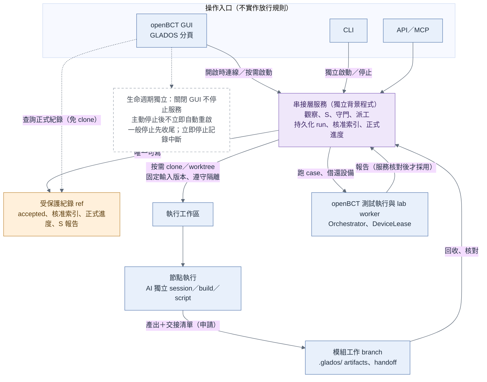
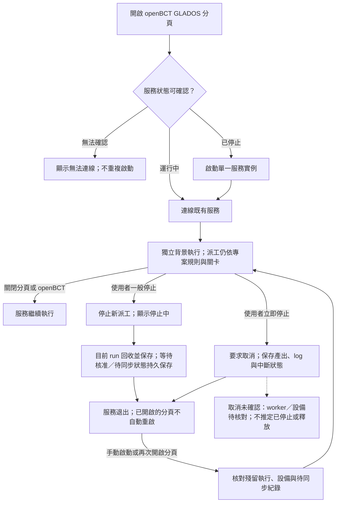

# GLADOS 串接層服務實作設計（v0.6 草稿）

> **狀態**：草稿 v0.6，2026-10-07。\
>\
> **與 spec 的關係**：[《GLADOS 平台 spec》](GLADOS_platform_spec.md)只規定串接層「要做什麼」（A9.1、A9.6、A8.6）。本文件記錄「用什麼實作、怎麼接 openBCT」。工具或宿主改變時只改本文件，不影響 spec。\
>\
> **內容來源**：I3–I7 來自 Codex v0.5 的 A9.6–A9.10，依 2026-10-07 的決策（選項 B）調整。

---

## I1. 決策：獨立服務＋openBCT 當入口（選項 B）

2026-10-07 決定：**串接層是一個獨立的背景服務，openBCT 的 GLADOS 分頁是它的操作入口之一；同時借用 openBCT 既有的測試執行、設備借用（DeviceLease）與 lab worker。**

| 選項 | 內容 | 結論 |
| :---- | :---- | :---- |
| A. 完整放進 openBCT | 串接層程式在 openBCT codebase 裡，與 GUI 共用同一個服務層 | 不採用：流程管理要背景常駐、等人簽核好幾天，不能跟 GUI 綁在一起 |
| **B. 獨立服務＋openBCT 當入口** | 串接層是獨立的常駐服務；GLADOS 分頁、CLI、API 都呼叫它；它再透過 openBCT 跑測試、借設備 | **採用** |

選 B 的理由：

- 服務是獨立背景程式，GUI 關閉、使用者登出不連動停止；使用者可獨立啟動或停止。開啟 openBCT 的 GLADOS 分頁時檢查並按需啟動服務（spec A9.6、I6）。\
- 入口不只一個：openBCT 分頁、CLI、其他人的 GUI、MCP 都能用同一套放行規則。\
- FPGA 等設備的互斥、測試執行與證據產生，沿用 openBCT 已有的能力，不重造。

---

## I2. 架構

**圖：串接層服務架構**

[可編輯 Mermaid 圖源](diagrams/glados_service_architecture.mmd)

圖源：[glados_service_architecture.mmd](diagrams/glados_service_architecture.mmd)

| 元件 | 角色 | 能寫正式紀錄嗎 |
| :---- | :---- | :---- |
| 串接層服務 | 觀察、S、守門、派工；持久保存進度、run、核准索引、S 分析 | 能，唯一可寫者（spec A8.6） |
| 操作入口：openBCT GLADOS 分頁、CLI、API／MCP | 查詢、送出要求（執行、核准、重跑）；不實作放行規則 | 不能，只能送要求給服務 |
| 專案工作區 repo | 模組 branch 放節點產出；受保護紀錄 ref 放正式紀錄 | — |
| 執行工作區 | 按需 clone／worktree，固定輸入版本，遵守隔離限制 | 不能 |
| 節點執行 | AI 獨立 session、build、script | 不能，只交產出與交接清單 |
| openBCT 測試執行與 lab worker | 跑 case、產生報告、管理設備借用 | 不能；報告由服務核對後才採用 |

服務與 openBCT 之間的介面（呼叫哪些 API、報告格式、設備借用流程）待定（I8）。

---

## I3. openBCT 的 GLADOS 分頁

openBCT GUI 新增一個分頁，名稱固定為 **GLADOS**，作為專案建立、進度查詢、環境檢查、節點啟動、產出查看與人工關卡的入口。分頁本身不實作放行規則，所有操作都送給串接層服務判斷。

| 區域 | 呈現 | 操作 |
| :---- | :---- | :---- |
| 上方專案區 | repo、project ID、branch、讀取 SHA、同步時間、服務與執行端連線狀態、整體狀態 | 選 GitLab／local repo、選既有專案或建立新專案、更新資訊、環境檢查、啟動服務、停止服務／立即停止 |
| 左側流程區 | P0–P7、C、S，以及各模組 M1–M7；阻擋、過期、等待核准 | 選節點、查看阻擋原因與重新進入點 |
| 右側節點詳情 | 輸入／輸出版本、checklist、必要核准、每輪 run、log 與證據索引 | 有權限且條件滿足時，要求服務執行、核准或重跑；連到既有 Tests／History 詳細結果 |

分頁常駐顯示服務狀態、執行位置，以及啟動／停止控制；服務狀態至少區分啟動中、運行中、停止中、已停止與無法連線。「無法連線」不等於「已停止」，不得據此重複啟動。服務停止後仍可查詢 GitLab 已保存的正式進度，即時狀態標為無法取得。環境按節點檢查：M1 不因 FPGA 不可用而被阻擋，M5 才檢查所需驗證設備。開啟專案可做資料載入與準備檢查；自動派工須依明確規則與專案設定，不能把「查看」當作執行授權。

---

## I4. GitLab／本機 repo：查詢與執行分開

| 情境 | 行為 | 工作區 |
| :---- | :---- | :---- |
| 查詢 GitLab 專案 | 以 GitLab API 讀受保護紀錄 ref 與模組 branch 的 `.glados/`；每次固定同一 commit 讀取 | 查詢端不需 clone |
| 本機執行 GitLab 專案 | 有合適 workspace 就重用，否則 clone 指定來源並準備節點 worktree；執行 S 與環境檢查 | 本機需要可重現的輸入快照 |
| 開啟本機 repo | 讀取本機 `.glados/`、ref／SHA，顯示與遠端同步情況 | 使用已有 repo；dirty／分岔先由 S 處理 |
| 查看／驅動遠端執行 | 查詢串接層服務，或由有權限者要求服務派工 | 查詢端不需 clone；執行機器負責 clone／worktree |

選 repo 後先找到 `.glados/projects/` 的既有 project ID；若未初始化，提供建立流程，不把整個 repo 當成唯一專案。建立時選起點、範圍與 profile 範本，按規則產生資料夾、草稿文件與設定，初步檢查後回 P0／G0；需要寫入 repo 時才準備 workspace。再次開啟只讀與核對，不覆蓋既有文件。

clone／fetch 的可見 refs 必須符合專案設定的隔離限制；有禁看 branch 的專案（例如 E39），工作區本身就是只含允許 refs 的獨立 repo（spec A8.5、B2）。GitLab API 查詢也只限該 repo。本機工作區對應保存在機器設定，避免不同機器互相覆蓋路徑。

---

## I5. 正式紀錄與即時狀態的雙來源監控

| 資訊 | 來源 | 語義 |
| :---- | :---- | :---- |
| 正式進度 | 受保護紀錄 ref（spec A8.6）；本機模式為本機的紀錄 ref | 交接、核准與證據所對應的已記錄版本；本機未同步要明列 |
| 即時狀態 | 串接層服務與執行端 | 節點正在跑、第幾輪、log、設備占用、回收／同步中 |
| 執行準備 | 本機或目標 worker 的環境檢查 | 該節點可用的工具、profile、來源版本與資源 |

分頁以 project ID、module、node、run ID、輸入 SHA／hash 合併呈現，兩個來源不能互相盲目覆蓋。正式紀錄已完成 M3、執行端正在做 M4 可以同時成立；執行端用的是舊 plan 時，顯示「輸入過期」，由 S 判斷。

| 連線情況 | 畫面行為 |
| :---- | :---- |
| GitLab 與服務都可用 | 顯示正式進度＋即時狀態，以及各自的版本與時間 |
| 只有 GitLab 可用 | 可查正式紀錄；即時狀態標為無法取得，不推定已停止 |
| 只有服務可用 | 可查即時狀態；正式進度標最後同步時間與可能過期 |
| 本機 repo | 顯示本機正式紀錄、未同步差異；連得到服務時另顯示即時狀態 |

---

## I6. 服務生命週期與持久化

spec A9.6 的必要性質，在本實作中的做法：

- **常駐**：服務是可獨立啟動與停止的程式，生命週期與 GUI 分開。開啟 openBCT 的 GLADOS 分頁時，先確認服務是否已啟動；已啟動就連線，未啟動就自動啟動，並以單一實例機制避免多個分頁或 GUI 重複啟動。關閉分頁或 openBCT 不停止服務，使用者登出也不連動停止。使用者主動停止後，已開啟的分頁顯示「服務已停止」與「啟動服務」按鈕，不自動把它啟動回來；再次開啟分頁時重新檢查並按需啟動。自動啟動服務不等於授權執行專案節點，派工仍依專案設定與原關卡。\
- **節點、run、產出物有效性分開管理**：一個節點可有多個 run；exit 0 只表示程式正常結束，分頁另外顯示「交接檢查中」「同步中」「節點完成」。一般「停止服務」立即停止新派工，狀態顯示「停止中」，等目前執行中的 run 回收並持久保存結果後退出，不啟動下一站；等待人工核准的節點保存後即可退出，不必等核准。同步失敗時保存待同步紀錄後退出，正式進度仍依 I5、spec A8.6 判定。\
- **完成順序**：收集產出與 log → S 核對版本 → 服務驗 hash、checklist、審查及必要核准 → 寫入受保護紀錄 ref 並同步 → 更新正式進度 → S 派工前檢查後決定下一站。遠端同步失敗時，保留已取得的結果並標「同步中」，不宣稱其他人已可從 GitLab 看到完成。\
- **持久化與重啟**：進度、核准索引、run、S 分析與中斷狀態持久保存；EventBus 通知與記憶體 job queue 不能當唯一事實來源。「立即停止」要求取消執行，保存已取得的產出、log 與中斷狀態後退出；取消尚未確認的 worker／設備明列為待核對，不宣稱已停止或已釋放。重啟時先核對殘留執行、設備與待同步紀錄，再決定接續或重跑，不盲目重派同一個 job。\
- **統一認領**：所有入口的執行要求都由服務認領與派工，避免多個 GUI 啟動同一站。

---

### I6.1 服務生命週期圖

[可編輯 Mermaid 圖源](diagrams/glados_service_lifecycle.mmd)

---

## I7. 可重用的 openBCT 元件

架構參考：使用者提供的舊版 openBCT repo（非最新版），只依其結構討論，未在該 repo 實作 GLADOS。下表描述可借用的能力與要補的部分，不代表最新版已具備全部功能。

| openBCT 元件 | 在選項 B 下怎麼用 | 要補或要注意 |
| :---- | :---- | :---- |
| 多入口 → OpenBctService 的分層 | GLADOS 服務是獨立程序，但可沿用同樣的分層與寫法；openBCT GUI 的 GLADOS 分頁透過 API 呼叫 GLADOS 服務，不把流程規則放進 OpenBctService | 核心規則維持只用標準函式庫，選用依賴放在邊界 |
| ToolSpec／ToolRunner | 服務啟動外部命令（`claude -p`、build、script）時沿用同樣的封裝方式 | 長任務另補 run ID、即時 log、取消／timeout 與中斷回收 |
| Orchestrator／結果保存／EventBus | 服務透過 openBCT 執行測試並取得結果 | 放行時要另外驗「必要 case 全部執行且 PASS」，不能只用允許部分 SKIP 的 `RunResult.passed` |
| lab diagnostics | 節點的環境檢查 | 只代表設定與工具存在，不代表設備已連通 |
| remote worker／DeviceLease | FPGA 等設備的互斥由 openBCT 管，服務透過 API 借用 | 另補專案層的認領規則；舊版記憶體 job store 需持久化與恢復設計 |
| AgentRuntime | 可作為一種節點執行介面 | GLADOS 仍按節點開獨立 session，由服務放行 |

GLADOS 分頁沿用 view-model／service 分離，不把新流程邏輯塞進既有的大型 GUI 檔。順序：先接建立／開啟、查詢、環境檢查、手動啟動與回收，再逐步啟用自動派工。

---

## I8. 待決事項

1. 服務部署在哪台機器；是否與 openBCT 的 remote worker 同機。\
2. 跨機器的身分與授權：誰能要求執行、誰能核准、服務帳號如何管理。\
3. 服務與 openBCT 之間的 API：跑 case、取報告、借還設備的介面與報告格式。\
4. 最新版 openBCT 是否仍有 I7 列出的元件（Codex 依據的是舊版）。\
5. 時程：平台建置路線步驟 2（手動跑一個模組）不需要本文件的任何元件；從步驟 3 開始實作（spec A12）。
