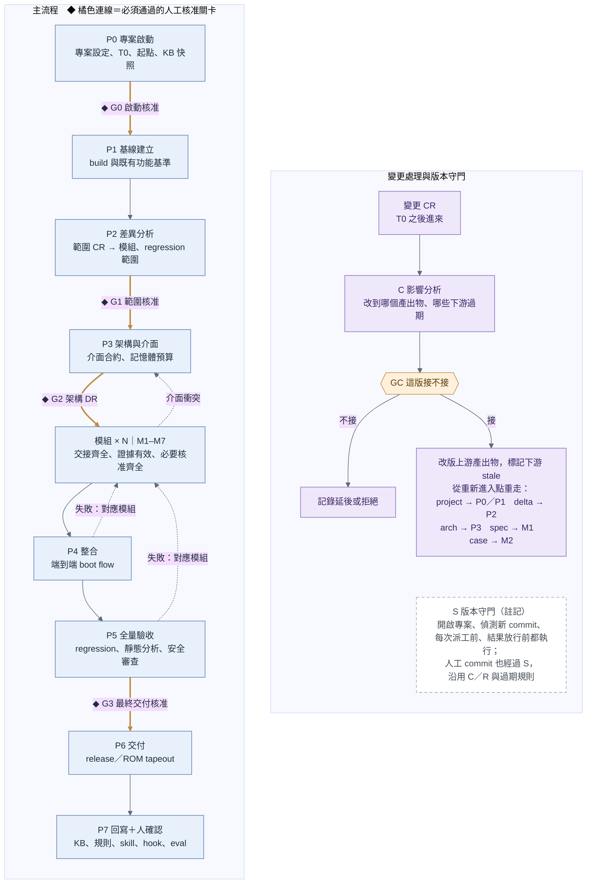
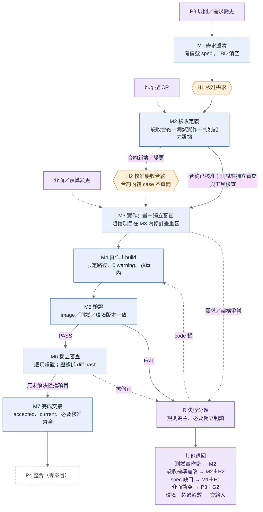
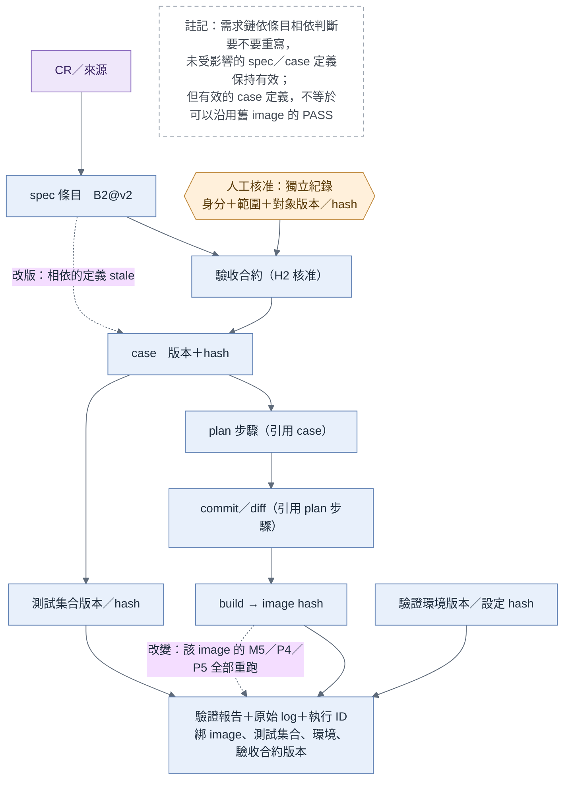
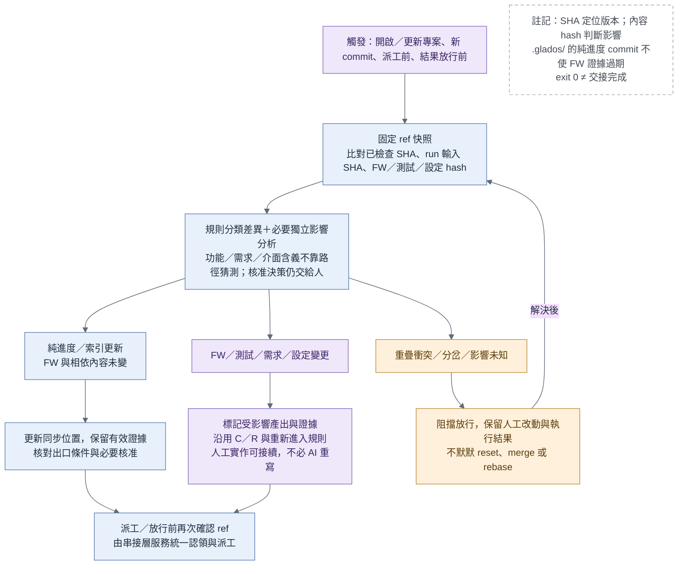

# GLADOS：bootcode FW 開發流程平台 spec（v0.6 討論稿）

> **狀態**：討論稿 v0.6，2026-10-07。合併 Codex v0.5 與 Claude v0.4 兩個平行版本（附錄 C）。尚未定案，只談流程與平台設計，不含實作。\
>\
> **這份文件的定位**：GLADOS 是一個**通用**的 bootcode FW 開發流程平台，目標是任何 bootcode 專案都能套用。E39（PS5039）是第一個用來開發與驗收 GLADOS 的專案，用來證明這套流程**正確**（產出的 FW 功能正常）而且**可行**（流程跑得通、成本合理）。\
>\
> **怎麼讀**：\
>

> - **Part A** 是平台本身，跟哪個專案無關。\
> - **Part B** 是 E39 怎麼套用 GLADOS、怎麼用它來驗收 GLADOS。\
> - **附錄**放修正建議、暫緩項目與版本紀錄。\
> - 串接層服務與 openBCT 入口的實作細節另見[《GLADOS 串接層服務實作設計》](GLADOS_impl_service.md)。本文件只規定串接層「要做什麼」，不規定用什麼工具實作。

---

# Part A：GLADOS 平台

## A1. 目標與範圍

**GLADOS 要做到的事**：從需求（spec、CR）出發，經過 spec 討論、功能實作、驗證、regression，最後產出一版功能正常、可以使用的 bootcode FW code。過程由 AI agent／skill、MCP、工具、人工審閱分工完成。流程切成多個**階段**與多個**模組**，每次交接都有固定格式的交接文件與 checklist（類似 design review list），確保每一站的產出合格才往下走。

**適用範圍**：Phison 的 bootcode 專案，包括：

- 不同 CPU 與 toolchain（ARM Cortex-R5／DS-5、Andes RISC-V）。\
- 新 IC，或從前代 IC 延伸（delta）的專案。\
- mask ROM 或非 ROM 的 boot code。

**平台的五個設計目標**：

| 目標 | 意思 | 靠什麼達成 |
| :---- | :---- | :---- |
| 可驗證 | 每一站做完都能客觀判斷合不合格 | 出口條件分自動與人工兩欄；先定驗收再寫 code |
| 可追溯 | 每一行 code 都能追到哪條需求、哪個 case | 產出物編號＋版本＋引用關係 |
| 可重入 | 需求變更或失敗時，只重做受影響的部分 | 過期機制（A7、A8） |
| 可替換 | 任何節點可以換成別的 agent、模型或人來做 | 節點只靠交接清單溝通；關卡由串接層統一檢查 |
| 可累積 | 這次的錯變成下次的能力 | P7 回寫到 KB、規則、skill、hook |

---

## A2. 用語

| 用語 | 定義 |
| :---- | :---- |
| **階段**（P0–P7） | 專案層的節點，每個專案各跑一次 |
| **模組** | 會改到同一塊 code 的一組 CR，例如 lcp、host 介面、安全。由 P2 切分 |
| **模組流程**（M1–M7） | 每個模組各跑一份的子流程 |
| **範圍 CR** | T0 之前的 CR，是 P2 的輸入，決定這一版要做什麼 |
| **變更 CR** | T0 之後才進來的 CR，從 C 節點進入流程 |
| **T0** | 範圍 CR 的截止點，在 P0 決定 |
| **產出物** | 每一站交出的檔案（spec、case、plan、diff、報告…），有 ID、版本、狀態 |
| **交接清單**（handoff manifest） | 每一站結束時交出的固定格式清單：吃了哪些上游產出物、交出哪些產出物、checklist 結果 |
| **節點卡** | 每一站的規格：目的、執行者、輸入、輸出、出口條件、失敗退回、權限 |
| **關卡** | 需要人簽核的點：專案層 G0–G3、變更核准 GC、模組層 H1、H2 |
| **串接層** | 確定性的流程管理背景服務（不是 LLM），負責觀察進度、版本同步（S）、守門與派工；GUI、CLI、API 都只是它的操作入口（A9.1、A9.6） |
| **正式紀錄** | 只有串接層服務能寫入的紀錄：accepted、核准索引、正式進度、S 報告（A8.6） |
| **S 版本同步與影響檢查** | 開啟、派工、回收及偵測新 commit 時，比對版本、分類影響，再沿用 C／R 與過期規則 |
| **執行紀錄** | 一次節點嘗試的 run ID、輸入快照、狀態、log 與結果；一個節點可有多次嘗試 |
| **GLADOS 專案** | 具 project ID 的一份需求範圍與流程實例；同一 FW repo 可以有多份專案紀錄 |
| **專案設定**（project profile） | 每個專案接上 GLADOS 時要填的一份設定：toolchain、build、驗證平台、觀察手段、code 模組對照等（A10） |

---

## A3. 設計原則

1. 一個節點只負責一件事、交出一份完整交接包（可含多份產出物）；邊就是交接清單，加上進入下一站的條件。\
2. 節點有四種執行者：AI（skill／agent）、工具（build、ICE、測試框架等結果固定的）、人（關卡）、路由。\
3. 退回哪一站由規則決定，不由產出者自己決定（球員不兼裁判）。\
4. 每個迴圈都有輪數上限，超過就交給人。\
5. **重新進入點＝最早一個「輸入產出物出了新版」的節點。** 失敗退回（R）、需求變更（C）與 S 發現的版本變更，都透過同一套相依與過期機制決定從哪裡重走；單純進度紀錄 commit 不使 FW 證據失效。\
6. **人只守關卡。** 人核准範圍、架構、需求、驗收標準、不可逆動作與最終交付；中間的 plan、diff、報告由 AI 產出、獨立 session 審查、工具驗證，串接層依規則放行，不逐份要求人簽。人工核准與產出物通過檢查是兩件事（A8）。

---

## A4. 平台組成

| 組成 | 內容 | 通用或專案專屬 |
| :---- | :---- | :---- |
| 流程定義 | 階段圖、模組流程圖、每個節點的節點卡 | 通用 |
| 串接層服務 | 背景常駐的流程管理服務：讀狀態、S 版本檢查、驗交接、派工；唯一能寫正式紀錄的身分 | 通用 |
| 操作入口 | GUI、CLI、API／MCP，都透過串接層服務操作，本身不實作放行規則。第一個 GUI 入口是 openBCT 的 GLADOS 分頁（見實作設計文件） | 通用 |
| 共用工具 | skills、MCP、測試框架、審查工具（A11） | 通用 |
| 專案設定 | toolchain、build、驗證平台、觀察手段、code 模組對照、隔離與 CI 規則…（A10） | 每個專案一份 |
| 專案工作區與紀錄 | 預設就是 FW repo，GLADOS 資料放 `.glados/`，以 project ID 區分流程實例；有隔離限制時改用只含允許 refs 的獨立 repo（A8.5）。節點產出在模組 branch，正式紀錄在受保護 ref（A8.6） | 每個專案一份；執行端另有 clone／worktree |

換一個專案時，只需要填一份新的專案設定、在專案工作區建立新的 `.glados/` 專案紀錄，按需準備執行工作區；流程、串接層服務、工具都不用改。如果某個專案需要改流程本身，代表平台還不夠通用，應該回頭修平台。

---

## A5. 專案層流程（階段）

**圖：專案層流程**



[可編輯 Mermaid 圖源](diagrams/glados_project_flow.mmd)

圖例：藍色為執行節點；橘色連線（標 ◆）與橘色六角形為人工核准關卡；紫色為變更路由；白色虛框為註記；虛線表示回退或重新進入。S 不是流程上的一站，而是每次派工前、結果放行前、開啟專案與偵測到新 commit 時都會執行的版本守門（A7.1），所以畫成註記。

圖源：[glados_project_flow.mmd](diagrams/glados_project_flow.mmd)

| 階段 | 目的 | 執行者 | 主要產出物 | 出口條件 | 失敗退回 |
| :---- | :---- | :---- | :---- | :---- | :---- |
| P0 專案啟動 | 定範圍與起點 | 人＋AI | project.md：專案設定、範圍 CR 來源、T0、起點 commit、KB 快照 | G0 人簽核 | — |
| P1 基線建立 | 確認起點 code 能 build、能在驗證平台跑，建立對照基準 | AI＋工具 | baseline 報告；既有功能的 golden log | 所有 build 設定 0 warning；既有功能在驗證平台跑通 | 環境問題 → 人 |
| P2 差異分析 | 範圍 CR → code 位置 → 模組 | AI（強模型） | delta.md：CR 與 code 對照、模組切分、受影響的既有功能（regression 範圍）、模組相依與執行順序 | G1 人簽核範圍 | 資訊不足 → P0 |
| P3 架構與介面 | 定模組邊界 | AI（強模型）＋人 DR | arch.md：介面合約、記憶體預算、錯誤碼表、boot flow 變更 | G2 架構 DR | 範圍有誤 → P2 |
| 模組 ×N | 見 A6 | — | 已審查的 diff＋驗證報告 | M7 交接齊全 | 介面衝突 → P3 |
| P4 整合 | 所有模組合入，驗端到端 boot flow | 工具＋AI | 整合 branch、boot flow 報告 | 整條 boot flow 通過 | → 對應模組 |
| P5 全量驗收 | 證明其他功能沒被改壞 | 工具＋AI 審 | regression 報告（綁 image、測試集合與驗證環境版本／hash）、靜態分析、授權掃描、安全審查 | 全過，且測試標準未被放寬 | → 對應模組 |
| P6 交付 | 最終決定 | 人 | release 包 | G3 最終簽核 | → P5 |
| P7 回寫 | 經驗變成團隊資產 | AI 提案＋人確認 | KB／規則／skill／hook 更新 | 人確認，eval 不退步 | — |
| C 變更分析 | 判斷變更 CR 改到哪個產出物 | AI（強模型）＋人 | 影響報告、上游產出物新版本 | GC 人核准（接或不接） | — |
| S 版本同步與影響檢查 | 對齊 repo、流程及執行輸入，處理人工穿插 commit | 規則程式＋必要獨立分析 | 版本／差異報告、過期清單與路由結果 | 版本相依可確認且無未解決衝突；已有交接仍須原關卡 | → C／R／受影響節點或人（A7.1） |

- **P1 對不同專案的意義**：delta 專案的起點是前代 code；新 IC 的起點是參考專案或骨架 code。不管哪種，都要先有能跑的起點，否則無法判斷一個 FAIL 是新改動造成的還是原本就壞。\
- **C 不在主流程上**，變更 CR 或 S 發現需要範圍／需求決策時才啟動（A7）。\
- **S 不增加一次性的專案階段**；在開啟、派工、回收及偵測新 commit 時重複執行，同步與檢查不等於自動 merge／rebase（A7.1）。\
- **ROM 專案的 P6**：交付後就是 tapeout，不能回頭，G3 的審查標準要比一般 release 更嚴格。

---

## A6. 模組流程（M1–M7）

**圖：模組流程**



[可編輯 Mermaid 圖源](diagrams/glados_module_flow.mmd)

圖中 H2 僅在驗收合約新增／變更時核准；合約內補 case 不重開 H2。M3 審查有阻擋項目時在 M3 內修計畫重審；牽涉需求或架構的爭議，和 M6 的需修正項目一樣經 R 退回相應節點與關卡。M7 交接後進入專案層 P4。每次派工與交接放行前均須 S 版本檢查。

圖源：[glados_module_flow.mmd](diagrams/glados_module_flow.mmd)

| 節點 | 執行者 | 主要產出物 | 出口條件 |
| :---- | :---- | :---- | :---- |
| M1 需求釐清 | M1a：AI 草擬（headless）→ M1b：人與 AI 討論（grill-me，互動式） | spec.md：有編號的條目 B1、B2… | TBD 清空；H1 spec 簽核 |
| M2 驗收定義 | AI 產出＋人核准標準＋獨立審查 | 驗收合約、測試實作、tests-baseline | H2 核准標準、判定方式與必要覆蓋；case 通過獨立審查與判別能力驗證（A6.1） |
| M3 實作計畫 | 強模型規劃＋另一模型審 | plan.md（每一步對應哪些 case） | 無未解決的阻擋項目；每項發現有處置與證據（A6.2） |
| M4 實作 | 次強模型＋build 工具（每輪一個新 session） | diff | 0 warning；記憶體在預算內；只動計畫內的檔案 |
| M5 驗證 | 工具＋AI 判讀 log | 驗證報告（綁 image、測試集合與驗證環境版本／hash） | 該模組所有 case PASS |
| R 失敗分類 | 規則為主、AI 輔助 | 失敗類型＋退回點 | — |
| M6 獨立審查 | 審查工具＋另一模型 | review 報告 | 無未解決的阻擋項目；非阻擋建議可記錄後放行（A6.2） |
| M7 完成交接 | 工具 | 交接包 | 交接清單齊全；產出物 accepted 且未 stale；必要人工核准齊全且對應目前版本 |

**模組流程的進入點**（圖左側）：

| 從哪裡來 | 進入點 |
| :---- | :---- |
| P3 展開（第一次） | M1 |
| C：需求變更（spec 要改） | M1 |
| C：bug 型 CR（spec 本來就對，是 code 錯） | M2：先補一個能重現 bug 的 case |
| P3 改版（介面或預算變了） | M3 |

**R 失敗分類的路由規則**（模組內部發現的問題）：

| 失敗類型 | 判斷依據 | 改版的產出物 | 退回 | 需要人？ |
| :---- | :---- | :---- | :---- | :---- |
| code 錯 | 測試符合 spec，實作不符 | diff | M4 | 否，計入輪數 |
| 測試實作錯 | case 未落實已核准的驗收合約 | case／測試腳本 | M2 | 否，合約內修正經獨立審查放行；若要改標準則須 H2 |
| 驗收標準需改 | 預期行為、判定方式或必要覆蓋需改變 | 驗收合約 | M2（需求有變則先 M1） | 是（H2；需求變更另須 H1） |
| spec 缺口／矛盾 | spec 沒定義此行為，或來源衝突 | spec 條目 | M1 | 是 |
| 介面衝突 | 必須改其他模組的介面 | arch.md | P3 | 是 |
| 環境 | 驗證平台、工具異常 | — | 交給人 | 是 |
| 沒有進展 | 連續 3 輪同樣 FAIL | — | 交給人 | 是 |

> 實作 AI 不得自行修改測試或驗收合約，也不能自行把失敗判成「測試錯」後放行。R 依規則及必要的獨立審查路由到 M2；測試實作在已核准合約內的修正可自動放行，變更驗收標準則必須由人核准。

### A6.1 M2：驗收合約、測試實作與判別能力

M2 分開管理兩類產出：

| 產出 | 內容 | 放行方式 |
| :---- | :---- | :---- |
| 驗收合約 | 對應 spec 條目、預期行為、可證明行為的判定訊號／方式、必要好壞情境與邊界覆蓋 | H2 人核准，綁版本與內容 hash |
| 測試實作 | case、輸入資料、執行腳本、合約對照與判別能力證據 | 獨立審查＋工具驗證，由串接層放行 |

- AI 可在已核准合約內新增 case 或修正測試實作；刪除必要情境、放寬預期、變更判定方式或必要覆蓋，必須回 H2。需求有缺口或矛盾則先回 M1。\
- 獨立審查需確認 case 真正落實合約。例如「HMAC 錯誤必須拒絕 ID page」不能只用「印出錯誤訊息」作為成功證據。\
- 驗收清單的執行結果由工具產生；尚未執行記為 `NOT_RUN`，不能把未執行、環境錯誤或驗證缺口混成行為 FAIL／PASS。\
- 人工核准的驗收合約受保護；通過檢查的測試集合由串接層建立新版 `tests-baseline`，綁合約、測試內容 hash 與審查證據。M4 無權修改或移動它。

**判別能力的證明，不一律要求未實作 image 上 FAIL：**

| 情況 | 必要證據 |
| :---- | :---- |
| 新功能／bug 修正 | 在尚未實作或修正該行為的 image 上，因目標原因 FAIL；在實作後 image 上 PASS |
| 既有功能／regression | 正常版本 PASS；以錯誤注入或受控修改證明 case 能抓到違反目標需求的行為 |
| 平台無法觸發或觀察 | 登記驗證缺口與受影響需求，由人決定補哪種驗證手段；補足前不能算 PASS 或聲稱已完成驗證 |

**M2 在實作前取得目標 FAIL 或既有功能的判別能力證據；實作後 PASS 由 M5 確認，不作為 M2 的前置出口條件。**

連不上 FPGA、下載 image 失敗等屬環境錯誤，不能當作成功重現目標 bug。錯誤注入或受控修改使用隔離的測試版本，保留修改、image hash 與結果證據，不合入交付版本。試點模組選定前，至少確認一條需求能在現有平台被觸發、觀察與穩定判定。

### A6.2 M3／M6：依發現、處置與證據放行

審查出口不採「兩個 AI 達成共識」。每項發現要記錄 ID、類型、對應位置與版本、影響、處置結果及證據，由獨立審查確認處置，串接層核對後依規則放行。

| 發現 | 放行規則 |
| :---- | :---- |
| 功能錯誤、安全問題、記憶體越界、介面違約，或違反明定必要規則 | 未解決就阻擋；修正後重新驗證，或由獨立審查依證據確認不成立 |
| 純風格或非必要改善建議 | 記錄與說明處置，可在不影響必要規則的前提下放行 |
| 牽涉需求／驗收標準／架構決策的爭議 | 回相應人工關卡，不由模型投票改變已核准決策 |

實作者不能自行降級或關閉阻擋項目。審查結果綁定被審查的 plan／diff hash；受審內容改變時，相關審查證據過期。超過節點迴圈上限仍無法處置的爭議交給人。

---

## A7. 變更處理（C 節點）

**R、C 與 S 的分工**：R 處理模組內部失敗；C 處理外部 CR 與需核准的範圍／需求變更；S 偵測 repo 版本差異，包括人工穿插 commit，先分類與分析影響，再沿用 C／R 與 A8 的過期機制。S 不自行放寬需求或驗收標準。

**流程**：

1. 變更 CR 進來 → 串接層啟動 C。\
2. C 讀 delta.md 和追溯關係，產出**影響報告**：會改到哪個產出物、哪些下游會過期、要重走哪些節點。\
3. **GC 人核准**這一版要不要接。不接就記錄後結束（延到下一版或拒絕）。\
4. 接的話，C 交出上游產出物新版本 → 過期機制標記下游 → 串接層從重新進入點派工。\
5. 重新進入點需要的人工關卡（G0、G1、G2、H1、H2）**審差異及受影響範圍**，核准紀錄綁新版本；合約內新增／修正測試不重開 H2。

**改到哪個產出物，就從哪裡重走**：

| 變更類型 | 改版的產出物 | 重新進入點 | 重走時的關卡 |
| :---- | :---- | :---- | :---- |
| 改基底、平台或 toolchain | project.md | P0／P1，所有證據過期 | G0 |
| 全新功能，不碰既有模組 | delta.md（追加模組） | P2 追加 → 新模組從 M1 開始 | G1 |
| 改模組介面或記憶體預算 | arch.md | P3 → 依賴該介面的模組從 M3 重走 | G2 |
| 改既有模組的需求 | spec 條目 | 該模組 M1，只重走改動條目往下的鏈 | H1 審差異與受影響範圍；合約變更才重開 H2 |
| 既有行為的 bug（spec 本來就對） | case（補重現 bug 的 case） | 該模組 M2 → M3 確認／更新計畫 → M4 | 合約內新增 case 可自動放行；需改合約則 H2 |
| 這版不做 | 無 | 不重走 | GC 決定延後或拒絕 |

**三種時間點**：

1. 模組還沒開始：直接併進該模組的 spec。\
2. 模組正在跑：等目前節點做完再切換，不在節點做到一半時打斷。\
3. 模組已合入整合 branch：重新打開該模組，P4、P5 結果一併過期。

**前提：追溯要細到條目**

**圖：追溯鏈**



[可編輯 Mermaid 圖源](diagrams/glados_cr_trace.mmd)

圖源：[glados_cr_trace.mmd](diagrams/glados_cr_trace.mmd)

1. spec 寫成有編號的條目（B1、B2…），不能是一整段敘述。\
2. 每個產出物標明引用的上游條目和版本：case 寫 `depends_on: spec#B2@v1`；plan 每一步寫對應哪些 case；commit message 寫對應的 plan 步驟。\
3. 過期分兩種：**需求鏈**看追溯關係，只有相連那條鏈過期；**驗證證據**綁 image、測試集合、驗證環境版本／hash。image 改變時，該 image 的 M5／P4／P5 驗證證據全部過期並重跑；測試或環境改變時，使用舊版本產生的相關證據過期並重跑（A8.4）。

### A7.1 S：版本同步與影響檢查

**圖：版本同步與影響檢查**



[可編輯 Mermaid 圖源](diagrams/glados_sync_flow.mmd)

圖源：[glados_sync_flow.mmd](diagrams/glados_sync_flow.mmd)

**觸發點**：開啟／更新專案、每次派工前、節點回收與結果放行前、偵測追蹤 branch 的新 commit。查詢時可只讀分析並顯示待同步狀態；修改正式紀錄與派工由串接層服務統一執行。

**處理順序**：固定本次讀取的 ref／commit → 比對前次已檢查快照及本次執行輸入 → 取得 diff 與內容 hash → 分類影響 → 標記受影響產出物／證據並決定路由 → 保存 S 報告。SHA、修改路徑、hash、明確相依由規則處理；功能、需求或介面含義由獨立分析補充，涉及已核准決策則回人工關卡。影響無法確認時，不推定無影響或放行。

| 變更 | S 的處置 |
| :---- | :---- |
| 純進度、索引或 log 參照更新 | 更新已檢查位置；內容與相依未變的 FW 證據可維持有效 |
| 人工修改 FW code／build 輸入 | 登記人工 diff、對應模組／需求與影響；舊 image 的結果保留作歷史，不能證明目前 source；重建並套用 A8.4，必要時核對／更新 M3，再 M5／M6 |
| 需求、介面、預算或 profile 改變 | 沿用 C、相應人工關卡及過期規則；已存在於 repo 的變更不等於已獲核准 |
| 測試實作或驗證環境改變 | 相應審查／執行證據過期；回 M2 或環境處理；驗收合約變更回 H2 |
| 執行中所依賴的輸入被修改 | 顯示「輸入版本已過期」；保留該次結果，先阻擋其放行；分析重用、重跑或重新進入點 |
| branch 分岔、重疊衝突、dirty 工作區或無法取得必要版本 | 顯示具體阻擋原因，依既定規則處理或交給人；不得默默覆蓋、reset、merge／rebase 人工改動 |

純紀錄變更只更新查詢游標／同步位置，不必每次讀取都再產生一個同步 commit；只有有意義的版本／影響／路由改變才留下新的 S 報告，避免自我觸發的 commit 迴圈。

人工完成的實作可作候選 diff 接回流程，不要求 AI 重寫，但仍需原本的計畫核對、build、驗證與獨立審查證據。若只是實作錯誤，依 R 回 M4；若新增需求則先走 C，不得由 S 自行接受新範圍。

派工時固定 `input_commit_sha` 與所有上游版本。執行結束後，即使 exit code 為 0，也要由 S 比對期間新增的 commit：只有可證明無關的變更可保留有效性；受影響結果不能直接套到新版本。狀態更新與派工前還須核對 ref 是否仍為已分析的版本，避免兩個 GUI 重複派工或用過期分析放行。S 的「同步」先指讀取、比較與更新紀錄，不承諾自動合併。

---

## A8. 產出物、狀態與交接清單

### A8.1 產出物狀態、有效性與人工核准

| 對象 | 狀態／紀錄 |
| :---- | :---- |
| 產出物處理狀態 | `draft → in-review → accepted`；未通過檢查則修正後重送 |
| 產出物有效性 | `freshness: current / stale`，與處理狀態分開 |
| 人工核准 | 獨立 approval 紀錄：關卡、核准人身分、日期、對象 ID、版本、內容 hash、核准範圍 |
| 節點 | `待開始 → 認領中 → 等待外部回覆 → 完成`（或 `交給人`） |

- 產出物帶 frontmatter：status、freshness、version、content hash、date、引用的上游產出物版本。節點提交內容，串接層在可信狀態紀錄中設定 `accepted`，不信任 agent 自報的字串。\
- `accepted` 表示符合該節點要求：自動檢查通過、必要獨立審查無阻擋項目、必要人工核准齊全。它不表示每份產出物都有人簽。\
- 進入下一站需 `accepted` 且 `current`；需要人工決策的輸入另須對應目前版本的 approval。\
- 上游改版時，依引用關係標記下游 `stale`。舊版已 accepted 的歷史紀錄保留，但不得當作新版的放行依據。\
- 人工核准只能由有權限的人產生，串接層驗證身分及版本／hash。舊核准保留作稽核，不能沿用來核准新版本；重審要呈現差異與受影響範圍。\
- 「認領中」記錄誰在做、從何時開始，避免同一站被重複執行。

### A8.2 交接清單格式

```yaml
node: M2
module: <模組名稱>
project_id: <GLADOS 專案 ID>
run_id: <本次嘗試 ID>
input_commit_sha: <本次使用的完整 commit SHA>
fw_source_hash: <本次 FW／build 輸入內容 hash>
status: in-review             # 串接層核對後才設定 accepted
freshness: current
inputs:
  - id: spec.md#B1
    version: v1
    hash: <內容 hash>
  - id: spec.md#B2
    version: v2
    hash: <內容 hash>
outputs:
  - id: acceptance_contract.md
    version: v1
    hash: <內容 hash>
  - id: cases/<case 檔>
    hash: <內容 hash>
  - id: tests-baseline
    version: v1
    hash: <測試集合 hash>
checklist:
  auto:
    - check: 每個必要情境都有 case
      result: PASS
      evidence: <工具產生的報告 ID 與 hash>
    - check: case 判別能力符合 A6.1
      result: PASS
      evidence: <實作前目標 FAIL 或既有功能錯誤注入證據 ID 與 hash>
  review:
    - check: 測試實作真正落實驗收合約
      evidence: <獨立審查紀錄 ID 與 hash>
approvals:
  - ref: <H2 核准紀錄 ID>     # 串接層核對身分、合約版本及 hash
open_blockers: []
verification_gaps: []
notes_for_next: "..."         # 補充資訊需顯式寫入；不能只留在對話
```

下一站光靠交接清單做不下去，就算上一站的 checklist 沒過。

### A8.3 節點卡範本

```text
# 節點卡：<節點 ID> <名稱>
目的：一句話
執行者：AI（skill／模型）｜工具｜人｜路由
執行形式：互動式｜headless｜每輪新 session｜純程式
輸入：<產出物>（必要狀態：accepted 且 current；必要人工核准另列）
輸出：<產出物>（schema／範本）
出口條件
  自動檢查：…（由串接層判定）
  人工檢查：…（簽核人）
失敗退回：<失敗類型> → <節點>
迴圈上限：N 輪，超過 → 交給人
權限：可讀…／可寫…／禁止…
```

範例（M2 驗收定義）：

```text
目的：依已簽核的 spec 定出「什麼叫做完」，在寫 code 之前鎖定正確答案
執行者：AI（產出合約與 case）＋獨立審查＋工具＋人（H2 合約核准）
執行形式：headless 產生 → 必要 H2 合約核准 → 獨立審查與工具檢查
輸入：specs/<模組>.md（accepted、current、具 H1 核准）、目前 image
輸出：驗收合約、驗收清單（執行結果初始 NOT_RUN）、測試實作、tests-baseline tag
出口條件
  自動檢查：每個必要條目／情境都有 case；判別能力證據符合 A6.1；獨立審查確認測試落實合約
  人工檢查：H2 核准預期行為、判定方式與必要覆蓋；合約內追加 case 不重審 H2
失敗退回：spec 條目無法轉成可驗證的 case → M1
迴圈上限：2 輪
權限：可寫 tests/、cases/、驗收清單；合約變更須 H2；禁止改 src/；tests-baseline 由串接層核對證據後建立新版
```

### A8.4 驗證證據的版本與有效性

驗證報告至少綁定：需求／驗收合約版本、image hash、測試集合版本與 hash、驗證環境版本或設定 hash、執行 ID、原始 log／報告 hash。串接層自行核對，不接受無法對應目前版本的舊 PASS 報告。

| 改變 | 文件與定義 | 執行證據 |
| :---- | :---- | :---- |
| spec／驗收合約改版 | 依條目追溯標記相依產出物 stale | 受影響驗收結果過期；若 image 改變再套用下一列 |
| image 改變 | 未受需求變更影響的 spec／case 定義可保持有效 | 該 image 的 M5／P4／P5 驗證全部過期並重跑；目前採保守規則，不推定未改需求的行為仍正確 |
| 測試集合改版 | 合約內變更不必重審 H2；需重審修改過的測試實作 | 使用舊測試版本產生的相關報告過期，依新集合重跑 |
| 驗證環境改版 | 視變更是否影響判定方式決定需不需要 H2 | 使用舊環境產生的相關報告過期，在新環境重跑 |

需求／case 定義有效，不代表舊 image 的 PASS 可以沿用。驗證缺口要明列、路由給人補驗證手段，不能用通過檢查的文件取代尚未取得的功能證據。

### A8.5 專案工作區的 `.glados/` 與版本對應

GLADOS 的設定、交接、核准及正式進度放在專案工作區 repo 的 `.glados/`。專案工作區預設就是 FW repo。**當專案設定列有禁止 agent 看到的 branch 時（例如 E39 的對照實驗），工作區必須是另一個只含允許 refs 的 repo（GitLab mirror／fork）**，agent 能用的 GitLab 權限也只限於該 repo；GLADOS 的產出同樣不推回原 repo，做到雙向隔離（A10、B2）。正文的 project.md、arch.md 等為邏輯產出物名稱；實際位於各 project ID 的管理目錄，節點執行用的 handoff/in、handoff/out 與設定由串接層服務依該紀錄準備。同 repo 可有多份流程實例，以 project ID、需求範圍與 branch 對應區分。以下為討論用配置，確切 schema 尚待定：

```text
<FW repo>/
  <FW source 與 build 檔案>
  .glados/
    projects/<project-id>/
      project.md               # P0 範圍、T0、起點
      profile.json             # 專案設定，不放機器密碼／token
      versions.json            # 已檢查 SHA、FW 來源快照與內容 hash
      workflow.json            # 流程版本、節點與執行規則
      artifacts/               # delta、arch、模組 spec／合約／plan／review
      handoff/                 # 各節點交接 manifest
      approvals/               # 可驗證的人工核准紀錄
      runs/                    # 執行摘要、輸入版本與證據索引
      sync/                    # S 差異／影響／路由報告
```

誰寫在哪裡（A8.6）：`artifacts/`、`handoff/` 由節點寫在各模組的工作 branch，屬於「申請」；`approvals/` 的核准索引、`runs/` 的正式狀態、`versions.json`、`sync/` 只由串接層服務寫在受保護的紀錄 ref。

較大的 image、log／報告可放在外部證據儲存區，repo 保存可存取的索引與 hash；保存位置、存取與保留期限尚待定。每台機器的 local path、憑證與暫存另存於本機，避免當成共用專案事實。查詢者讀到 `.glados/` 字串不等於可自行產生有效 accepted／approval；仍須核對可信證據與身分（A8.1）。

| 版本資訊 | 意義 |
| :---- | :---- |
| `tracking_ref` | 正式進度所追蹤的 branch／ref；模組工作 branch 與其輸入版本另行記錄 |
| `last_inspected_commit_sha` | S 已完成分析的 ref 快照；不是含該紀錄本身的 commit SHA |
| `fw_source_commit_sha` | 能取得本次 FW／build 輸入的來源 commit |
| `input_commit_sha` | 每次執行實際使用的不可變輸入版本，放在 run／manifest |
| `fw_source_hash` | 依 profile 宣告的 FW／build 輸入範圍計算的內容 hash；不能只 hash `.c` 檔 |
| image／test／environment hash | build 產物、測試集合與驗證環境的證據對應（A8.4） |

每個被管理的 ref 分別記錄已檢查 SHA；不同模組 branch 的版本不能共用一筆游標。M4 的 build／驗證證據綁修改後實際使用的來源 SHA／內容 hash，保留原輸入 SHA 作追溯，不能用原輸入版本代替修改後來源。

**SHA 定位版本與 diff；內容 hash 判斷相關輸入是否改變。** 寫入 `.glados/` 也會產生 commit，故不能要求 versions.json 記的 SHA 永遠等於目前 HEAD，也不能要求檔案記下其自身所在 commit 的 SHA。例：A（FW 修改）→ B（交接紀錄）→ C（人工 FW 修改）→ D（S 報告）；D 記錄已檢查 C 及 C 的來源內容 hash，D 的純紀錄更新不再次使 FW 證據過期。

純進度紀錄可排除於 FW 來源 hash，但 `.glados/` 內的需求、合約、架構、profile 或流程規則變更仍按其相依類別檢查，不能整個目錄一律忽略。同樣地，FW 來源 hash 沒變，不代表測試、環境或人工核准必然有效。

**CI**：只改 `.glados/`（或只改紀錄 ref）的 commit 不得觸發 FW 的 CI pipeline，否則每次交接、每份 S 報告都會跑一次 build、靜態分析、授權掃描。需要這些檢查時，由串接層在對應節點明確觸發（例如 M4 的 build、P5 的靜態分析與授權掃描）。具體做法依專案的 CI 設定（例如 pipeline 規則排除只改 `.glados/**` 的 commit、紀錄 ref 不跑 pipeline），寫進專案設定（A10）。

### A8.6 信任邊界：誰能寫正式紀錄

前面所有「串接層不相信自報狀態」的規則，都要有一個不能被節點竄改的地方存放判定結果，否則 agent 只要寫一個 `status: accepted` 或一份核准檔就能繞過關卡。

| 寫入者 | 能寫什麼 | 寫在哪裡 |
| :---- | :---- | :---- |
| 節點（AI agent、人、script） | 自己這一站的產出物與交接清單 | 自己模組的工作 branch |
| 串接層服務帳號 | accepted 判定、核准索引、正式進度、S 報告、run 正式狀態 | 受保護的紀錄 ref（例如 protected branch `glados/records/<project-id>`）或服務的持久資料庫；節點使用的 token 沒有寫入權 |
| 有權限的人 | 人工核准 | 能獨立驗證身分的地方：簽章 commit、GitLab MR approval 或 Jira 核准紀錄（具體機制待定，A13） |

- 節點交出的交接清單只是「申請」，串接層核對後寫進正式紀錄才算生效。\
- 串接層只採信正式紀錄與可驗證身分的核准來源。模組 branch 上出現的核准檔、`status: accepted` 字串，一律不算數。\
- 建置路線步驟 2（A12）由人扮演串接層時，也照這條規則：正式紀錄由人在受保護 ref 上提交，核准用 MR approval 或簽章 commit。

---

## A9. 執行架構

### A9.1 三層結構

1. **串接層：獨立的背景服務，不是 LLM。** 以獨立程式在背景執行，使用者可明確啟動或停止；開啟 openBCT 的 GLADOS 分頁時檢查並按需啟動服務，關閉 GUI 不連動停止服務（A9.6）。GUI（第一個是 openBCT 的 GLADOS 分頁）、CLI、API／MCP 都只是它的操作入口，不各自實作放行規則；LLM 可提供影響分析，不能自行決定放行。三個角色：\
   - 觀察：整合專案工作區（GitLab 或本機）的正式紀錄與執行端即時狀態，以 project ID、run ID、ref／SHA 對齊。\
   - 守門：先執行 S 版本檢查，再自己驗證交接、必要 case 覆蓋與核准，不相信 manifest 自報的狀態。\
   - 派工：決定下一站、標記過期、啟動 headless 節點或通知人做互動式節點。\
2. **節點：每個節點一個全新的 session。** 只給節點卡、上游交接清單、清單引用的產出物；不給前一站的對話。模型、工具、權限、MCP、工作目錄各自設定。\
3. **節點內部：需要時才用 subagent。** 例如 P2 把 CR 分給多個 subagent 平行分析；M6 從安全、MISRA、記憶體配置多角度審查。結果只回到該節點。

為什麼不用「主 session＋subagent」當階段：主 session 本身是 LLM，會看到所有 subagent 的結果，階段之間就不獨立，下一站也變成 LLM 決定；而且主 session 不能為了等人簽核開好幾天。

### A9.2 各節點的執行形式

| 形式 | 節點 |
| :---- | :---- |
| 互動式 session（人和 AI 討論） | P0、P3、M1b、C 的核准討論 |
| headless（`claude -p`） | P1、P2、C 的影響分析、M1a、M2、M3、M6、P7 |
| 每輪一個新 session | M4（靠 progress.md 接續，搭配 3 輪停止條件） |
| 純程式，不用 LLM | M5、M7、P4／P5 的執行部分、串接層 |
| 規則為主＋必要獨立分析 | R、S 的影響判讀 |
| 人 | G0–G3、GC、H1、H2、P6 |

審查節點（M3 互審、M6）一定是另一個 session，最好換一個模型。

### A9.3 headless 節點：啟動與回收

生命週期：S 派工前檢查 → 決定下一站 → 按需 clone／準備 worktree，固定輸入 commit 與產出物版本，產生 run／session ID → 用節點專屬參數執行 `claude -p` → 串接層自設 timeout → 回收 → S 結果放行前檢查 → 驗交接與出口條件 → 提交／同步紀錄 → 更新正式進度並路由。

```bash
claude -p "執行節點 M4：依 handoff/in/M3.yaml 實作，完成後寫出 handoff/out/M4.yaml" \
  --model sonnet --effort high \
  --append-system-prompt-file nodes/M4/card.md \
  --setting-sources project --settings nodes/M4/settings.json \
  --mcp-config nodes/M4/mcp.json --strict-mcp-config \
  --permission-mode dontAsk \
  --session-id <uuid> --output-format json
```

（參數已在 Claude Code 2.1.187 的 `claude --help` 確認。）

| 節點卡上的設定 | 對應參數 |
| :---- | :---- |
| 角色與規則 | `--append-system-prompt-file`（或 `--system-prompt` 整個替換） |
| 模型 | `--model`、`--effort` |
| 權限、hook | `--settings` 指向節點專屬設定；`--setting-sources project` 避免個人設定混入 |
| 可用工具 | `--tools`、`--allowedTools`、`--disallowedTools` |
| 可用 MCP | `--mcp-config` 加 `--strict-mcp-config` |
| 無人在旁時的權限詢問 | `--permission-mode dontAsk`：未事先允許的動作直接拒絕 |
| 追蹤 ID | `--session-id`，由串接層產生 |

**回收結果只看檔案**：

1. exit code 與 JSON 的 `is_error`（實測未登入時 `subtype` 仍是 `success`，但 `is_error: true`、exit 1，所以不能看 subtype）；`permission_denials` 列出被擋下的動作。\
2. 真正的產出是 handoff manifest：串接層驗格式、核對 hash。`--json-schema` 可讓最後回覆變成固定格式的摘要，但依據仍是 manifest。\
3. headless 節點用 Stop hook 擋住「沒交 manifest 就結束」。

**企業訂閱方案注意事項**：

- 串接層機器要先登入（`claude auth login`；無人值守用 `claude setup-token`）。\
- 不要用 `--bare`：該模式只接受 API key。隔離改用 `--setting-sources` 和 `--strict-mcp-config`。\
- `-p` 模式下設定檔格式錯誤會被**默默忽略**，hook 跟著消失、關卡失效。串接層啟動前必須自己驗證設定檔。\
- 所有節點都吃同一人的額度；以個人席位跑無人值守自動化是否合規，需與管理員確認，必要時改用組織 API key。\
- 另一個選擇是 Claude Agent SDK（同一引擎，改用函式呼叫）。建議先用 CLI，需要更細的控制再換。

### A9.4 互動式節點

- 不加 `-p` 執行 `claude` 就是互動式。節點設定改寫成工作目錄裡的檔案（CLAUDE.md 或 skill、`.claude/settings.json`、`.mcp.json`），人用終端機、desktop app、VS Code 都會套用。\
- **不能用 Stop hook 強制交 manifest**：互動模式下每回一次話就觸發一次，會讓 AI 不把發言權交回給人。改用人執行的收尾指令（例如 `/m1-done`）驗證 manifest，加上 SessionEnd hook 記錄未完成狀態。\
- 要等客戶、SOC、HW 回答的問題：登記 TBD 並寫進 Jira，節點狀態改「等待外部回覆」。答案回來後開**新 session** 從檔案接續，不用 `--resume`。

### A9.5 任何 agent 都能執行任何節點

節點交接與正式完成以專案紀錄及可信產出證據為準，即時執行狀態另由串接層服務呈現，所以 Claude Code、Codex、人、script 都能接手任何節點。前提是關鍵檢查由串接層在節點邊界自己做：

- git diff 確認只改了允許的路徑（排除專案設定中列出的「被追蹤的編譯產物」）。\
- M4 沒改測試或 case 判定；M2 的測試變更符合已核准合約，且有獨立審查證據；合約變更有新版 H2 核准。\
- manifest 列的 hash 與實際檔案一致。\
- 驗證報告對應目前 image、測試集合與驗證環境版本／hash。\
- 審查證據對應目前 plan／diff hash；阻擋項目已處置；必要人工核准對應目前版本。

agent 內部的 hook 只是提早攔截的輔助。

**專案工作區規則**：每個模組一個工作 branch，節點把產出與交接清單 commit 在該 branch 的 `.glados/`；正式紀錄由串接層服務寫在受保護的紀錄 ref（A8.6）。人工 commit 可穿插，但須由 S 核對；run 分別記輸入 SHA／hash，進度 commit 的 SHA 與 FW 來源 SHA 不混用。正式進度只顯示已寫入正式紀錄的交接，執行端保存即時嘗試與同步中狀態。

### A9.6 串接層服務的必要性質

不論用什麼工具實作，串接層服務都必須滿足以下性質；GUI 版面、GitLab／本機兩種模式、與 openBCT 元件的對應等實作細節，見[《GLADOS 串接層服務實作設計》](GLADOS_impl_service.md)。

- **背景常駐**：服務是獨立程式，生命週期與 GUI 分開；GUI 關閉、使用者登出，不連動停止服務。開啟 openBCT 的 GLADOS 分頁時先檢查服務：已啟動就連線，未啟動就自動啟動；可獨立啟動或停止服務，不必先開 openBCT。同一服務只啟動一個實例。使用者主動停止後，已開啟的分頁顯示「服務已停止」並提供「啟動服務」，不得因持續監控而立即重啟；再次開啟分頁時重新檢查並按需啟動。背景常駐不代表使用者不能停止。\
- **統一認領與派工**：同一個節點同一時間只會有一個 run 被放行；GUI、CLI、API 等入口不能各自派工。\
- **持久化**：進度、核准索引、run、S 分析與中斷狀態都要持久保存。一般停止先停止新派工，顯示「停止中」；目前正在執行的 run 回收並保存結果後退出，不啟動下一站。等待人工核准的節點保存後即可退出；同步失敗則保存待同步狀態，不把尚未同步的結果宣稱為正式完成。另提供「立即停止」：要求取消執行，保存已取得的產出、log 與中斷狀態；未確認停止的 worker／設備明列為待核對，不推定已停止或已釋放。重啟後先核對殘留執行、設備與待同步紀錄，再決定接續或重跑；記憶體裡的 queue 或事件通知不能當唯一的事實來源。\
- **run 生命週期**：一個節點可以有多個 run。exit 0 只代表程式正常結束，不代表節點完成。完成順序：收集產出與 log → S 核對版本 → 驗 hash、checklist、審查與必要核准 → 寫入正式紀錄並同步 → 更新正式進度 → S 派工前檢查後決定下一站。\
- **正式紀錄與即時狀態分開**：正式進度以已寫入正式紀錄（A8.6）的為準；即時狀態（正在跑、第幾輪、log、設備占用）來自執行端。兩者用 project ID、node、run ID、輸入 SHA 對齊，不互相覆蓋；任一來源連不上時要明確標示，不推定。\
- **查詢不需要執行環境**：只看進度不必 clone、不必連設備；要執行時才準備工作區，而且可見的 refs 必須遵守專案設定的隔離限制。

---

## A10. 專案設定（project profile）

每個專案接上 GLADOS 時要填一份。串接層、節點卡、出口條件都從這裡讀專案相關的值，流程本身不寫死任何專案細節。

| 欄位 | 內容 | 哪些節點用到 |
| :---- | :---- | :---- |
| 專案與 IC | project ID、名稱、IC 代號、前代專案（若為 delta）；`.glados/projects/<id>/` | P0、P2、GUI、S |
| repo 與流程追蹤 | GitLab repo ID／URL 或 local repo、正式 tracking ref、模組 branches、流程版本；機器 local path 另存 | 開啟、S、派工與監控 |
| 版本與 hash 規則 | FW／build 輸入範圍、測試與環境版本、純進度紀錄分類；見 A8.5 | S、M4、M5、P4／P5 |
| 執行端與同步 | 串接層服務與 worker 位址、證據索引位置、派工模式；憑證由本機安全設定提供 | 入口、派工、監控 |
| 正式紀錄位置 | 受保護紀錄 ref 名稱或服務資料庫；串接層服務帳號；人工核准的驗證方式（A8.6） | 串接層 |
| 起點 | repo、起點 branch／commit；**禁止 agent 看到的 branch**（例如同專案的人工開發 branch） | P0、P1、串接層 |
| 隔離方式 | 有禁看 branch 時：獨立工作區 repo 的位置、agent 可用的 GitLab 權限範圍、GLADOS 產出不推回原 repo（A8.5） | P0、串接層、所有節點 |
| CI 規則 | 只改 `.glados/` 或紀錄 ref 時不跑 pipeline 的設定；哪些節點會明確觸發 CI（A8.5） | 串接層、M4、P5 |
| CPU 與 toolchain | ARM／Andes、對應的 build skill | P1、M4 |
| build 設定 | 所有要過 0 warning 的 build 設定 | P1、M4、P5 |
| 記憶體預算 | ROM／SRAM／stack 上限、量測方式 | P3、M4 |
| 是否為 mask ROM | 決定 P6 之後是否不可回頭 | P6 |
| 驗證平台 | FPGA、SIM、ASIC 各有幾台、怎麼連線 | M5、P5 |
| 觀察手段 | UART token、tracker step、readsys 等可當預期結果的訊號 | M2、M5 |
| 製造錯誤的手段 | 可注入錯誤的 VUC 或旗標，用來觸發壞情境 | M2、M5 |
| 測試框架 | openBCT 等；case 放哪、怎麼跑、報告格式 | M2、M5、P5 |
| code 模組對照 | 目錄 → 模組名稱；衝突熱點檔案 | P2、P3 |
| 共用層規則 | 多顆 IC 共用的 code 及其旗標，改動時的額外 regression 範圍 | P2、P5 |
| 被追蹤的編譯產物 | repo 裡被 git 追蹤的 build 輸出路徑（守門時要排除） | 串接層 |
| CR 來源 | Jira 的 Epic（不要用標題關鍵字，會漏掉標題沒寫專案代號的 CR）；CR 撰寫範本 | P0、P2、C |
| 既有測試項目 | Jira 上的功能／測試項目清單（如 sub-task），可作為驗收定義的來源 | M2 |
| 知識庫 | KB 版本或快照 | P0、M1 |
| 不可逆動作清單 | eFuse trim 等需人批准的動作 | 全部節點的 hook |

---

## A11. 平台工具對照

各節點可直接使用的現有 skill、MCP 與工具。標「playbook」者為 playbook 頁提到、尚待確認是否已存在。

| 節點 | 工具 |
| :---- | :---- |
| 全流程／S | 串接層服務（入口：openBCT GLADOS 分頁、CLI、API）、GitLab／local git、版本比對與必要獨立影響分析 |
| P0、C | Atlassian MCP（Jira／Confluence 讀 CR 與 spec）、bootcode-qa |
| P1 | ds5-build／andes-build、remote-ice、bootcode-qa |
| P2 | Atlassian MCP、GitLab MCP、bootcode-qa、subagent 平行分析 |
| P3 | bootcode-qa、pyconvert（eFuse／BCFG 欄位與 layout） |
| M1 | bootcode-qa、pyconvert、grill-me（playbook） |
| M2 | write-jira-desc、write-openbct-test（playbook）、openBCT |
| M3 | 強模型規劃＋另一模型審 |
| M4 | ds5-build／andes-build |
| M5 | remote-ice、openBCT、bootcode-qa（log 判讀）、logic-analyzer（實體訊號）、pps-log-verify（以已知通過的 log 當標準比對） |
| M6 | corvia-code-review、另一模型 |
| P4、P5 | openBCT、ci-owner（Coverity／cppcheck／Black Duck）、corvia-code-review |
| P6 | sim-release |
| P7 | vault-smith（寫 KB）、the-validator（驗 KB 沒退步）、skill-creator |

---

## A12. 平台建置路線

| 步驟 | 做什麼 | 完成的判斷 |
| :---- | :---- | :---- |
| 1\. 打底 | 寫好流程定義與節點卡；填第一份專案設定；把測試項目轉成測試框架 case；不可逆動作用 hook 擋 | 節點卡與專案設定審過 |
| 2\. 手動跑一個模組 | 挑一個邊界清楚的模組，由人扮演串接層，每個節點開獨立 session，手動跑完 M1–M7 | 這個模組產出合格交付，交接清單在每一站都夠用 |
| 3\. 接上串接層服務 | 背景服務＋操作入口（openBCT GLADOS 分頁）；GitLab／local 開啟；`.glados/`；環境檢查、S、持久紀錄、雙來源監控、手動啟動與回收，再接自動派工／3 輪停止 | 查詢 GitLab 不需 clone；執行按需準備 workspace；人工 commit 可追蹤；一個模組能自動派工跑完，人只出現在關卡 |
| 4\. 擴大到整個專案 | 所有模組、P4／P5、C 變更處理 | 交出整版 FW，通過驗收（Part B） |
| 5\. 第二個專案 | 換一個專案只填新的專案設定 | 不用改流程就能跑，證明平台是通用的 |

步驟 5 很重要：只在一個專案上跑通，只能證明 GLADOS 適用於那個專案。要證明是平台，必須在第二個專案上「只換專案設定」也跑得通。

**各機制從哪一步開始需要**

步驟 2 要驗證的是流程與交接規則本身；工具化放到步驟 3，避免流程還沒驗證就先投入大量開發。

| 機制 | 步驟 2（手動跑一個模組） | 步驟 3 起 |
| :---- | :---- | :---- |
| 交接清單、證據綁版本／hash、判別能力證明、審查發現紀錄 | 必須，這些就是要驗證的流程本身 | 必須 |
| 串接層 | 由人照節點卡與 checklist 扮演 | 背景服務 |
| S 版本檢查 | 由人在派工前、放行前用 git diff 與 hash 對照 checklist | 服務自動執行 |
| 正式紀錄與信任邊界（A8.6） | 由人在受保護 ref 提交正式紀錄；核准用 MR approval 或簽章 commit | 只有服務帳號可寫 |
| 隔離與 CI 規則 | 必須（有禁看 branch 的專案從第一天就要隔離） | 必須 |
| GUI、雙來源監控、遠端 worker、自動派工、3 輪自動停止 | 不需要 | 逐步加上 |

---

## A13. 平台層待決事項

1. 專案層關卡 G0–G3、GC 是否都需要？playbook 頁主張「人只守 4 個點」。\
2. 審查放行原則已定：依發現類型、處置與證據，不以模型共識放行（A6.2）。待定：發現紀錄 schema 與必要規則清單。\
3. R 由誰判定：純規則，還是 AI 判斷加人確認？\
4. 模組平行還是序列？（至少改到同一個衝突熱點檔案的模組要序列）\
5. 已定：紀錄放專案工作區的 `.glados/`，用 project ID 區分；有隔離限制時工作區為只含允許 refs 的獨立 repo（A8.5）。待定：大型證據保存位置、存取與保留期限。\
6. 串接層帳號：個人企業席位，還是組織 API key？\
7. 已定：人工核准與 accepted 分開，綁身分、對象版本與 hash（A8.1）；正式紀錄只由串接層服務寫在受保護 ref（A8.6）。待定：人工核准的具體機制（簽章 commit、MR approval、Jira 核准）。\
8. 已定：設定與版本紀錄放 `.glados/`；A8.5 為建議配置，正式 schema、目錄細節及 hash 輸入清單待定。\
9. 測試判別能力證明方式已定（A6.1）；待確認各專案可用的錯誤注入、受控修改與缺口補驗證手段。\
10. 已定（2026-10-07）：串接層為獨立的背景服務，openBCT 的 GLADOS 分頁是它的操作入口之一；Part A 只規定服務要做什麼（A9.6），實作細節在實作設計文件。待定：服務部署在哪台機器、跨機器身分與授權、與 openBCT 服務的介面。\
11. 已定：S 在開啟、派工、回收及新 commit 時核對 SHA／內容 hash，人工與 AI commit 可交錯。待定：衝突處置、影響分析信心不足的升級規則及跨機器資源認領。\
12. CI 規則的具體設定（A8.5）：要跟各專案的 CI 管理者確認可行的排除方式。

---

# Part B：以 E39 驗收 GLADOS

## B1. 為什麼用 E39、驗收什麼

E39（PS5039）目前由團隊以傳統方式開發。讓 GLADOS 在同樣的起點、同樣的需求下再做一次，傳統做法的成果就是現成的對照組。

| 驗收面向 | 要回答的問題 | 怎麼判斷（細節暫緩） |
| :---- | :---- | :---- |
| **正確性** | GLADOS 產出的 FW 功能正常嗎？ | 與傳統版本跑同一套驗收；兩版行為不同時以 spec 判定誰對；靜態分析、安全審查、記憶體用量 |
| **可行性** | 這套流程跑得通嗎？成本合理嗎？ | 每一站能否交出合格交接；迴圈是否收斂；人工介入的次數與時間；與傳統做法的效率比較 |

E39 同時也是平台建置路線（A12）步驟 1–4 的實作場。

---

## B2. E39 專案設定

依 A10 欄位填寫（2026-10-06 依 code base 檢視結果）：

| 欄位 | E39 的值 |
| :---- | :---- |
| 專案與 IC | E39／PS5039，從 PS5037 延伸（delta） |
| 起點 | `D:\repo\duanyue`，`release/PS5037` @ `83dc1a65b`（2025-12-18）。`release/PS5039` \= 此起點＋8 個 commit |
| 禁止 agent 看到的 branch | `release/PS5039`、`PS5039/*`（傳統做法每張 CR 一個 branch，例如 `PS5039/260918_cr_2262_uart_timer`） |
| 隔離方式 | 另開一個 GitLab project 當 GLADOS 工作區（mirror），只放 `release/PS5037` @ `83dc1a65b`；agent 的 GitLab token 只授權這個 project；GLADOS 的產出不推回 duanyue，傳統團隊也看不到（雙向隔離）。待建立（B7） |
| CI 規則 | duanyue 的 `.gitlab-ci.yml` 引用 devops 共用設定；工作區 repo 要設定只改 `.glados/` 的 commit 不跑 pipeline，需與 devops 確認（B7） |
| CPU 與 toolchain | ARM Cortex-R5，DS-5（ds5-build） |
| build 設定 | 4 個：boot\_mask／boot\_spice × ASIC／FPGA。burner（sandaru）有自己的 scatter，build 方式待確認 |
| 記憶體預算 | ROM 區 `0x80000`、大小 `0x4D000`（308KB），尾端固定 ROM key 與版本 |
| 是否為 mask ROM | 是 |
| 驗證平台 | FPGA，暫定一台 |
| 觀察手段 | UART 精簡字元（`b`、`X`、`V`、`p`、`r`…）、tracker step（`0x01`–`0x11`），bootcode-qa 可解讀 |
| 製造錯誤的手段 | `VUC_InjectError`、`VUC_OcpRecoveryErrorInject`、`phal_update_boot_inject_error` |
| 測試框架 | openBCT（覆蓋率不高）；code 內只有編譯旗標開啟的板上測試，沒有主機端單元測試 |
| code 模組對照 | `duan/app/boot`（主流程、lcp、sib）、`duan/app/sandaru`（burner）、`duan/user/top`（安全）、`duan/user/front`（host 介面）、`duan/user/back`（flash 後端）、`proj/ps5037/phal`（IC 專屬 HAL） |
| 衝突熱點 | `duan/app/boot/lcp/lcp.c`（1,836 行；HMAC、landmark、UDS、KAT 類都會改到） |
| 共用層規則 | `duan` 由 PS5037／PS5033／PS2321／PS2327 共用，以 `sal_build_feature.h` 的 `IC_NAME` 區分 |
| 被追蹤的編譯產物 | `ws_fw/ps5037_boot_mask_asic/` 下的 `.o`／`.d`／`.axf`／`.bin` |
| CR 來源 | Jira Epic `SDKBOOT-2148`（PS5039）底下的 Change Request；CR 撰寫範本 `SDKBOOT-2420` |
| 既有測試項目 | 同一個 Epic 底下的 Task 與約 200 張 sub-task（例如「Xmodem Timeout with error case」「scan header fail」），是否可直接作為驗收定義來源待確認 |
| 不可逆動作 | eFuse trim／program |

規模參考：約 29 萬行，其中約 21 萬行是自動產生的 register 定義（`proj/ps5037/lib/dal/inc/*_reg.h`），手寫約 6–7 萬行。

---

## B3. 驗收實驗設計要點（細節暫緩）

1. **起點與隔離**：GLADOS 用只含起點 commit 的獨立工作區 repo（B2），agent 的 GitLab 權限也只限於它；GLADOS 的產出不推回原 repo，避免傳統團隊看到（雙向隔離）。KB 也要用 T0 時的快照，避免 E39 傳統開發的經驗已寫進 KB。\
2. **T0**：spec 本體已凍結，但 CR 仍在進來。例如 SDKBOOT-2786（PMIC 的 I2C backdoor）10/01 才提出、要求 10 月中前完成。T0 之前的 CR 是範圍 CR；之後的走 C，同時也是測試 C 節點的現成素材。\
3. **逐張 CR 比較**：傳統做法每張 CR 都有 branch，可以和 GLADOS 的結果逐張比對。\
4. **人的資訊外洩**：M1b 回答問題的人若參與過傳統 E39 開發，答案要標註來源（「spec／Jira 查得到」或「憑 E39 經驗」）。\
5. **效率要拆兩本帳**：平台一次性建置成本與每張 CR 的邊際成本分開計算。

---

## B4. E39 模組初步切分

依 CR 關鍵字對到 code（僅初步，正式切分由 P2 產出）：

| CR | 主要會改的地方 | 模組 |
| :---- | :---- | :---- |
| 2421 ID page HMAC | `lcp/lcp_idpg.c`、`user/back` | lcp |
| 2258 burner bin size overflow | `sandaru/vuc/VUC_ISPFlash.c`、`front/xmodem.c` | sandaru |
| 2259 DICE UDS | `user/top/dice.c`、`lcp.c` | 安全 |
| 2263 fault delay | `init.c`、`hal/sec/hal_conf_sec.c` | 安全 |
| 2478 雙 WP pin | `phal_fip.c`、`phal_fphy.c` | phal |

改到 `lcp.c` 的模組不適合平行，P3 要先定好 `lcp.c` 的對外介面。

---

## B5. E39 CR 盤點與試點模組

Epic `SDKBOOT-2148` 底下的 Change Request 共 **36 張**（2026-10-06 重掃），其中 1 張（2482）為 REJECTED，實際 35 張。

- 狀態：Open 23、In Review 11、Evaluated 1、REJECTED 1。\
- 依標題標籤：FIP 10、Security 9（含 2 張 Security／MP）、System 7、MP 4、無標籤 6。\
- 10/05 用「標題含 `[PS5039]`」只找到 33 張，漏掉 2422（eFuse 關閉 landmark 寫入）、2528（UART CQ delay 由 eFuse 控制）、2786（PMIC I2C backdoor）。這是 A10「CR 來源要以 Epic 為準」的由來。\
- 完整清單見 Confluence 子頁面第 11 節。

建置路線步驟 2 的試點模組候選（僅依標題）：

| 候選 | 理由 |
| :---- | :---- |
| 2421 ID page HMAC check | 好壞情境明確、fail-closed |
| 2467 backdoor 寫入範圍限制 | 適合邊界值測試 |
| 2258 burner bin size overflow | 邊界值、好壞情境明確 |

不建議先做：NAND 廠牌相關（2284、2286、2480、2488，FPGA 上不一定有該顆 NAND）、power flow 與 HW bug 類。

---

## B6. C 節點的 E39 例子

ID page HMAC check（2421）已做到 M5，此時進來一張變更 CR：HMAC key 改用 HW key（類似 2283）。

- C 判斷：改的是「key 來源」那一條 spec → 「改既有模組的需求」。\
- GC 核准後：該條 spec 出 v2 → 對應 case、plan 步驟、commit 過期 → 從 M1 重走這條鏈。\
- H1 審這一條的差異與受影響範圍；M2 更新對應驗收合約與 case，合約變更經 H2 核准；M3 確認／更新計畫，M4 依計畫修改 key 載入程式。\
- 「簽章正確／錯誤時的行為」等未受影響的 spec／case 定義保持有效，但舊 image 的 PASS 不能證明新 image 正確。\
- image 變了，該 image 的 M5、P4、P5 驗證證據全部過期並重跑；報告另綁目前測試集合與驗證環境。

---

## B7. E39 待決事項

1. T0 定在哪一天。\
2. 模組切分原則；跨兩個 code 模組的 CR 歸哪個。\
3. 試點模組選哪一個。\
4. burner 的 build 方式。\
5. M1b 由誰回答問題（是否找沒參與傳統 E39 開發的人）。\
6. Epic 底下約 200 張 sub-task 是不是 E39 的測項清單？如果是，就作為 M2 驗收合約的來源，並在打底時（A12 步驟 1）對照現有 openBCT case，找出還沒有 case 的項目。\
7. 2786（PMIC I2C backdoor，10/01 提出、要求 10 月中前完成）是否拿來當演練 C 節點的第一張變更 CR。\
8. E39 的獨立工作區 GitLab project 由誰建立、權限怎麼設；CI 排除規則與 devops 確認（B2）。

---

# 附錄

## 附錄 A：對 playbook 頁 kit 範本的修正建議

**3\_CLAUDE.md**

- Model Routing、「不准改驗收清單其他欄位」等關鍵約束不應只寫在 CLAUDE.md（playbook 頁心法 6：CLAUDE.md 只是提醒）。模型分工放在節點啟動設定（A9），欄位保護用節點的 PreToolUse hook，並由串接層在節點邊界再檢查一次（A9.5）。\
- bootcode 通用紅線應寫進平台預設：記憶體預算、linker script 不准動、所有 polling 都要有 timeout、MISRA、不可動態配置記憶體、register 只能經由 HAL 存取。\
- 「spec 沒寫的行為不實作」太嚴：timeout、防禦性檢查通常 spec 不會寫，需要一份「預設允許的防禦性行為」清單。\
- build 工具依專案設定選擇，不寫死。

**2\_feature\_list.json／5\_regression\_gate.md 的防作弊漏洞**

- passes、evidence 由 agent 自己寫；`REVIEW: APPROVED` 也是寫進 plan.md 的字串，實作 agent 自己就能寫。建議 passes 由測試結果腳本產生；review 結論由另一個 process 寫入獨立檔案並綁定 diff hash。\
- regression\_gate.py 沒檢查 report 對應的 image hash，舊的 PASS report 也會被放行。\
- block\_irreversible.py 用黑名單 regex，包一層 script 就能繞過；改用白名單。\
- 合法新增 case 後，由串接層依已核准驗收合約、獨立審查與工具證據建立新版 tests-baseline。合約變更才回 H2；實作 agent 無權移動（A6.1）。

## 附錄 B：暫緩項目

- 全專案驗證產能與分層細節：平台數量、測試覆蓋率、靜態檢查／主機端單元測試／FPGA／SIM 分工。試點所需的觸發、觀察與判定能力不可暫緩；選模組前先確認（A6.1）。\
- 工時統計與效率基準。\
- E39 驗收實驗的隔離細節與指標定義。

## 附錄 C：版本紀錄

| 版本 | 內容 |
| :---- | :---- |
| v0.1 | Confluence 子頁面討論稿 |
| v0.2 | 統一用語；修正 CR 變更處理與流程圖對不上的問題（見下表） |
| v0.3 | 改以「通用平台」為主軸，E39 移到 Part B 作為驗收專案；新增平台組成（A4）、專案設定（A10）、工具對照（A11）、建置路線（A12） |
| v0.4（Codex） | 2026-10-07 討論更新：accepted／stale 與人工核准分離；人只核准決策；M3／M6 依發現與證據放行；H2 核准驗收合約、合約內 case 可自動放行；判別能力三種證明方式；證據綁 image／測試／環境；補齊三張流程圖 |
| v0.4（Claude，平行版本） | 與 Codex v0.4 同時進行：E39 CR 重掃為 36 張、CR 來源改以 Epic 為準、專案設定加「既有測試項目」（這三項 Codex v0.5 已收錄）；E39 待決事項新增 sub-task 與 2786 兩項（v0.6 補回） |
| v0.5（Codex） | 2026-10-07 討論更新：openBCT GLADOS sheet；GitLab／local repo、按需 clone、免 clone 進度查詢；正式／即時雙來源監控；FW repo 共用 `.glados/`；S 版本同步與人工 commit 影響檢查；SHA／hash 對應及結果放行；新增管理與同步兩張圖 |
| v0.6 | 2026-10-07 合併兩個版本。串接層改為獨立的背景服務、openBCT GLADOS 分頁是操作入口之一，補充背景服務的啟動連動、獨立停止與中斷恢復規則；原 A9.6–A9.10 的 openBCT 實作細節移到《串接層服務實作設計》，A9.6 改為服務的必要性質；新增 A8.6 信任邊界、專案工作區隔離（A8.5、B2）、CI 規則；A12 標明各機制從哪一步開始需要；流程圖改為全部由 .mmd 產生，模組流程補上 M7→P4 與 M3 的退回路線 |

v0.1 → v0.2 的歷史修正（現行規則以 v0.6 正文為準）：

| \# | v0.1 的問題 | 處理 |
| :---- | :---- | :---- |
| 1 | 「CR」同時指這版要做的範圍和中途進來的變更 | 用 T0 分成範圍 CR（P2 輸入）與變更 CR（C 輸入） |
| 2 | 流程圖畫「CR 變更事件 → P2」，看起來要從 P2、P3 一路重跑所有模組；但內文說要退回 M1／M2／P3／P0 | 新增 C 變更分析節點，圖上畫出到各重新進入點的線 |
| 3 | 模組流程圖只有一個入口，但 bug 型 CR 從 M2 進、介面變更從 M3 進 | 模組流程圖左側加上三個進入點 |
| 4 | 變更 CR 的人工關卡分散 | 統一由 GC 決定接不接；重新進入點的關卡只審差異 |
| 5 | 「認領中」被寫進產出物狀態 | 產出物狀態與節點狀態分開 |
| 6 | 「case 在基線上必須 FAIL」對 bug 型 CR 意思不清 | 改為「在尚未實作該條目的 image 上 FAIL」 |
| 7 | M1 在內文拆兩段，表格與圖只有一個 | 標明 M1a、M1b |
| 8 | R 與 CR 處理看起來是兩套機制 | 兩者都只是讓上游產出物改版，由同一套過期機制決定重新進入點 |
| 9 | 「工作包」不直觀 | 改為階段（P0–P7）、模組、模組流程（M1–M7） |
