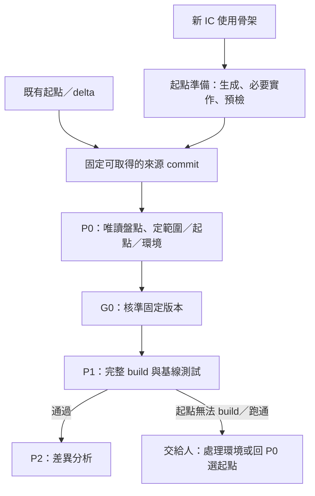

# bcgen 在 GLADOS P0／P1 的角色評估

評估日期：2026-10-08（Asia/Taipei）

文件性質：獨立評估提案，供討論與決定修改範圍。本文沒有變更 GLADOS 規則，也沒有修改 bcgen。

評估依據：兩個 repo 當前工作目錄的文件與程式，以及 bcgen 的唯讀設定檢查和記憶體內產出測試。工作目錄包含尚未提交的變更，因此不能只用 Git HEAD 代表本次閱讀版本；相關檔案 SHA-256 記在附件。

## 1. 建議決策

**bcgen 值得納入 GLADOS，但第一個角色應是 P0 的「起點盤點與設定檢查工具」。P1 可以使用它提供的設定與輸入清單，實際的基線仍由 build、載入 image 和執行測試建立。**

現有 bcgen 同時包含設定編輯、參考程式搜尋、HAL 搬入、骨架產生等能力。這些操作的責任不同，不能整個工具直接放進 P0 或 P1 的工具列表就算完成整合。

| 使用情境 | 在 P0 的角色 | 在 P1 的角色 | 本次建議 |
| :--- | :--- | :--- | :--- |
| 既有專案／delta，例如 E39 | 盤點固定起點，提供設定草稿、未知項目與來源 | 核對使用的 code、設定與 target；交給既有 build／測試工具 | 優先做，採唯讀模式 |
| 新 IC，沿用參考專案 | 協助比較起點與目標條件；提供移植缺口 | 驗證已凍結的起點是否在指定平台能跑 | 先盤點，移植實作另有責任歸屬 |
| 新 IC，使用公版骨架 | 提供生成方案與可用能力清單；起點準備完成後供 P0 選用 | 驗證生成並凍結的起點；不能一邊補 code 一邊建立基線 | 第二階段再做，先處理起點準備流程 |

建議分成三種明確操作：

1. **盤點與檢查**：只讀已指定的輸入，產生工具報告；適合 P0，也可供 P1 派工前核對。
2. **準備候選起點**：在隔離目錄產生 code、補必要實作，最後形成可取得的來源 commit；目前應在正式 P0／P1 之外完成。
3. **建立基線**：對 G0 核準的起點跑完整 build 設定與既有功能測試；由 P1 的執行工具與串接層負責。

P0／P1 本身都禁止修改 FW source。若希望生成或補實作直接成為節點內的工作，必須另行修訂節點可寫範圍、起點版本與 G0 核準對象。這是框架決策，不能靠 bcgen 的輸出目錄或 CLI 包裝避開。[S1][S2]

## 2. 本次確實檢查了什麼

### 2.1 範圍

- GLADOS：P0、P1、P2、P3，流程、產出物、檢查、專案設定、待決事項，以及 E39 專案說明。
- bcgen：CLI、project／catalog／rules、importer／coderef、settings、generate／codepkg、buildgen／linker、usercode／HAL、register 匯入及公版 code 包。
- 直接呼叫既有檢查函式；使用 PS5910 範例與在記憶體內修改的邊界案例；呼叫 `generate()` 取得產出文字，**沒有呼叫 `write_output()`**。

本次沒有實際編譯 IC image、沒有上板、沒有執行 ICE／UART／openBCT，也沒有掃描本機 duanyue 的現行 code。以下結果是評估用觀察，不是 GLADOS 的正式基線證據。

### 2.2 實測結果

| 案例 | `check_project().ok` | error／warning | build target 描述數 | linker 數 | 結論 |
| :--- | :--- | :--- | :--- | :--- | :--- |
| 原本 PS5910 範例 | true | 0／0 | 4 | 2 | 設定檢查通過；仍不能推出可 build 或可上板 |
| 將 platform 改成只有 ASIC_SIMULATION | true | 0／0 | 0 | 0 | 支援選項與實際 target 產生能力沒有連成阻擋條件 |
| 將 CPU 改成 ARM | true | 0／0 | 4 | 0 | target 函式仍列出組合，但生成器沒有可用的 ARM build 與 linker 支援 |
| 在本次 Python process 模擬找不到 code 包 | true | 0／1，CODE-PKG-NONE | 4 | 2 | 「只產設定檔」是工具允許的模式，不能當成 P1 完整輸入 |

後三列是合成邊界案例；ARM 一列不是對 PS5910 硬體 CPU 的判定。表中的 target 數是 `buildgen.targets()` 回傳的描述數，**不等於成功 build 的數量**。

另有以下觀察：

- 公版 code 包版本為 `0.1.0`，54 個模組的 metadata 是 **53 stub、1 partial**。
- PS5910 範例選用的 5 個模組，metadata 均為 stub，但 `check` 沒有 error 或 warning。
- PS5910 匯入的 register header 有 136 個，存在 `projects/ps5910/reg/`，不在專案 JSON 本體裡。
- 記憶體內產出取得 51 個 render 檔案；這個數量沒有包含後續複製的公版 code、CPU 檔案、範本及 register header。
- 產出的 `project.json` 只有 code 包路徑與版本號，沒有記錄 bcgen／catalog／範本／全部輸入的固定 hash。

**stub 數量只能說明 metadata。** Step 4 的 `project.code` 和 Step 6 的 `project.hal` 可以另外帶入實作，因此不能直接宣稱「53 個功能都完全沒寫」。反過來，也不能把 metadata 改成 done 就當成已通過功能驗證。[S5][S6]

完整觀察、來源 hash 與重跑方式見第 12 節。

## 3. 現有 bcgen 可以重用的資產

| 資產 | 已有能力 | 對 GLADOS 的價值 | 必須保留的限制 |
| :--- | :--- | :--- | :--- |
| 功能 catalog 與相依規則 | 分類、相依自動加入、互斥、CPU／image 限制 | P0 討論範圍時有一致的功能名稱，能提示「選 A 也需要 B」 | catalog 不代表所有專案的全部既有功能 |
| 專案設定與檢查 | IC、系列、CPU、image、記憶體、參數、eFuse、linker 設定 | 提供 `profile.json` 某些欄位的草稿與一致性檢查 | 不是完整 GLADOS profile；缺 repo、隔離、測試與證據等欄位 |
| 匯入現有案子 | 讀 scatter、部分 KAT／功能、IC 實作與參數、eFuse | 降低 P0 手工盤點成本 | 盡力解析；有推測、缺漏，不能把沒找到當成不存在 |
| 各案 code 參考 | 找函式定義與呼叫、列出來源行號 | P0b 討論起點；後續需求與實作的參考線索 | 現行掃描整個 src_root；不是按固定 commit 和授權範圍查詢 |
| register／eFuse 解析 | 表格、IP 摘要、register 差異、eFuse 位置 | 起點與平台資料盤點，找出版本差異與待確認項目 | register 版本與真實硬體一致仍需外部依據 |
| 注意事項 | 按功能、系列、CPU 篩出歷史問題 | P0 的風險討論，後續測試／審查的候選項目 | 其中有尚未實作的自動檢查，清單不能當 PASS 報告 |
| 公版 code 包與產生器 | 勾選模組、填設定、帶入 HAL、生成 build／linker | 新 IC 候選起點的工廠 | 多數功能是骨架，尚未提供可跑基線的保證 |
| `core/` 與 UI／CLI 分離 | 核心檢查與產生函式已獨立 | 能加程式介面與 JSON 報告，不必重做整套 UI | 目前仍依賴全域路徑、共用 catalog 與本機設定 |

最值得重用的是「已有的結構化知識和檢查」，以及「核心邏輯可以不經 UI 呼叫」；第一階段不需要先把網頁 wizard 改成 GLADOS 主介面。

## 4. P0：能扮演哪些角色

### 4.1 P0a 草擬的盤點助手

P0a 要讀來源快照、盤點起點既有功能，並草擬範圍、profile 和 environment。bcgen 可以提供以下**候選資料**，讓 AI 與人有來源可核對：[S1]

- 起點 CPU／系列／image／build 設定，以及判斷依據。
- 記憶體區域、子區域、eFuse 與 register header 清單。
- catalog 功能與起點 code 的可能對應。
- 已找到的實作、條件編譯、參數來源、未知或無法解析的項目。
- 起點與目標平台的差異，以及需要人工確認的風險。

**要改進的重點不是自動幫人勾更多功能，而是把「找到什麼、沒找到什麼、根據什麼」分開列。**

目前 importer 會依檔案存在與文字內容猜 CPU／系列，用直接數值或有限的算式讀記憶體，再讀部分 KAT 和 catalog 設定的函式。函式非空只是程式線索，不代表在指定 target 有編入、真的走到或行為正確。條件編譯與共用層需要按 build 設定解析；無法確定時應標 unknown。[S7][S8]

建議每個盤點項目至少帶以下資料，作為工具報告格式的提案：

| 欄位 | 意義 |
| :--- | :--- |
| feature／symbol | catalog 名稱或來源 code 裡的名稱；容許 catalog 外項目 |
| observation | observed（直接讀到）、inferred（推測）、unknown（無法判定） |
| implementation_state | 找到宣告、找到實作、疑似空殼、尚未判定；與 observation 分開 |
| source | repo 身分、commit、相對路徑、行號、檔案 hash |
| build_configuration | 哪些 target／條件編譯下成立；尚未解析就明寫 |
| unknown_reason | 沒有對應規則、macro 算不出來、來源不在允許集合等 |
| test_reference | 已知測項或 log 的引用；沒有就空，不能自動補成「已驗證」 |

盤點報告可先作為工具執行的原始附件，由 P0 引用到現有四種文件中。若要把 `inventory.json` 變成 GLADOS 新的正式產出物，需另外修訂產出物目錄與節點介面；本提案未假設它已經被框架接受。

### 4.2 P0b 討論的設定編輯與風險提示

網頁 wizard 對記憶體、eFuse、功能相依的討論有幫助，適合用來確認「起點和目標的條件」。但 P0b 還要決定每張 CR 與既有功能的新增、修改、保留、移除、這版不做。這些決策不是單純的功能勾選。

應建立對照，不應合併成同一個 boolean：

| 概念 | 由誰決定 | bcgen 可以做什麼 |
| :--- | :--- | :--- |
| 這版做不做、留不留 | P0b，由 G0 核準 | 提供盤點與相依提示 |
| 現有 code 是否有某項能力 | 盤點工具提供線索，後續由測試確認 | 列來源與未知項目 |
| 生成 code 要放哪些模組 | 起點準備階段的 recipe | 解相依、產生組合 |
| 功能是否已驗證 | P1 或後續驗證證據 | 引用結果，不能自行宣布通過 |

例如「新需求要支援 DICE」可以在範圍清單標新增，但不能因為 recipe 勾了 DICE 就列成起點的既有可用功能。相依規則自動加入的功能，也不能默默改動已核準的需求範圍。

### 4.3 profile／environment 的草稿提供者

bcgen 與 GLADOS 有一部分欄位相交，但兩個設定不能直接視為同一份文件。[S3]

| bcgen 資料 | 能協助的 GLADOS 欄位 | 尚缺資料 |
| :--- | :--- | :--- |
| `basic.ic`、CPU、系列 | 專案與 IC、CPU 與 toolchain | 專案編號、起點 repo／commit、實際 toolchain 版本 |
| images、platforms、boot_types | build 設定 | 原 repo 的完整 target 清單、排除條件、實際命令與支援狀態 |
| memory、link | 記憶體配置與預算草稿 | 實際 ROM／SRAM／stack 用量、量測方式、P3 的正式分配 |
| code 包版本、catalog／工具 | environment 的部分項目 | skill、MCP、知識庫、build／測試環境的固定版本 |
| 模組清單 | code 模組對照候選 | 舊專案的真實目錄、共用層、衝突熱點與依賴 |
| eFuse／register | 平台資料附件 | 硬體、regmap、bitfile 的對應版本與核對依據 |

bcgen 應回傳草稿與缺欄位清單，GLADOS adapter 再映射到 profile。既有 delta 專案不能因為 bcgen 的 target 產生器列了幾個組合，就覆蓋原本已核準的 build 設定。

本機路徑應由執行端解析 logical resource ID；不能把目前 `project.json.generated_with.code_package` 的絕對路徑直接放進正式 profile。工具自身的完整版本、catalog、範本與公版包都要鎖住，僅有 `VERSION=0.1.0` 不足以證明兩次用的是同一份內容。[S3][S4][S6]

### 4.4 P0 的環境與起點檢查助手

可增加唯讀 preflight，回傳下列結果：

- 指定來源 commit 與資料包是否可取得，內容 hash 是否相符。
- 盤點／生成／host syntax check 分別需要的 Python、gcc 等能力是否存在。
- 宣告的 CPU／platform／image 組合是否有對應支援；不支援要明確列出。
- 是否仍依賴固定機器路徑、共享 mutable 設定或未凍結的輸入。
- 缺少的檔案、來源版本或人工決策。

DS-5／Andes、ICE、FPGA、MCP 等完整環境就緒檢查仍由各專門 adapter 負責。bcgen 不需要再實作一套 ICE 或設備管理；它只核對自己依賴的輸入和能力，再提供 GLADOS 可組合的結果。

## 5. P1：能做的工作與不能替代的證據

### 5.1 提供基線輸入與一致性核對

若起點來自 bcgen，P1 可核對：生成來源 commit、recipe、code 包與工具 hash，是否對應 G0 核準的起點；實際檔案是否與封存清單一致；本次 build 設定是否完整。這項工作是核對既有來源，不能在 P1 重新生成、帶入 HAL 或修 stub。[S2][S4]

若起點來自舊 repo，P1 仍可使用 bcgen 的唯讀盤點報告了解記憶體與設定，但 build 使用該 repo 原有的 DS-5／Andes 設定，不需要先轉成 `common/modules/` 的公版結構。

### 5.2 P1 基線需要的完整鏈

```text
G0 核準的起點 commit 與 profile
  → 核對 FW／build 輸入 hash 與執行環境
  → 逐一執行 profile 列出的 build 設定
  → 確認成功、0 warning、image hash，保存 map／用量
  → 載入指定 image，綁定設備、bitfile／平台、環境版本
  → 跑起點既有功能的基線測試，保存逐 case 結果與原始 log
  → 串接層核對版本並寫證據紀錄
```

bcgen 可以協助前兩步的資料準備。後面的 build、載入、測試與正式紀錄，分別屬於 build adapter、remote-ice／測試工具、串接層。bcgen 的 stdout、HTTP 回應或檔案裡的 `ok` 不能直接決定 P1 放行。[S2][S4]

### 5.3 不同層次的通過不能混用

| 已取得的結果 | 可以證明 | 仍不能證明 |
| :--- | :--- | :--- |
| 設定檢查通過 | 已實作的設定規則未報 error | 支援完整 target、實作完成、編譯成功 |
| host syntax check 通過 | 指定 gcc 與旗標下的語法／部分型別問題未出現 | 目標 CPU startup、link、MMIO、ABI 或板上行為 |
| PC 模擬跑完 | 在模擬 hook 下走過某些控制流程 | FPGA／ASIC 的初始化、真正的 UART／NAND／安全驗證 |
| 真正 IC build 通過 | 指定輸入與工具鏈能產生 image | 0 warning，或 image 在指定硬體功能正常；兩者還要分別核對 |
| 基線測試通過 | 起點的指定既有功能在指定環境 PASS | 新需求已實作，或完整專案已通過 P5 |

現行 PC Makefile 使用 `BC_TOOL_SRCS`，實際 IC 使用 `BC_PLATFORM_SRCS`。因此 PC 模擬即使通過，也可能沒有驗到 Step 4／HAL 帶入的實際平台 code。這不降低 PC 模擬的用途，但它應是開發／預檢結果，不能替代目標硬體基線。[S5]

### 5.4 基線功能範圍必須明確

P1 要驗起點既有功能，不是把 P0 想新增的所有功能都要求已存在；但也不能為了讓空殼起點通過，把原本應保留的能力改名成「未支援」便不驗。

- Delta：以前代起點實际具有的功能建立對照；最終要移除的功能在起點仍存在，也應留下對照資料。後續 P5 是否保留其 case，再依已核準的範圍規則處理。
- 新 IC：起點可以只有明確的一組基礎能力，例如 reset／記憶體初始化／timer／UART；哪些能力真的存在、哪些是後續新增，應在 P0 說清楚。只有這組能力經 P1 在指定平台跑通，才是它的基線。
- 空殼：如果連基礎能力都不能觀察或尚未實作，P1 就不能通過。需要先完成起點準備，不能以產生成功或 `[STUB]` log 作為通過依據。

選擇很小的起點能力集合，是可能的專案策略；若 GLADOS 要正式採納，需要把其與「既有功能跑通」的解釋、測試集合來源和 G0 核準內容講清楚，不應默默降低目前的出口要求。

## 6. 新 IC 的骨架應該放在哪裡

### 6.1 現行規則的循環問題

目前 P0 的輸入已有起點 repo／commit，P0 和 P1 都不能改 FW。若候選 bcgen 骨架還缺 UART、HAL 或 boot flow，會出现：

```text
起點還不能跑 → P1 不通過 → 需要修改 code 才能跑
             → P0／P1 都不允許修改 code
```

這不是加一個 `bcgen generate` 呼叫就能解決的問題。還要指定誰準備起點、哪些必要行為算準備完成、來源怎麼提交，以及 G0 審的是哪個版本。

### 6.2 可選方案

| 方案 | 做法 | 優點 | 代價／適用時機 |
| :--- | :--- | :--- | :--- |
| A：正式流程前準備候選起點 | 工具／人先在隔離區生成與補必要實作，形成來源 commit，再交 P0 選用 | 可符合現行 P0／P1 的唯讀邊界 | 準備工作尚未由 GLADOS 管理；要另記成本與責任。短期推薦 |
| B：新增正式的起點準備階段 | 定義輸入、測試要求、可寫範圍、review、freeze，然後才由 G0 綁定起點 | 新 IC 的打底可追溯、可自動化 | 需要修改框架與核準對象；中期可討論 |
| C：允許 P0 產生 code | 擴充 P0，區分討論、候選生成與起點凍結 | 介面較集中 | P0 同時決策與實作，責任變大；仍需新增 source 權限與起點交接規則 |
| D：P1 邊生成邊修再驗證 | 在基線建立時修改 code | 操作看似直接 | 起點持續變動，無法保持驗證對象；不建議 |

建議先用 A；B／C 等確定新 IC 是試點需求，再另行決策。本文不預設新增節點，也不把生成 C source 當成一般文件輸出。

### 6.3 建議的責任流程



圖中的「起點準備」是本提案的流程外工作，不是現行 GLADOS 新增的正式節點。預檢與 smoke log 只能輔助 P0 選擇，G0 後仍由 P1 對核準的 commit 重新建立正式證據。

起點一旦交接，後續 M4 修改 source 的責任也要明確。現行 `write_output()` 每次會清空整個輸出；不能把持續開發中的 source 放在這個目錄，再讓 P1 或開發人員無條件重跑 generate。短期採一次輸出、封存 recipe、提交來源，之後由正常 FW 流程維護；未來要重生成，必須先提出差異與受影響範圍。[S6]

## 7. 需要補的能力與目前的缺口

以下優先順序以「先接上唯讀 P0；之後才讓生成起點進入正式基線」為目標。不是每一項都要塞進 bcgen。

| # | 缺口與證據 | 對 P0／P1 的影響 | 建議修改 | 責任／順序 |
| :--- | :--- | :--- | :--- | :--- |
| 1 | 現有 CLI 只有 serve、check、generate；import／code 參考主要透過 HTTP／Python 函式 | P0a 不方便在固定輸入下取得可解析盤點結果 | 新增唯讀 inspect、JSON check、穩定 exit code，保留 UI | bcgen，第一階段 |
| 2 | importer 是盡力解析；coderef 非空／字串比對未對 target 條件求值 | 可能把未編入的 code 當成既有功能，或把缺漏當成移除 | 每項保留來源、條件、推測與 unknown；按 target 解析既有設定 | bcgen，第一階段可先標未知，再補解析 |
| 3 | src_root、catalog、自訂功能、設定與快取使用共用路徑／全域狀態 | 專案混用、執行中輸入變動、無法可靠鎖版本 | 每次執行傳入不可變的 context／input bundle；不用 live settings 決定中途輸入 | bcgen 核心＋adapter，第一階段 |
| 4 | 模擬平台可 check 通過卻沒有 target；ARM 有描述但沒有實际 build 支援 | 宣告「所有設定都有檢查」時可能漏掉未支援組合 | 輸出 explicit capability matrix，逐一對照 profile；不支援不得算已執行 | bcgen＋GLADOS adapter，第一階段 |
| 5 | code 包缺失是 warning；stub／partial 狀態不阻擋產出 | 工具合法的「設定檔／骨架模式」可能被誤用成基線 ready | 區分 configuration、generation prerequisites、baseline prerequisites；報告模式清楚，P1 使用嚴格前置檢查 | bcgen＋adapter，生成整合前 |
| 6 | `project.json` 只記 code 包路徑／版本；register 是外部目錄；generate 與 write_output 重讀 code 包 | 同 JSON 可能產出不同內容；只 hash JSON 無法重現來源 | bundle 收齊全部輸入、逐檔 hash；生成全程使用同一份凍結 context | bcgen，生成整合前 |
| 7 | register 摘要 SHA-1 是解碼後文字；原始 bytes 另行複製 | Big5／換行等原始內容差異不能只靠解析摘要追溯 | 保留 UI 解析摘要，正式輸入另算原始 bytes 的 SHA-256 | bcgen，生成整合前 |
| 8 | `build.sh` 使用 `make ... | tee`，末尾 `exit 0`，沒有 pipefail；flags 是 Wall | 正常 target 分支可能遮住 make 失敗；exit 0 也不證明 0 warning | 正確傳回 make／pipeline 狀態；build adapter 保留 log、驗證產物與 warning 數 | bcgen buildgen＋build adapter，採生成 build 前必修 |
| 9 | Andes 工具路径、CPU n45、環境旗標寫死；ARM startup／DS-5／scatter 尚未完整生成 | 跨機器與新 IC 不可泛化；ARM 骨架不能直接成為 E39 起點 | 本機 toolchain resolution 與版本核對；新 CPU adapter 個別做驗收 | bcgen＋build adapter；ARM 生成支援另列專案 |
| 10 | 清空 `out/<ic>` 後重建；沒有 immutable run output／提交結果的完整機制 | 覆蓋手改與既有證據，中斷留下不完整輸出 | fresh staging、明確輸出 allowlist、逐檔 manifest、完成後發布；拒絕覆蓋已凍結目錄 | bcgen，生成整合前 |
| 11 | generated JSON 的 code 包路徑是本機絕對路徑 | 無法直接當 portable profile；輸入版本與機器配置混合 | 記 logical ID＋hash，路徑由本機 executor 解析 | bcgen adapter，第一階段 |
| 12 | 沒有 image／測試集合／平台版本／run ID 的基線證據鏈 | 無法通過 P1「證據對應目前版本」 | build、載入、測試由串接層同一派工鏈串接，結果綁定 hash | GLADOS／build／lab adapter，不由 bcgen包辦 |

第 8 項是從生成腳本內容可確認的結果傳遞問題，本次沒有實際執行 IC build。無論採 pipefail、擷取 PIPESTATUS 或直接由 runner 監督 make，都要測「make 失敗而 tee 成功」的案例，不能只檢查腳本成功編譯的一次結果。[S9]

HAL 掃描也要另外看待：目前用 host gcc、固定 Andes／FPGA／MASKROM 巨集，收集特定錯誤文字；「缺少項目已清空」不能推出所有語法、link 或硬體行為都正確。它適合起點準備時解依賴；P0／P1 的唯讀模式不可順便執行 `apply` 或 auto-import 改輸入。[S10]

## 8. 建議的工具與 GLADOS 分工

### 8.1 bcgen 專注於哪些能力

- 解析與盤點 bootcode 專案設定、功能線索、記憶體、eFuse、register。
- 解功能相依、提供設定一致性檢查與未知清單。
- 在明確生成模式下，從固定 recipe／code 包準備候選 source。
- 輸出來源清單、能力支援矩陣與完整檔案 manifest。

### 8.2 GLADOS adapter 專注於哪些能力

- 把核準起點與執行端本機路徑對接；只傳入允許來源的固定快照。
- 把 bcgen 候選欄位映射成 GLADOS profile／environment 的草稿與檢查結果。
- 管理派工、timeout、取消與 log 收集，保存工具回應。
- 核對 profile 的全部 build 設定；缺支援或未執行不能略過。
- 呼叫既有 build、載入與測試工具，將結果交給串接層核對。

### 8.3 串接層保留哪些權責

- 決定輸入是否最新且已通過、核準是否有效。
- 自己計算產出物 hash、核對可寫範圍，決定放行或退回。
- 寫正式執行／證據紀錄；處理 scope／起點／環境變更的影響。

bcgen 可以回傳觀察結果與自己計算的 hash 供對照，但正式 hash 與 PASS／FAIL 仍依 GLADOS 的紀錄規則由串接層核對。不要讓工具直接寫「G0 已核準」「P1 完成」或移動正式測試基準。[S4]

## 9. 輸入凍結與資料格式提案

### 9.1 不能只封存專案 JSON

要重現生成結果，至少要固定：

1. bcgen 程式版本／內容 hash。
2. platform／features／subregions catalog、自訂功能及注意事項的版本。
3. code 包：include、core、app、modules、templates、CPU startup 等實際 bytes。
4. recipe：basic、memory、features、init、code、params、eFuse、link、HAL。
5. register header 的原始 bytes，及其來源身分／版本。
6. 參考 code 的允許 snapshot；已搬入的片段仍需保留來源與轉換紀錄。
7. 生成參數與本機環境解析結果；本機路徑留在執行紀錄或 local config，不作 portable profile 的身分。

所有輸入一次解析成凍結 context，再進行 check／render／copy；不能 check 使用 A 版，copy 時又讀到 B 版。運行時間等事件 metadata 應另存，source content hash 不應因為 log 時間戳而任意改變。

### 9.2 最小工具報告範例

下列是**提案格式**，不是現有指令已會輸出的內容，也不是已定案的 GLADOS schema。`inventory` 與 `generation` 可各自有報告，避免使用一個 `ok` 表達全部成熟度。

```json
{
  "format": "bcgen.inventory/v1",
  "source": {
    "repository_id": "authorized-source",
    "commit": "<fixed SHA>",
    "input_manifest_hash": "<sha256>"
  },
  "observations": [
    {
      "feature": "uart",
      "observation": "inferred",
      "implementation_state": "unconfirmed",
      "source_locations": [
        {"path": "proj/<ic>/phal/phal_uart.c", "line": 1, "hash": "<sha256>"}
      ],
      "build_configuration": "<target>",
      "unknown_reason": "conditional compilation not resolved"
    }
  ],
  "configuration_errors": [],
  "unsupported_build_configurations": [],
  "unknown_items": [],
  "baseline_validation_performed": false
}
```

生成封存另加 recipe／工具／code 包／catalog hash、逐檔 output manifest、source tree hash、生成後來源 commit。GLADOS 再用這些資訊綁定起點；後續 build image hash 是另一個欄位，不能拿 source tree hash 代替。

### 9.3 recipe 與 source 的維護責任

短期推薦：生成只用來準備一次候選起點。封存 recipe 與 manifest 後，交接的是完整 source commit，後續以 FW source 為開發依據。

如果未來希望持續由 recipe 重生成，就要訂明哪些檔案屬於模板、哪些可以由 M4 改、手改如何回到 recipe、重生成差異怎麼 review。這是新的維護模型，應另做設計，不能在 P0／P1 整合時順便默認。

## 10. E39 與新 IC 的實際落地建議

### 10.1 E39：先做唯讀盤點 PoC

E39 文件指定 PS5037 前代起點、ARM Cortex-R5／DS-5，並禁止 agent 看到傳統 PS5039 開發成果。[S11]

推薦流程：

1. 由 GLADOS／人提供只含允許來源的隔離 repo，固定指定的 PS5037 起點 commit。
2. bcgen inspect 只讀這份 snapshot，列 CPU／系列、4 個既有 build 設定、記憶體、eFuse／register，以及功能候選與未知。
3. 與起點 code、來源快照／既有測試清單交叉核對，供 P0a 草擬與 P0b 定案；bcgen 不能取代 Jira／Confluence 來源快照的完整性檢查。
4. P1 保留原 source 結構與 DS-5 build，對核準起點產出 image 與基線 log。

不建議先把 E39 轉成 bcgen 公版 source。那會同時改變目錄、模組、初始化、安全流程與 build，失去同一起點比較的價值，並超出原本 delta 的工作範圍。**ARM 生成支援不是 E39 唯讀 PoC 的前提。**

目前 settings 指向本機 duanyue 的一般工作目錄，coderef 又會遞迴掃描全部 `.c`。即使最後只回傳 PS5037 的定義，也不能保證 agent 沒讀到不允許的內容。第一階段一定要改成或包裝成明確指定的隔離 snapshot；不可只在回傳結果做字串過濾。[S8]

工具 catalog、模板、預存 project/HAL、知識庫也屬於參考資訊來源；E39 的隔離要求不只適用於 Git branch。需檢查採用的版本和資料是否符合試點的資訊邊界。

### 10.2 新 Andes IC：另做最小可跑起點 PoC

等唯讀路徑穩定後，再挑一個已支援的 Andes／FPGA 組合：

- 先定義起點必備的最小能力與觀察方法；例如初始化完成、timer 可用、UART 輸出指定訊號。
- 依核準輸入資料準備候選 source，補必要平台 hook／HAL；不要一開始就選完整 NAND／安全／host 功能。
- 修正 build 結果傳遞與完整輸入封存；先證明相同输入能得到相同來源內容。
- 建立來源 commit，再由 P0／G0 綁定，P1 重新執行 target build 與 smoke／既有能力測試。

某項必備能力仍是 stub、實際 target 不支援、沒有可用硬體或測試觀察時，分別列為缺實作、缺工具能力或驗證缺口；不能全部揉成「check failed」，也不能視為已完成。

## 11. 建議修改順序與驗收

### 第一階段：先拿到 P0 的價值

**工作包：唯讀 inspect／JSON 報告＋固定來源 context＋能力支援矩陣＋profile 草稿 mapping。**

先支援一個 delta 來源，保留不完整項目為 unknown。不要同時搬 source、補 ARM code 包、重做 UI 或建立新的 lab 控制框架。

驗收條件：

- 所有來源在執行前明確指定並核對版本，沒有掃描一般工作目錄的隱含 fallback。
- repo／來源快照的檔案 bytes 未變；盤點工具沒有寫入 FW source 或共用 catalog。
- 既有 target 全部列出；不知道／不支援的 target 明確回報，不以少列幾個組合通過。
- 每項盤點附來源；未識別的功能／macro／條件保持 unknown，不能自動寫成不存在。
- 基本資訊可映射到 profile 草稿；缺欄位列出；正式 profile 沒有機器路徑。
- 相同固定輸入在不同執行中產生一致的內容結果；事件時間與來源內容 hash 分開。

### 第二階段：生成的起點可以可靠交接

**工作包：完整 input bundle、不可變執行 context、完整 output manifest、隔離產出、build 回傳修正、必備 hook 與 stub 缺口檢查。**

驗收條件：

- 無 code 包、無必需檔案、無對應 target 時，不能標為完整生成輸入 ready；保留原設定檔模式也要明確標註。
- 改任一 register／範本／catalog／recipe 輸入，都會改變對應輸入 hash；只搬機器路徑不會改 portable source 身分。
- 連續兩次同輸入生成的 FW／build 來源內容一致，manifest 覆蓋實際複製的所有檔案。
- 失敗／取消不會損壞已封存起點；不能覆蓋既有開發 source。
- 故意讓 make 失敗、保留舊 image、產生 warning、漏一個 target，都不能得到有效的 P1 build 通過結果。
- 已生成起點形成可取得的 commit；G0 綁的是這個 commit 與固定輸入，不是暫時的 out 目錄。

這一階段包含 source 準備；先採流程外準備方案，或先決定新的正式準備階段，不能在 P0／P1 禁寫 source 的規則下直接開做。

### 第三階段：接上 P1 的實際證據鏈

**工作包：既有 build adapter＋image 載入／測試串接＋逐 target／case 報告＋正式紀錄映射。**

驗收條件：

- 每個核準 build 設定都有本次結果、0 warning、實際產物與 image hash。
- 每條基線 case 的 image、測試集合、平台／環境版本都可核對；舊 log／舊 image 不能混用。
- host syntax check、PC 模擬、未執行、環境錯誤、驗證缺口不能升格成硬體功能 PASS。
- 串接層能核對目前版本並寫正式證據；bcgen／節點本身不能直接寫完成或核準狀態。

### 尚需討論的決策

1. 首個使用場景是 E39 唯讀盤點，還是新 Andes IC 骨架？本次推薦先 E39 盤點，再獨立驗證骨架。
2. 新 IC 的起點準備採流程外工作，還是新增正式階段？需要先決定責任與版本交接。
3. 起點既有能力與基線測試集合由哪些來源列出，誰確認完整？不能直接用 catalog 勾選清單代替。
4. recipe 是一次性生成依據，還是持續維護的主要來源？本次推薦短期一次性輸出與封存。
5. 工具／catalog／模板改版會使哪些產出物過期？目前 GLADOS 的環境清單中途改版規則仍有待決事項，本文不替它定案。[S12]

建議用 PoC 量測人工盤點時間、unknown 解決數、來源可追溯率、漏 target 的攔截效果與人工修正次數，再估計後續工時。單靠模組數、產出檔案數或一次 `check OK`，無法估出整合 ROI 或 FW 完成度。

## 12. 附件、重跑與來源索引

### 12.1 獨立附件

- [observations.json：觀察結果與來源 SHA-256](observations.json)
- [inspect_bcgen.py：重跑唯讀觀察](inspect_bcgen.py)

在 GLADOS repo 根目錄執行下方指令；範例假設 bct_knowledge_base 位於相鄰目錄，實際位置不同時調整參數。腳本只讀兩個 repo；JSON 輸出必須放在兩個 repo 之外。缺 code 包的案例只替換當次 process 的函式，隨後恢復；不刪除任何檔案。腳本禁止 Python bytecode 寫入，沒有執行磁碟生成、真正 build 或來源 code 掃描。

```powershell
python -B assessments/bcgen-p0-p1/inspect_bcgen.py --bcgen-root ../bct_knowledge_base/tools/bcgen --glados-root . --output ../bcgen_glados_assessment_latest.json
```

發布版 observations.json 將三處本機絕對根目錄改成邏輯標記；保留原觀察時間、測值、來源版本與 SHA-256，沒有重新執行測試。來源連結固定在評估時的 commit。

這份 JSON 的 hash 用來讓讀者知道評估針對哪份工作目錄內容，不是由 GLADOS 串接層產生的正式證據。重新執行會取得當時的來源版本，結果可能隨工具修改而不同。

### 12.2 來源索引

| 索引 | 來源 | 本文使用的依據 |
| :--- | :--- | :--- |
| S1 | [GLADOS P0](https://github.com/kevintsou/glados/blob/1d4fe12fc4cd25de46177f64d2d218bd7c31b407/nodes/P0.md#L5) | 輸入／輸出、P0a／P0b、禁止改 source、G0 |
| S2 | [GLADOS P1](https://github.com/kevintsou/glados/blob/1d4fe12fc4cd25de46177f64d2d218bd7c31b407/nodes/P1.md#L5) | 所有 build 設定、既有功能、hash、起點失敗、唯讀邊界 |
| S3 | [GLADOS 專案設定](https://github.com/kevintsou/glados/blob/1d4fe12fc4cd25de46177f64d2d218bd7c31b407/framework/07_project_profile.md#L11) | profile 欄位、機器路徑與憑證不得放入 |
| S4 | [產出物與 hash](https://github.com/kevintsou/glados/blob/1d4fe12fc4cd25de46177f64d2d218bd7c31b407/framework/03_artifacts.md#L42)、[檢查](https://github.com/kevintsou/glados/blob/1d4fe12fc4cd25de46177f64d2d218bd7c31b407/framework/05_checks.md#L9) | 正式證據、SHA-256、FW／build 輸入、只寫允許範圍 |
| S5 | [codepkg](https://github.com/kevintsou/bct_knowledge_base/blob/458201183677a95d813948f3e474027d99136da6/tools/bcgen/core/codepkg.py#L30)、[project check](https://github.com/kevintsou/bct_knowledge_base/blob/458201183677a95d813948f3e474027d99136da6/tools/bcgen/core/project.py#L74) | code 包缺失、模組 metadata、檢查範圍、PC／IC 檔案分工 |
| S6 | [產生器](https://github.com/kevintsou/bct_knowledge_base/blob/458201183677a95d813948f3e474027d99136da6/tools/bcgen/core/generate.py#L159)、[register 存取](https://github.com/kevintsou/bct_knowledge_base/blob/458201183677a95d813948f3e474027d99136da6/tools/bcgen/core/reghdr.py) | JSON 快照、清空產出、重讀 code 包、外部 register 目錄與 hash |
| S7 | [現有案子匯入](https://github.com/kevintsou/bct_knowledge_base/blob/458201183677a95d813948f3e474027d99136da6/tools/bcgen/core/importer.py#L127)、[必填 code 檢查](https://github.com/kevintsou/bct_knowledge_base/blob/458201183677a95d813948f3e474027d99136da6/tools/bcgen/core/usercode.py#L28) | 盡力解析、功能缺漏、非空不代表功能正確 |
| S8 | [code 參考搜尋](https://github.com/kevintsou/bct_knowledge_base/blob/458201183677a95d813948f3e474027d99136da6/tools/bcgen/core/coderef.py#L16)、[本機設定](https://github.com/kevintsou/bct_knowledge_base/blob/458201183677a95d813948f3e474027d99136da6/tools/bcgen/core/settings.py#L17) | 遞迴掃描、全域路徑與快取 |
| S9 | [build 生成](https://github.com/kevintsou/bct_knowledge_base/blob/458201183677a95d813948f3e474027d99136da6/tools/bcgen/core/buildgen.py#L23)、[linker](https://github.com/kevintsou/bct_knowledge_base/blob/458201183677a95d813948f3e474027d99136da6/tools/bcgen/core/linker.py#L38) | 固定路徑／CPU、platform 過濾、ARM 缺支援、pipeline 與 exit 0 |
| S10 | [HAL 掃描](https://github.com/kevintsou/bct_knowledge_base/blob/458201183677a95d813948f3e474027d99136da6/tools/bcgen/core/halimport.py#L134) | host syntax scan、固定巨集、缺項收集與帶入 |
| S11 | [E39](https://github.com/kevintsou/glados/blob/1d4fe12fc4cd25de46177f64d2d218bd7c31b407/projects/E39.md#L21) | Delta／ARM 起點、禁止來源、build 設定與隔離 |
| S12 | [GLADOS 待決事項](https://github.com/kevintsou/glados/blob/1d4fe12fc4cd25de46177f64d2d218bd7c31b407/framework/08_open_questions.md#L11) | 環境清單改版、格式及實作仍待定 |
| S13 | [bcgen README](https://github.com/kevintsou/bct_knowledge_base/blob/458201183677a95d813948f3e474027d99136da6/tools/bcgen/README.md)、[公版 code 包](https://github.com/kevintsou/bct_knowledge_base/blob/458201183677a95d813948f3e474027d99136da6/tools/bcgen/bootcode_ai/README.md) | 工具用途、wizard、輸出、stub／PC 模擬設計 |

本提案新增的 CLI、報告格式、input bundle、嚴格前置檢查與流程位置，均為建議能力；第 2 節與附件中的測試結果才是這次確認的現況。
