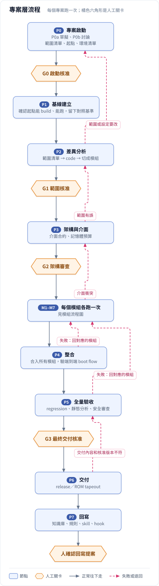
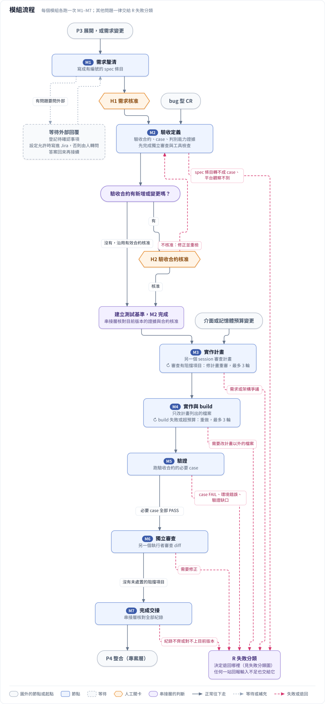

# 02 流程

> **這份文件回答**：流程怎麼走、有哪些節點、哪裡要人核准、遇到例外時交給誰、模組之間怎麼排。
>
> 每個節點的介面細節見 [nodes/](../nodes/README.md)；串接層怎麼判斷放行與退回見 [04 串接層規則](04_rules.md)。

---

## 2.1 專案層流程

圖源：[`diagrams/src/01_project_flow.mjs`](../diagrams/src/01_project_flow.mjs)

- **主流程**（實線，由上往下）：P0 → G0 → P1 → P2 → G1 → P3 → G2 → 各模組跑 M1–M7 → P4 → P5 → G3 → P6 → P7 → 人確認。
- **失敗退回**（紅色虛線）：P2 發現範圍清單或專案設定要改，回 P0；P2 發現基線缺既有功能的測試結果，回 P1；P3 範圍有誤回 P2；模組遇到介面衝突回 P3；P4、P5 失敗回對應的模組；P6 交付內容和核准版本不符回 P5。
- **圖上沒畫的**：關卡不核准時退回關卡前的那一站；超過迴圈上限或遇到環境問題時交給人；變更 CR、來源快照有差異與新 commit 的處理見 §2.5。

**P0、P2 各分兩段**：

- P0a 由 AI 草擬，P0b 由人和 AI 一起討論定案（[nodes/P0](../nodes/P0.md)）。
- P2a 由 AI 分析；發現 CR 不夠用時，在 P2b 由人和 AI 一起整理 CR（拆分、補 CR、澄清、修改），不另開節點（[nodes/P2](../nodes/P2.md)）。

範圍在 P0 決定「做不做、留不留」；P2 只負責把已核准的範圍對到 code、切成模組，必要時整理 CR；M1 再決定每個模組的行為細節。三站不重複討論同一件事。

---

## 2.2 節點總表

| 節點 | 做什麼 | 主要產出物 | 人怎麼參與 | 出口關卡 |
| :---- | :---- | :---- | :---- | :---- |
| [P0 專案啟動](../nodes/P0.md) | 定範圍（新增、修改、保留、移除）、起點、環境；確認環境就緒 | project.md、範圍清單、專案設定、環境清單 | P0b 與 AI 一起討論 | G0 啟動核准 |
| [P1 基線建立](../nodes/P1.md) | 確認起點能 build、能跑，留下對照基準 | 基線報告 | 只在關卡 | — |
| [P2 差異分析](../nodes/P2.md) | 範圍清單 → code → 切成模組；必要時整理 CR | 差異分析、CR 修訂紀錄 | P2b 與 AI 一起整理 CR（有修訂提案時） | G1 範圍核准 |
| [P3 架構與介面](../nodes/P3.md) | 定模組邊界、介面、記憶體預算 | 架構文件 | 與 AI 一起做（架構審查會議） | G2 架構審查 |
| [P4 整合](../nodes/P4.md) | 合入所有模組，驗端到端 boot flow | 整合 branch、boot flow 報告 | 只在關卡 | — |
| [P5 全量驗收](../nodes/P5.md) | 證明其他功能沒被改壞 | 全量驗收報告 | 只在關卡 | G3 最終交付核准 |
| [P6 交付](../nodes/P6.md) | 交出最終版本 | release 包 | 由人執行 | — |
| [P7 回寫](../nodes/P7.md) | 把這次的錯變成下次的能力 | 回寫提案 | 確認 AI 的提案 | 人確認 |
| [C 變更分析](../nodes/C.md) | 判斷變更 CR 的影響 | 影響報告 | 與 AI 一起做（討論接不接） | GC 變更核准 |
| [M1 需求釐清](../nodes/M1.md) | 把需求寫成有編號的 spec 條目 | 模組 spec | 第二段（M1b）與 AI 一起討論 | H1 需求核准 |
| [M2 驗收定義](../nodes/M2.md) | 寫 code 之前先定「什麼叫做完」 | 驗收合約、測試實作 | 只在關卡 | H2 驗收合約核准（合約新增或變更時） |
| [M3 實作計畫](../nodes/M3.md) | 把 spec 和 case 轉成計畫，另一個 session 審查 | 實作計畫 | 不參與 | — |
| [M4 實作與 build](../nodes/M4.md) | 依計畫改 code | 模組 commit | 不參與 | — |
| [M5 驗證](../nodes/M5.md) | 證明 image 符合驗收合約 | 驗證報告 | 不參與 | — |
| [M6 獨立審查](../nodes/M6.md) | 由另一個執行者審查 diff | 審查報告 | 不參與 | — |
| [M7 完成交接](../nodes/M7.md) | 串接層核對模組全部紀錄 | 模組交接包 | 不參與 | — |

---

## 2.3 模組流程

圖源：[`diagrams/src/02_module_flow.mjs`](../diagrams/src/02_module_flow.mjs)

- **主流程**（實線，由上往下）：M1 → H1 → M2 →（合約有新增或變更才經 H2）→ M3 → M4 → M5 → M6 → M7 → P4 整合。
- **M1 有問題要問外部**時，節點轉為「等待外部回覆」，答案回來再從 M1 接續。
- **在節點內重做**（框裡標 ↻）：M3 審查有阻擋項目就在 M3 內修計畫重審；M4 build 不過、有 warning 或超出預算就重做，最多 3 輪。
- **其他問題一律交給 R 失敗分類**（紅色虛線），由它決定退回哪裡（[04 §4.5](04_rules.md#45-r-失敗分類)）。

**模組流程從哪裡進來**：

| 從哪裡來 | 進入點 |
| :---- | :---- |
| P3 展開（第一次） | M1 需求釐清 |
| C 變更分析：需求變更（spec 要改） | M1 需求釐清 |
| C 變更分析：bug 型 CR（spec 本來就對，是 code 錯） | M2 驗收定義：先補一個能重現 bug 的 case |
| P3 改版（介面或記憶體預算變了） | M3 實作計畫 |
| R 失敗分類的退回 | 依問題類型回到 M1–M4 |

---

## 2.4 人工關卡

| 關卡 | 位置 | 核准什麼 | 什麼時候要重開 |
| :---- | :---- | :---- | :---- |
| G0 啟動核准 | P0 專案啟動的出口 | project.md、範圍清單、專案設定、環境清單；固定專案範圍、起點與環境，核准時間就是範圍凍結點 | 改基底、平台或 toolchain；範圍清單改版 |
| G1 範圍核准 | P2 差異分析的出口 | 整理後的來源快照與 CR 修訂紀錄、範圍清單對到 code 的結果、模組切分與 regression 範圍；綁定版本與 hash，建立需求基準 | 追加模組、模組切分或 CR 修訂改變 |
| G2 架構審查 | P3 架構與介面的出口 | 架構文件：介面合約、記憶體預算、錯誤碼、boot flow 變更 | 介面或記憶體預算改變 |
| G3 最終交付核准 | P5 全量驗收之後、P6 交付之前 | 全量驗收結果，綁定整合 branch 的 commit 與 image hash | 驗收證據改變（例如 image 變了） |
| GC 變更核准 | C 變更分析的出口 | 這張變更 CR 這一版接或不接 | 每張變更 CR 各一次 |
| H1 需求核准 | M1 需求釐清的出口 | 模組 spec 的條目 | spec 條目改版 |
| H2 驗收合約核准 | M2 驗收定義的出口（合約新增或變更時） | 驗收合約：預期行為、判定方式、必要覆蓋 | 合約改變；在合約內補 case 不重開 |
| 人確認 | P7 回寫的出口 | 回寫提案（知識庫、規則、skill、hook） | — |

所有關卡共同的規則：

- **關卡只做決定，討論在前一站**：需要討論的關卡，前面都有一個互動式的節點或段落（P0b → G0、P2b → G1、P3 架構審查會議 → G2、C 的討論 → GC、M1b → H1）；其他關卡（G1 沒有 P2b 時、H2、G3、P7 的人確認）只需要審閱。
- **核准人**：每個關卡由專案設定列的核准人核准（[07](07_project_profile.md)）。
- **最後一步必須由人親自完成**：送出決定的那個動作，必須是 AI 無法代為完成的；AI 可以協助審閱，但不能替人核准。這樣無人在旁的節點不可能核准自己的產出，互動中 AI 也不會把一句「ok」當成核准。
- **AI 不給核准建議**：AI 協助審閱時，只把差異、檢查結果、還沒解決的項目擺出來，並讓核准人對每個關鍵風險逐項表態（例如「B4 有驗證缺口，這版接受嗎？」），不說「建議核准」。避免人照著建議直接按下去，讓關卡失去作用。
- **核准要綁定**核准的人、核准的對象（編號、版本、內容 hash）與核准範圍（[03 §3.6](03_artifacts.md#36-核准與決定紀錄)）。對象出了新版，舊核准就失效。
- **重審只看差異**：重開關卡時，呈現差異與受影響範圍。舊核准保留作稽核，但不能拿來核准新版本。
- **不核准**：退回關卡前的那一站修正。
- **核准在動作之前**：G3 放在 P6 交付之前，因為 mask ROM 交付後不能回頭（待確認：[08 框架第 2 項](08_open_questions.md#81-框架待決)）。
- 關卡是否都需要、P7 的人確認要不要算正式關卡，待決（[08 框架第 1、3 項](08_open_questions.md#81-框架待決)）。

**G0 與 G1 的分工**：G0 固定專案範圍；專案第一次通過 G1 前，CR／spec 的新增或修改都在 P0／P2 整理，不依修改者區分。P2b 定案即由工具更新 Jira（專案設定允許時），不等 G1；G1 審核整理後的結果並建立需求基準。第一次通過 G1 後，需求變更一律走 C＋GC；即使之後重開 G1 或退回 P0／P2，也不恢復成開案時可直接整理需求的階段。具體規則見 [04 §4.6](04_rules.md#46-c-變更處理)。

**一個關卡怎麼簽**：串接層準備審查包（核准對象、和上次核准的差異、檢查結果、還沒解決的項目）→ 通知核准人 → 核准人審閱並逐項表態 → 核准人親自送出決定 → 串接層確認決定綁定的 hash 和審查包一致，寫入核准紀錄。「交給人」之後的決定也用同一套流程。實作方式（簽核 skill、確認動作）見 [impl/gate_signoff](../impl/gate_signoff.md)。

---

## 2.5 例外情況交給誰

主流程之外的情況，都由串接層的三個機制加上「交給人」處理：

| 情況 | 由誰處理 | 結果 | 規則 |
| :---- | :---- | :---- | :---- |
| 節點內部、P4 整合或 P5 全量驗收發現問題 | R 失敗分類 | 依問題類型退回某一站，或交給人 | [04 §4.5](04_rules.md#45-r-失敗分類) |
| 第一次通過 G1 前，CR／spec 新增或修改 | P0／P2 整理 | 不改已核准範圍的留在 P2；改範圍、起點或平台的回 P0 重開 G0 | [nodes/P2](../nodes/P2.md) |
| 第一次通過 G1 後，CR／spec 新增或修改（含取消 CR） | C 變更分析＋GC | 不接就記錄；接就從受影響的那一站重走 | [04 §4.6](04_rules.md#46-c-變更處理) |
| 有人直接 commit、執行期間輸入被改、branch 分岔 | S 版本同步 | 判斷影響，標記過期、轉給 C 或 R，或擋住交給人 | [04 §4.7](04_rules.md#47-s-版本同步) |
| 超過迴圈上限、環境問題、判不出原因 | 交給人 | 人決定重跑、指定退回、自己做，或這版不做 | [04 §4.9](04_rules.md#49-迴圈上限與交給人) |

R、C、S 都不是流程上的一站，而是串接層的規則。它們需要語意判讀時，串接層會另外派一次獨立分析，但分析結果只是規則的輸入，最後怎麼走仍由規則決定。

---

## 2.6 模組之間

- **模組切分、相依與執行順序**由 P2 差異分析決定；**模組對外介面**由 P3 決定。
- **改到同一個衝突熱點檔案的模組要序列執行**；其他模組能不能平行，待決（[08 框架第 7 項](08_open_questions.md#81-框架待決)）。
- **每個模組各跑一次 M1–M7**。所有模組完成 M7 後才進入 P4；P4、P5 失敗時，經 R 失敗分類回到對應模組。
- **模組已經合入整合 branch 後又被重新打開**時，P4、P5 的結果一併過期。
