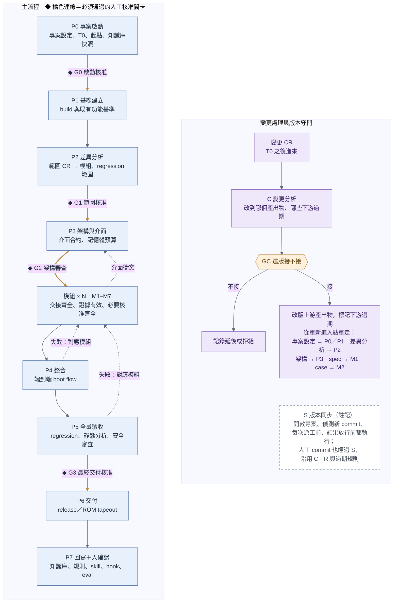
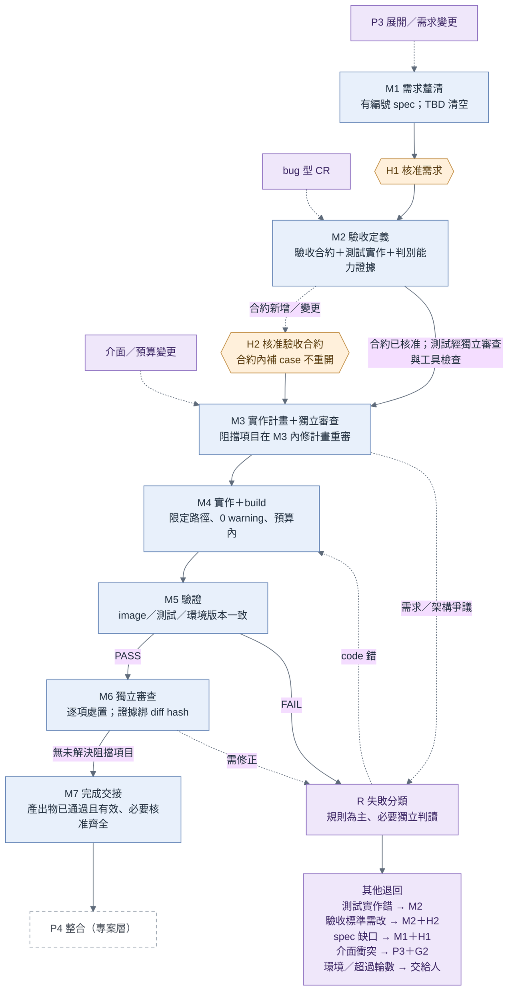

# GLADOS 流程定義（v0.7 討論稿）

> 這份文件說明流程怎麼走：有哪些節點、節點之間怎麼接、哪裡有人工關卡、產出物之間的相依。每個節點的詳細介面見 [nodes/](../nodes/README.md)；串接層怎麼判定放行見 [03 串接層規則](03_rules.md)。

---

## 2.1 節點總表

| 節點 | 名稱 | 層級 | 人怎麼參與 | 出口關卡 |
| :---- | :---- | :---- | :---- | :---- |
| [P0](../nodes/P0.md) | 專案啟動 | 專案 | 與 AI 一起做 | G0 啟動核准 |
| [P1](../nodes/P1.md) | 基線建立 | 專案 | 只在關卡 | — |
| [P2](../nodes/P2.md) | 差異分析 | 專案 | 只在關卡 | G1 範圍核准 |
| [P3](../nodes/P3.md) | 架構與介面 | 專案 | 與 AI 一起做（架構審查會議） | G2 架構審查 |
| [P4](../nodes/P4.md) | 整合 | 專案 | 只在關卡 | — |
| [P5](../nodes/P5.md) | 全量驗收 | 專案 | 只在關卡 | G3 最終交付核准 |
| [P6](../nodes/P6.md) | 交付 | 專案 | 由人執行 | — |
| [P7](../nodes/P7.md) | 回寫 | 專案 | 確認 AI 的回寫提案 | 人確認 |
| [C](../nodes/C.md) | 變更分析 | 變更 | 與 AI 一起做（討論接不接） | GC 變更核准 |
| [M1](../nodes/M1.md) | 需求釐清 | 模組 | 第二段（M1b）與 AI 一起討論 | H1 需求核准 |
| [M2](../nodes/M2.md) | 驗收定義 | 模組 | 只在關卡 | H2 驗收合約核准（合約新增或變更時） |
| [M3](../nodes/M3.md) | 實作計畫 | 模組 | 不參與 | — |
| [M4](../nodes/M4.md) | 實作與 build | 模組 | 不參與 | — |
| [M5](../nodes/M5.md) | 驗證 | 模組 | 不參與 | — |
| [M6](../nodes/M6.md) | 獨立審查 | 模組 | 不參與 | — |
| [M7](../nodes/M7.md) | 完成交接 | 模組 | 不參與 | — |

**S 版本同步**與 **R 失敗分類**不是流程上的一站，而是串接層的規則：

- **S 版本同步**（[03 §3.8](03_rules.md)）：開啟專案、偵測到新 commit、每次派工前、每次放行前都會執行。
- **R 失敗分類**（[03 §3.6](03_rules.md)）：模組內部發現問題時，決定退回哪一站。

這兩者需要語意判讀時，串接層會另外派一次獨立分析，但分析結果只是規則的輸入，最後怎麼走仍由規則決定。

---

## 2.2 專案層流程

**圖：專案層流程**

[可編輯 Mermaid 圖源](../diagrams/glados_project_flow.mmd)

圖例：藍色為執行節點；橘色連線（標 ◆）與橘色六角形為人工核准關卡；紫色為變更路由；白色虛框為註記；虛線表示回退或重新進入。

- **主流程**：P0 → P1 → P2 → P3 → 各模組跑 M1–M7 → P4 → P5 → P6 → P7。
- **C 變更分析不在主流程上**，只有變更 CR 進來，或版本同步發現需要範圍／需求決策時才啟動（[03 §3.7](03_rules.md)）。
- **S 版本同步不是一站**，畫成註記；它在開啟專案、偵測新 commit、每次派工前、結果放行前都會執行。同步與檢查不等於自動 merge 或 rebase（[03 §3.8](03_rules.md)）。
- **失敗回退**：P4 整合、P5 全量驗收失敗時，回到對應的模組；模組內遇到介面衝突時，回到 P3。

---

## 2.3 模組流程

**圖：模組流程**

[可編輯 Mermaid 圖源](../diagrams/glados_module_flow.mmd)

- H2 只在驗收合約新增或變更時核准；在已核准的合約內補 case 不重開 H2。
- M3 審查有阻擋項目時，在 M3 內修計畫重審；牽涉需求或架構的爭議，和 M6 的需修正項目一樣，經 R 失敗分類退回對應的節點與關卡。
- M7 完成交接後，模組進入專案層的 P4 整合。
- 每次派工與放行前都會做 S 版本同步檢查。

**模組流程的進入點**（圖左側）：

| 從哪裡來 | 進入點 |
| :---- | :---- |
| P3 展開（第一次） | M1 需求釐清 |
| C 變更分析：需求變更（spec 要改） | M1 需求釐清 |
| C 變更分析：bug 型 CR（spec 本來就對，是 code 錯） | M2 驗收定義：先補一個能重現 bug 的 case |
| P3 改版（介面或記憶體預算變了） | M3 實作計畫 |

---

## 2.4 人工關卡

| 關卡 | 位置 | 核准什麼 | 什麼時候要重開 |
| :---- | :---- | :---- | :---- |
| G0 啟動核准 | P0 專案啟動的出口 | project.md 與專案設定 | 改基底、平台或 toolchain |
| G1 範圍核准 | P2 差異分析的出口 | 差異分析（delta.md）的範圍、模組切分與 regression 範圍 | 追加模組或範圍改變 |
| G2 架構審查 | P3 架構與介面的出口 | 架構文件（arch.md）：介面合約、記憶體預算、錯誤碼、boot flow 變更 | 介面或記憶體預算改變 |
| G3 最終交付核准 | P5 全量驗收之後、P6 交付之前 | 全量驗收結果，綁定整合 branch 的 commit 與 image hash | 驗收證據改變（例如 image 變了） |
| GC 變更核准 | C 變更分析的出口 | 這張變更 CR 這一版接或不接 | 每張變更 CR 各一次 |
| H1 需求核准 | M1 需求釐清的出口 | 模組 spec 的條目 | spec 條目改版；重審時只審差異與受影響範圍 |
| H2 驗收合約核准 | M2 驗收定義的出口（合約新增或變更時） | 驗收合約：預期行為、判定方式、必要覆蓋 | 合約改變；在合約內補 case 不重開 |
| 人確認 | P7 回寫的出口 | 回寫提案（知識庫、規則、skill、hook） | — |

所有關卡共同的規則：

- **核准要綁定**：核准的人、核准的對象（編號、版本、內容 hash）、核准範圍。格式見 [04 §4.4](04_records.md)。
- **重審只看差異**：重開關卡時，呈現差異與受影響範圍。舊核准保留作稽核，但不能拿來核准新版本。
- **人只守關卡**：中間的計畫、diff、報告不逐份要求人簽，由檢查與獨立審查放行。
- **G3 的位置**（v0.7 調整，待確認）：v0.6 的圖把 G3 畫在 P5→P6 的連線上，表格卻寫成 P6 的出口條件。v0.7 統一成「進入 P6 之前核准」，因為 mask ROM 交付後不能回頭，核准必須在動作之前。

---

## 2.5 產出物與相依

下表是「哪個節點產出什麼、誰會用到、改版時從哪裡重走」。細到條目的追溯規則見 [03 §3.5](03_rules.md)。

| 產出物 | 產出節點 | 會用到的節點 | 改版時的重新進入點 |
| :---- | :---- | :---- | :---- |
| project.md、專案設定 | P0 | 全部 | P0／P1；所有證據過期；重開 G0 |
| 基線報告、既有功能 golden log | P1 | P2、M2、P5 | P1 之後依相依重走 |
| 差異分析（delta.md） | P2 | P3、C、M1 | P2；新模組從 M1 開始；重開 G1 |
| 架構文件（arch.md） | P3 | M1、M3、M4、P4 | P3；依賴該介面的模組從 M3 重走；重開 G2 |
| 模組 spec 條目 | M1 | M2、M3、M6 | 該模組 M1，只重走改動條目往下的鏈；重開 H1 |
| 驗收合約 | M2 | M3、M5、M7、P5 | M2；重開 H2 |
| case、測試實作、測試基準 | M2（測試基準由串接層建立） | M3、M4（唯讀）、M5、P5 | M2；合約內的修正不重開 H2 |
| 實作計畫（plan.md） | M3 | M4、M6 | M3 |
| 模組 commit／diff | M4 | M5、M6、P4 | M4 |
| image | 由串接層派工的 build 產生 | M5、P4、P5 | 用這個 image 產生的驗證證據全部過期並重跑 |
| 驗證報告 | M5 | M6、M7 | M5 |
| 審查報告與發現紀錄 | M3、M6 | M7 | 受審內容改變時過期 |
| 模組交接包 | M7 | P4 | 模組被重新打開時，P4、P5 結果一併過期 |
| 整合 branch、boot flow 報告 | P4 | P5 | P4 |
| 全量驗收報告 | P5 | G3、P6 | P5 |
| release 包 | P6 | P7 | — |
| 影響報告 | C | GC、重新進入點的節點 | C |

---

## 2.6 模組之間

- **模組切分、相依與執行順序**由 P2 差異分析決定；**模組對外介面**由 P3 決定。
- **改到同一個衝突熱點檔案的模組要序列執行**；其他模組能不能平行，待決（[01 §1.8 第 4 項](01_overview.md)）。
- **每個模組各跑一份 M1–M7**。模組 M7 完成交接後才進入 P4；P4、P5 失敗時，依 R 失敗分類回到對應模組。
- **模組已經合入整合 branch 後又被重新打開**時，P4、P5 的結果一併過期（[03 §3.7](03_rules.md)）。
