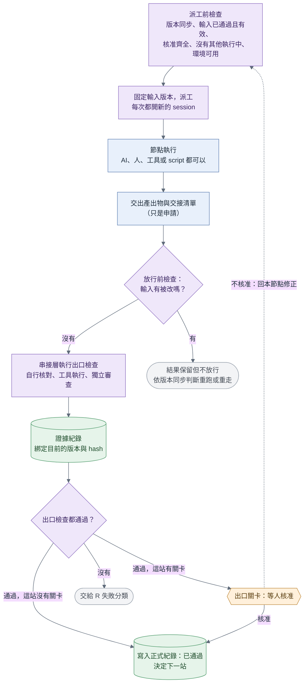
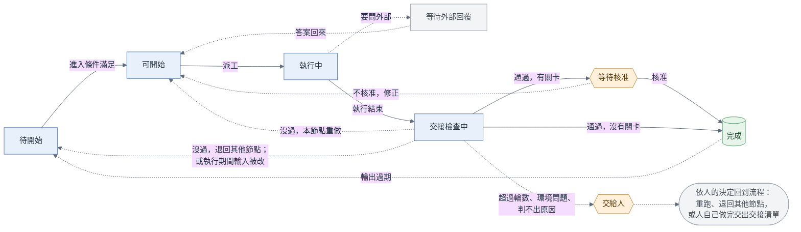
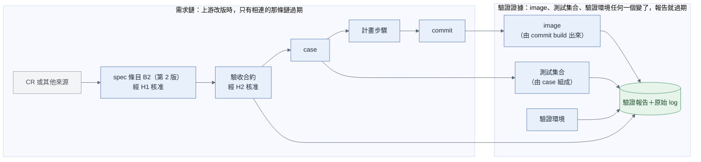
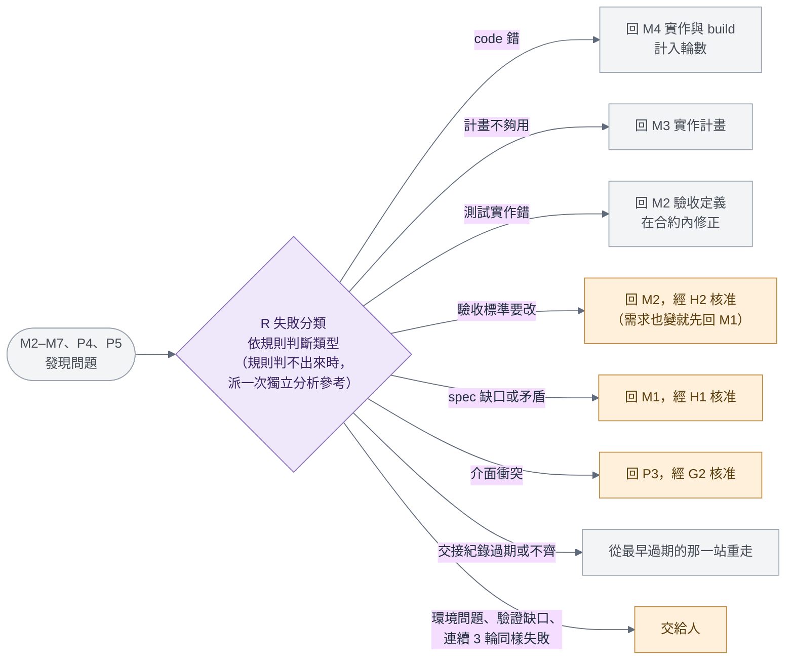
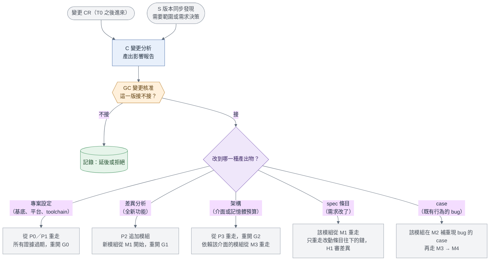
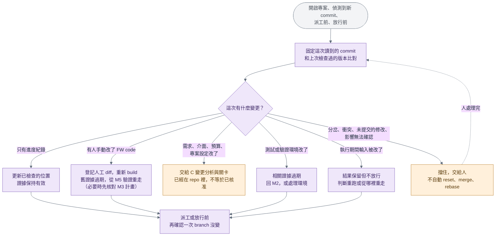

# GLADOS 串接層規則（v0.7 討論稿）

> 串接層是確定性的流程管理服務，不是 LLM。這份文件規定它怎麼守門、派工、判定放行。用什麼程式實作見 [impl/service.md](../impl/service.md)。
>
> 建置路線步驟 2 由人扮演串接層時，照同一份規則執行。

---

## 3.1 串接層的角色

串接層是一個獨立的背景服務，不是 LLM。GUI（第一個是 openBCT 的 GLADOS 分頁）、CLI、API／MCP 都只是它的操作入口，不各自實作放行規則。它有三個角色：

- **觀察**：整合專案工作區（GitLab 或本機）的正式紀錄與執行端的即時狀態，用專案編號、執行編號、branch 與 commit 對齊。
- **守門**：先做 S 版本同步檢查，再自己核對交接、檢查結果與核准，不相信交接清單裡自己寫的狀態。
- **派工**：決定下一站、標記過期、啟動不需要人在旁的節點，或通知人來做需要互動的節點。

LLM 可以提供影響分析或失敗判讀，但只是給規則的輸入，不能自己決定放行。

**每個節點一個全新的 session。** 節點只拿到節點卡、上游交接清單，以及清單引用的產出物；不給前一站的對話。這樣才能驗證「光靠交接清單就做得下去」。節點內部需要時可以用 subagent（例如 P2 把 CR 分給多個 subagent 平行分析；M6 從安全、MISRA、記憶體配置多角度審查），結果只回到該節點。

**為什麼不用「一個主 session 加 subagent」當作整個流程**：主 session 本身是 LLM，會看到所有 subagent 的結果，各站就不獨立了，下一站也變成 LLM 決定；而且主 session 不可能為了等人簽核開好幾天。

---

## 3.2 只認證據，不認自己說的話

這是 v0.7 補上的核心規則，也是「節點實作可以替換」的前提。

- **節點交出的東西都只是「申請」**：交接清單、產出物裡寫的狀態、放在 branch 上的核准檔，都不算數。
- **出口條件由檢查判定**。每個檢查都定義在 [05 檢查清單](05_checks.md)，有固定名稱、要驗什麼、由誰執行、留下什麼證據。
- **檢查依執行方式分四種**：

| 執行方式 | 誰做 | 留下什麼 |
| :---- | :---- | :---- |
| 串接層自行核對 | 串接層自己計算，不需要執行環境（例如核對 hash、核對改了哪些檔案） | 證據紀錄 |
| 工具執行 | 串接層派工，用固定的輸入版本在執行環境跑（例如 build、跑 case） | 證據紀錄，附原始 log 或報告與其 hash |
| 獨立審查 | 和被審節點不同的執行者（另一個 session，最好換模型） | 審查發現紀錄與證據紀錄 |
| 人工核准 | 有權限的人 | 核准紀錄 |

- **節點自己跑的結果只供參考**。例如 M4 在 session 裡自己 build 了好幾次，這些 log 可以附在交接清單供參考，但放行看的是串接層派工的那次 build。
- **證據必須對應目前的版本**：受檢對象的版本與 hash、輸入的 commit，以及（如果適用）image、測試集合、驗證環境的 hash。對不上就不算。
- **沒跑、環境壞掉、平台觀察不到，都不是 PASS**：分別記成「未執行」「環境錯誤」「驗證缺口」，也不能混成行為上的 FAIL（[05 §5.3](05_checks.md)）。

---

## 3.3 派工與放行

**圖：一次派工到放行**

[可編輯 Mermaid 圖源](../diagrams/glados_dispatch_release.mmd)

圖例：藍色＝節點或執行步驟；橘色＝需要人（關卡、核准、交給人）；紫色＝串接層的判斷；綠色＝紀錄；灰色＝這張圖以外的節點或起點。實線＝正常往下走；虛線＝失敗、退回或等待。

### 派工前要滿足的條件（依序）

1. **S 版本同步的派工前檢查通過**，並固定這次要用的輸入 commit 與所有上游產出物版本。
2. **節點卡列的輸入都已通過且有效**（[§3.4](#34-狀態)）。
3. **必要的人工核准都在**，而且對應目前的版本。
4. **這個節點目前沒有其他執行中的嘗試**：同一個節點同一時間只放行一個。
5. **節點需要的環境可用**：只檢查這個節點用得到的（例如 M1 不會因為 FPGA 不可用而被擋，M5 才檢查驗證設備）。
6. **派工方式允許**：自動派工依專案設定；有人「打開來看」不等於授權執行。

### 回收與放行（依序）

1. 收集產出、交接清單與 log。
2. **S 版本同步的放行前檢查**：比對執行期間新增的 commit。輸入在執行期間被改了，結果保留但不放行（[§3.8](#38-s-版本同步與影響檢查)）。
3. 核對交接清單格式與每個檔案的 hash。
4. 執行節點卡列的出口檢查：自行核對的直接算；需要工具的派工去跑；需要獨立審查的確認有審查證據。每個檢查都留下證據紀錄。
5. 這一站有出口關卡時，等人核准（節點狀態為「等待核准」）。不核准就回本節點修正。
6. 檢查全過、必要核准齊全 → 把產出物設為「已通過」，寫入正式紀錄並同步。
7. 更新正式進度；再做一次派工前檢查，決定下一站。

出口檢查沒過，交給 [§3.6 R 失敗分類](#36-r-失敗分類與退回)決定去處。**程式正常結束（exit 0）只代表程式跑完了，不代表節點完成。**

---

## 3.4 狀態

v0.7 把狀態分成五組，各自獨立：產出物處理狀態、產出物有效性、節點狀態、執行狀態、核准狀態。

### 3.4.1 產出物處理狀態（每個版本各一份）

| 狀態 | 意思 | 由誰設定 |
| :---- | :---- | :---- |
| 草稿 | 節點還在產出 | 節點 |
| 審核中 | 已隨交接清單提交，等串接層核對 | 串接層（收到交接時） |
| 已通過 | 出口檢查全過、必要核准齊全，已寫入正式紀錄 | 串接層 |
| 未通過 | 核對沒過；修正後要用新版本重送 | 串接層 |

- 已提交的版本內容不能改；要改就是新版本。
- 「已通過」代表符合該節點的要求：檢查全過、獨立審查沒有阻擋項目、必要核准齊全。**不代表每份產出物都有人簽。**
- v0.6 只有「草稿 → 審核中 → 已通過」加上「修正後重送」；v0.7 補上「未通過」，讓「重送就是新版本」講清楚（待確認，[01 §1.8 第 14 項](01_overview.md)）。

### 3.4.2 產出物有效性

| 狀態 | 意思 |
| :---- | :---- |
| 有效 | 它依賴的上游版本與證據都還是目前的版本 |
| 過期 | 上游出了新版、或證據綁定的 image／測試集合／驗證環境改變了 |

- 有效性和處理狀態分開記。**進入下一站，輸入必須「已通過」而且「有效」。**
- 過期了就不會變回有效，要用新版本重走並重新通過。舊版已通過的歷史紀錄保留，但不能當作新版的放行依據。
- S 版本同步能證明無關的變更，一開始就不標過期，而不是「先標過期再恢復」。

### 3.4.3 節點狀態

專案層節點每個專案一份；模組層節點每個模組一份。

**圖：節點狀態**

[可編輯 Mermaid 圖源](../diagrams/glados_node_state.mmd)

圖例：藍色＝節點或執行步驟；橘色＝需要人（關卡、核准、交給人）；紫色＝串接層的判斷；綠色＝紀錄；灰色＝這張圖以外的節點或起點。實線＝正常往下走；虛線＝失敗、退回或等待。 圖上把「交給人之後怎麼回到流程」收成一個方框，細節見下表與 [§3.10](#310-迴圈上限與交給人)。

| 狀態 | 意思 |
| :---- | :---- |
| 待開始 | 進入條件還沒滿足 |
| 可開始 | 進入條件都滿足了，等派工 |
| 執行中 | 已派工，有一次正在進行的嘗試；記錄誰在做、執行編號、開始時間 |
| 交接檢查中 | 這次嘗試已結束，串接層正在回收與核對 |
| 等待外部回覆 | 有待確認事項要等客戶、SOC、HW 回答，已登記並寫進 Jira |
| 等待核准 | 出口檢查都過了，等出口關卡 |
| 完成 | 輸出都已通過且有效，必要核准齊全 |
| 交給人 | 超過迴圈上限、環境問題、判不出失敗類型、或有衝突 |

**狀態怎麼轉換**：

| 目前狀態 | 發生什麼事 | 變成 |
| :---- | :---- | :---- |
| 待開始 | 進入條件滿足 | 可開始 |
| 可開始 | 串接層派工 | 執行中 |
| 執行中 | 這次嘗試結束 | 交接檢查中 |
| 執行中 | 節點登記了要等外部回答的問題，並交出交接清單 | 等待外部回覆 |
| 等待外部回覆 | 外部答案回來 | 可開始（開新 session 從檔案接續，不接續舊對話） |
| 交接檢查中 | 檢查都過，而且有出口關卡 | 等待核准 |
| 交接檢查中 | 檢查都過，沒有出口關卡 | 完成 |
| 交接檢查中 | 檢查沒過，R 判定在本節點重做 | 可開始（計入輪數） |
| 交接檢查中 | 檢查沒過，R 判定退回其他節點 | 待開始（等上游新版） |
| 交接檢查中 | 執行期間輸入被改了 | 依 S 版本同步的判斷：重跑（可開始）或等上游（待開始） |
| 等待核准 | 核准 | 完成 |
| 等待核准 | 不核准 | 依核准人的決定：回本節點修正（可開始）或交給人 |
| 完成 | 輸出變成過期（上游改版、變更 CR、人工 commit） | 待開始（保留這次完成的歷史紀錄） |
| 任何狀態 | 超過迴圈上限、環境問題、判不出失敗類型 | 交給人 |
| 交給人 | 人做出決定（[§3.10](#310-迴圈上限與交給人)） | 依決定而定 |

### 3.4.4 執行狀態（每次嘗試一份）

| 狀態 | 意思 |
| :---- | :---- |
| 準備中 | 已固定輸入版本，正在準備工作區 |
| 執行中 | 正在跑 |
| 已結束 | 程式結束（記下 exit code 與錯誤旗標）；不代表完成 |
| 核對中 | 正在做放行前的版本檢查、hash 與出口檢查 |
| 已通過 | 核對通過，等寫入正式紀錄 |
| 待同步 | 已通過，但正式紀錄還沒同步到共用位置；不能宣稱其他人已經看得到 |
| 已記錄 | 已寫入正式紀錄 |
| 未通過 | 核對沒過或節點失敗，交給 R 失敗分類 |
| 輸入過期 | 執行期間輸入被修改；結果保留，不放行 |
| 已取消 | 使用者要求立即停止，而且確認已經停下來 |
| 中斷待核對 | 服務停止或取消後，無法確認執行端或設備已經停止或釋放 |

服務重啟後，先核對「中斷待核對」和「待同步」的執行，再決定接續或重跑，不盲目重派同一個工作。

### 3.4.5 核准狀態

| 狀態 | 意思 |
| :---- | :---- |
| 有效 | 核准的對象還是目前的版本 |
| 已失效 | 核准的對象出了新版；保留作稽核，不能拿來核准新版 |

人工核准只能由有權限的人產生，串接層要核對身分與對象的版本與 hash。

---

## 3.5 過期與重新進入

**原則**：重新進入點＝最早一個「輸入產出物出了新版」的節點。失敗退回、需求變更、版本同步發現的變更，都走同一套相依與過期機制。

### 追溯要細到條目

**圖：追溯鏈**

[可編輯 Mermaid 圖源](../diagrams/glados_cr_trace.mmd)

怎麼看這張圖：箭頭從上游指向下游，上游改版時，箭頭指到的東西就過期。左邊框是**需求鏈**，右邊框是**驗證證據**；驗證報告同時綁定 image、測試集合、驗證環境與驗收合約的版本。

1. spec 寫成有編號的條目（B1、B2…），不能是一整段敘述。
2. 每個產出物寫明引用的上游條目和版本：case 寫「依賴 spec 的 B2 第 1 版」；計畫的每一步寫對應哪些 case；commit message 寫對應的計畫步驟。格式見 [04 §4.2](04_records.md)。
3. 過期分兩種，規則不一樣（見下）。

### 兩種過期

- **需求鏈**：看追溯關係，只有相連的那條鏈過期。例如 spec 的 B2 改版，只有依賴 B2 的 case、計畫步驟、commit 過期；沒受影響的條目保持有效。
- **驗證證據**：綁 image、測試集合、驗證環境的版本與 hash。

| 什麼改變 | 文件與定義 | 執行證據 |
| :---- | :---- | :---- |
| spec 或驗收合約改版 | 依條目追溯，標記相依的產出物過期 | 受影響的驗收結果過期；如果 image 也變了，再套用下一列 |
| image 改變 | 沒受需求變更影響的 spec、case 定義保持有效 | 用這個 image 產生的 M5、P4、P5 驗證全部過期並重跑。目前採保守規則，不推定沒改需求的行為仍然正確 |
| 測試集合改版 | 合約內的變更不必重審 H2；改過的測試實作要重審 | 用舊測試版本產生的相關報告過期，用新集合重跑 |
| 驗證環境改版 | 看變更是否影響判定方式，決定要不要重開 H2 | 用舊環境產生的相關報告過期，在新環境重跑 |

**case 定義有效，不代表舊 image 的 PASS 可以沿用。** 驗證缺口要明列、交給人決定補哪種驗證手段，不能用通過檢查的文件代替還沒取得的功能證據。

單純的進度紀錄 commit（例如只更新 `.glados/` 裡的交接紀錄）不會讓 FW 證據過期（[04 §4.1](04_records.md)）。

---

## 3.6 R 失敗分類與退回

模組內部或專案層發現問題時（M2 的 spec 條目轉不成 case 或平台觀察不到、M3 遇到需求或架構爭議、M4 需要改計畫以外的檔案、M5 驗證失敗、M6 審查要求修正、M7 交接核對沒過、P4 整合或 P5 全量驗收失敗），依下表決定退回哪裡。

**圖：R 失敗分類的去處**

[可編輯 Mermaid 圖源](../diagrams/glados_failure_routing.mmd)

圖例：藍色＝節點或執行步驟；橘色＝需要人（關卡、核准、交給人）；紫色＝串接層的判斷；綠色＝紀錄；灰色＝這張圖以外的節點或起點。實線＝正常往下走；虛線＝失敗、退回或等待。

| 失敗類型 | 怎麼判斷 | 要改版的產出物 | 退回 | 需要人嗎？ |
| :---- | :---- | :---- | :---- | :---- |
| code 錯 | 測試符合 spec，實作不符 | diff | M4 | 不用，計入輪數 |
| 計畫不夠用 | 需要改計畫以外的檔案，或計畫的步驟做不出來 | 實作計畫 | M3 | 不用 |
| 測試實作錯 | case 沒有落實已核准的驗收合約 | case／測試腳本 | M2 | 不用；在合約內修正，經獨立審查放行。若要改標準則須 H2 |
| 驗收標準要改 | 預期行為、判定方式或必要覆蓋要改 | 驗收合約 | M2（需求有變則先 M1） | 要（H2；需求變更另須 H1） |
| spec 缺口或矛盾 | spec 沒定義這個行為，或來源互相衝突 | spec 條目 | M1 | 要 |
| 介面衝突 | 必須改其他模組的介面 | 架構文件 | P3 | 要 |
| 交接紀錄過期或不齊 | M7 或 P4 核對時，發現產出物過期、核准不對應目前版本、或證據對不上 | — | 依 [§3.5](#35-過期與重新進入)，從最早過期的那一站重走 | 依重走那一站的關卡 |
| 環境問題 | 驗證平台或工具異常 | — | 交給人 | 要 |
| 驗證缺口 | 平台觸發不了或觀察不到 | — | 交給人，決定補哪種驗證手段 | 要 |
| 沒有進展 | 連續 3 輪同樣的失敗 | — | 交給人 | 要 |

其他規則：

- **規則為主**。規則判不出來時，串接層派一次獨立分析（執行者不能是被判定節點的執行者），分析結果只是規則的輸入；需要人的類別一律交給人。這一條待最後確認（[01 §1.8 第 3 項](01_overview.md)）。
- **實作 AI 不能自己改測試或驗收合約，也不能自己把失敗判成「測試錯」然後放行。** 在已核准合約內修正測試實作可以自動放行；改驗收標準一定要人核准。
- **M3 的審查阻擋項目**在 M3 內修計畫重審，不經 R；但牽涉需求或架構的爭議要經 R 回到對應的節點與關卡。
- **P4 整合、P5 全量驗收失敗**，回到對應的模組，再用上表分類。

---

## 3.7 C 變更分析：變更 CR 怎麼處理

**圖：變更處理**

[可編輯 Mermaid 圖源](../diagrams/glados_change_flow.mmd)

圖例：藍色＝節點或執行步驟；橘色＝需要人（關卡、核准、交給人）；紫色＝串接層的判斷；綠色＝紀錄；灰色＝這張圖以外的節點或起點。實線＝正常往下走；虛線＝失敗、退回或等待。

**R、C、S 的分工**：R 處理模組內部的失敗；C 處理外部進來的變更 CR，以及需要核准的範圍或需求變更；S 偵測 repo 的版本差異（包括人工穿插的 commit），先分類與分析影響，再沿用 C、R 與過期機制。S 不會自己放寬需求或驗收標準。

**流程**：

1. 變更 CR 進來 → 串接層啟動 C 變更分析（[nodes/C](../nodes/C.md)）。
2. C 讀差異分析與追溯關係，產出**影響報告**：會改到哪個產出物、哪些下游會過期、要重走哪些節點。
3. **GC 由人核准**這一版要不要接。不接就記錄後結束（延到下一版或拒絕）。
4. 接的話，C 交出上游產出物的新版本 → 過期機制標記下游 → 串接層從重新進入點派工。
5. 重新進入點需要的人工關卡（G0、G1、G2、H1、H2）**只審差異與受影響範圍**，核准紀錄綁新版本；在合約內新增或修正測試不重開 H2。

**改到哪個產出物，就從哪裡重走**：

| 變更類型 | 改版的產出物 | 重新進入點 | 重走時的關卡 |
| :---- | :---- | :---- | :---- |
| 改基底、平台或 toolchain | project.md | P0／P1，所有證據過期 | G0 |
| 全新功能，不碰既有模組 | 差異分析（追加模組） | P2 追加 → 新模組從 M1 開始 | G1 |
| 改模組介面或記憶體預算 | 架構文件 | P3 → 依賴該介面的模組從 M3 重走 | G2 |
| 改既有模組的需求 | spec 條目 | 該模組 M1，只重走改動條目往下的鏈 | H1 審差異與受影響範圍；合約變更才重開 H2 |
| 既有行為的 bug（spec 本來就對） | case（補一個能重現 bug 的 case） | 該模組 M2 → M3 確認或更新計畫 → M4 | 在合約內新增 case 可自動放行；要改合約則 H2 |
| 這一版不做 | 無 | 不重走 | GC 決定延後或拒絕 |

**變更進來的三種時間點**：

1. 模組還沒開始：直接併進該模組的 spec。
2. 模組正在跑：等目前節點做完再切換，不在節點做到一半時打斷。
3. 模組已合入整合 branch：重新打開該模組，P4、P5 的結果一併過期。

---

## 3.8 S 版本同步與影響檢查

**圖：版本同步與影響檢查**

[可編輯 Mermaid 圖源](../diagrams/glados_sync_flow.mmd)

圖例：藍色＝節點或執行步驟；橘色＝需要人（關卡、核准、交給人）；紫色＝串接層的判斷；綠色＝紀錄；灰色＝這張圖以外的節點或起點。實線＝正常往下走；虛線＝失敗、退回或等待。 圖上六種變更和下方表格一一對應。

**什麼時候執行**：開啟或更新專案、每次派工前、節點回收與結果放行前、偵測到追蹤中 branch 的新 commit。單純查詢時可以只讀分析、顯示「待同步」；修改正式紀錄與派工由串接層服務統一執行。

**處理順序**：

1. 固定這次讀取的 branch 與 commit。
2. 和上次已檢查的版本、以及這次執行用的輸入版本比對。
3. 取得 diff 與內容 hash。
4. 分類影響。
5. 標記受影響的產出物與證據，決定要往哪裡走。
6. 保存版本同步報告（[04 §4.8](04_records.md)）。

commit、修改的路徑、hash、明確的相依關係由規則處理；功能、需求或介面上的含義由獨立分析補充，涉及已核准的決策時回到人工關卡。**影響無法確認時，不推定沒影響，也不放行。**

| 變更 | 怎麼處理 |
| :---- | :---- |
| 只有進度、索引或 log 參照更新 | 更新已檢查的位置；內容與相依沒變的 FW 證據保持有效 |
| 有人手動改了 FW code 或 build 輸入 | 登記這次人工 diff、對應的模組與需求、影響範圍。舊 image 的結果保留作歷史，但不能證明目前的 source；重新 build 並套用 [§3.5](#35-過期與重新進入) 的證據規則，必要時核對或更新 M3 計畫，再走 M5、M6 |
| 需求、介面、預算或專案設定改變 | 沿用 C 變更分析、對應的人工關卡與過期規則。**已經存在 repo 裡的變更，不等於已獲核准** |
| 測試實作或驗證環境改變 | 相關的審查與執行證據過期；回 M2 或環境處理；驗收合約改變則回 H2 |
| 執行期間它依賴的輸入被改了 | 顯示「輸入版本已過期」；保留該次結果，先不放行；分析可以沿用、要重跑，還是要從哪裡重新進入 |
| branch 分岔、重疊衝突、工作區有未提交的修改、或拿不到必要的版本 | 顯示具體的阻擋原因，依規則處理或交給人；**不默默覆蓋、reset、merge 或 rebase 人工的修改** |

其他規則：

- **不製造無意義的 commit**：純紀錄變更只更新查詢位置，不必每次讀取都產生一個同步 commit；只有版本、影響或路由真的改變時才留下新的版本同步報告，避免「同步本身又觸發同步」的迴圈。
- **人工完成的實作可以接回流程**，不要求 AI 重寫，但仍需要原本的計畫核對、build、驗證與獨立審查證據。只是實作錯就依 R 回 M4；新增需求就先走 C，版本同步不能自己接受新範圍。
- **派工時固定輸入**：派工時固定輸入 commit 與所有上游版本。執行結束後即使程式正常結束，也要比對期間新增的 commit：只有能證明無關的變更才保留有效性，受影響的結果不能直接套到新版本。
- **防止重複派工**：狀態更新與派工前還要確認 branch 仍是剛分析過的版本，避免兩個 GUI 重複派工或用過期的分析放行。
- 這裡的「同步」是指讀取、比較與更新紀錄，**不承諾自動合併**。

---

## 3.9 審查放行

M3 實作計畫與 M6 獨立審查的放行，不採「兩個 AI 達成共識」。每一項發現都要記錄（[04 §4.7](04_records.md)）：編號、類型、位置與版本、影響、處置結果與證據，由獨立審查確認處置，串接層核對後依下表放行。

| 發現 | 放行規則 |
| :---- | :---- |
| 功能錯誤、安全問題、記憶體越界、介面違約，或違反明定的必要規則 | 沒解決就擋住；修正後重新驗證，或由獨立審查依證據確認不成立 |
| 純風格或非必要的改善建議 | 記錄並說明處置，可以在不影響必要規則的前提下放行 |
| 牽涉需求、驗收標準或架構決策的爭議 | 回到對應的人工關卡，不由模型投票改變已核准的決策 |

- 實作者不能自己把阻擋項目降級或關閉。
- 審查結果綁定被審查的計畫或 diff 的 hash；受審內容一改，相關的審查證據就過期。
- 超過迴圈上限仍無法處置的爭議交給人。
- 必要規則清單待定（[01 §1.8 第 2 項](01_overview.md)）。

---

## 3.10 迴圈上限與交給人

- 每個迴圈都有輪數上限，寫在節點卡上；超過就交給人。
- 連續 3 輪同樣的失敗，視為沒有進展，交給人。
- 交給人時，串接層要附上：哪個節點、跑了幾輪、每一輪的失敗證據、目前擋住的原因。

**交給人之後怎麼回到流程**（v0.7 新增，待確認）：

| 人的決定 | 之後怎麼走 |
| :---- | :---- |
| 自己來做這個節點 | 人是合法的執行者，交出交接清單，照同樣的檢查放行 |
| 指定退回的地方（例如判定是測試錯 → M2，或 spec 缺口 → M1） | 記成一筆決定紀錄（[04 §4.4](04_records.md)），串接層照這個決定派工 |
| 修好環境後要求重跑 | 回到「可開始」；輪數要不要重算，待定 |
| 這一版不做這個模組或這個功能 | 走 C 變更分析與 GC |

人的決定不能代替關卡核准：例如要改驗收標準，仍然要 H2。

---

## 3.11 信任邊界：誰能寫正式紀錄

前面所有「串接層不相信自己寫的狀態」的規則，都需要一個節點改不到的地方存放判定結果。否則 agent 只要寫一句「已通過」或放一份核准檔，就能繞過關卡。

| 寫入者 | 能寫什麼 | 寫在哪裡 |
| :---- | :---- | :---- |
| 節點（AI agent、人、script） | 自己這一站的產出物與交接清單 | 自己模組的工作 branch |
| 串接層服務帳號 | 通過判定、核准索引、正式進度、版本同步報告、執行的正式狀態 | 受保護的紀錄 branch（例如 `glados/records/<專案編號>`）或服務自己的資料庫；節點使用的 token 沒有寫入權 |
| 有權限的人 | 人工核准 | 能獨立驗證身分的地方：簽章 commit、GitLab MR approval 或 Jira 核准紀錄（具體機制待定） |

- 節點交出的交接清單只是「申請」，串接層核對後寫進正式紀錄才算生效。
- 串接層只採信正式紀錄與能驗證身分的核准。模組 branch 上出現的核准檔、「已通過」字樣，一律不算數。
- 建置路線步驟 2 由人扮演串接層時也一樣：正式紀錄由人提交到受保護的 branch，核准用 MR approval 或簽章 commit。

**本機模式**（v0.7 新增，待確認）：本機模式的紀錄 branch 就在本機。如果節點和串接層在同一台機器、用同一個系統帳號執行，節點可以直接改那個 branch，這條信任邊界就守不住。v0.7 提案：**本機模式只用來查詢與演練，不產生正式的「已通過」紀錄**；要產生正式紀錄，紀錄必須放在節點權限寫不到的地方（GitLab 受保護的 branch，或只有服務帳號能寫的資料庫）。

---

## 3.12 串接層服務必須做到的事

不論用什麼工具實作，串接層服務都要做到以下幾點。GUI 版面、GitLab／本機兩種模式、怎麼接 openBCT 等細節，見 [impl/service.md](../impl/service.md)。

- **背景常駐**：服務是獨立程式，生命週期與 GUI 分開；關閉 GUI、使用者登出，都不會連帶停止服務。開啟 openBCT 的 GLADOS 分頁時先檢查服務：已啟動就連線，未啟動就自動啟動；也可以不開 openBCT，單獨啟動或停止服務。同一個服務只會有一個實例。使用者主動停止後，已開啟的分頁顯示「服務已停止」並提供「啟動服務」按鈕，不能因為持續監控就馬上自動重啟；再次開啟分頁時才重新檢查並按需啟動。背景常駐不代表使用者不能停止它。
- **統一派工**：同一個節點同一時間只放行一次執行；GUI、CLI、API 等入口不能各自派工。
- **持久保存**：進度、核准索引、執行紀錄、版本同步分析與中斷狀態都要持久保存。
  - **一般停止**：先停止新派工，顯示「停止中」；正在執行的工作回收並保存結果後才退出，不啟動下一站。等待人工核准的節點保存後即可退出。同步失敗就保存「待同步」狀態，不把還沒同步的結果宣稱為正式完成。
  - **立即停止**：要求取消執行，保存已取得的產出、log 與中斷狀態。沒能確認停止的執行端或設備，明列為「待核對」，不推定已停止或已釋放。
  - **重啟後**：先核對殘留的執行、設備與待同步紀錄，再決定接續或重跑。記憶體裡的工作佇列或事件通知不能當唯一的事實來源。
- **一個節點可以有多次執行**：程式正常結束只代表程式跑完，不代表節點完成。完成的順序見 [§3.3](#33-派工與放行)。
- **正式紀錄和即時狀態分開**：正式進度以已寫入正式紀錄的為準；即時狀態（正在跑、第幾輪、log、設備占用）來自執行端。兩者用專案編號、節點、執行編號、輸入 commit 對齊，不互相覆蓋；任何一邊連不上時要明確標示，不推定。
- **查詢不需要執行環境**：只看進度不必 clone、不必連設備；要執行時才準備工作區，而且看得到的 branch 必須遵守專案設定的隔離限制。

---

## 3.13 任何執行者都能接手、工作區與 CI

**任何執行者都能接手任何節點**：節點交接與正式完成以專案紀錄及可信的證據為準，所以 Claude Code、Codex、人、script 都能接手任何節點。前提是關鍵檢查由串接層在節點邊界自己做（對應 [05 檢查清單](05_checks.md)）：

- 確認只改了允許的路徑（排除專案設定列出的「被 git 追蹤的編譯產物」）——「只寫在允許範圍內」。
- M4 沒改測試或 case 的判定——「測試沒被動過」；M2 的測試變更符合已核准的合約、有獨立審查證據；合約變更有新的 H2 核准。
- 交接清單列的 hash 與實際檔案一致——「檔案 hash 相符」。
- 驗證報告對應目前的 image、測試集合與驗證環境——「證據對應目前版本」。
- 審查證據對應目前的計畫或 diff；阻擋項目都已處置；必要人工核准對應目前版本。

agent 內部的 hook 只是提早攔截的輔助，不能代替這些檢查。

**工作區規則**：每個模組一個工作 branch，節點把產出與交接清單 commit 在這個 branch 的 `.glados/` 底下；正式紀錄由串接層服務寫在受保護的紀錄 branch（[§3.11](#311-信任邊界誰能寫正式紀錄)）。人工 commit 可以穿插，但要經過版本同步核對；每次執行各自記錄輸入 commit 與 hash，進度 commit 和 FW 來源 commit 不混用。正式進度只顯示已寫入正式紀錄的交接；執行端保存即時的嘗試與同步中的狀態。

**CI**：只改 `.glados/`（或只改紀錄 branch）的 commit 不能觸發 FW 的 CI pipeline，否則每次交接、每份同步報告都會跑一次 build、靜態分析、授權掃描。需要這些檢查時，由串接層在對應節點明確觸發（例如 M4 的 build、P5 的靜態分析與授權掃描）。具體做法依各專案的 CI 設定（例如 pipeline 規則排除只改 `.glados/**` 的 commit、紀錄 branch 不跑 pipeline），寫進專案設定。
