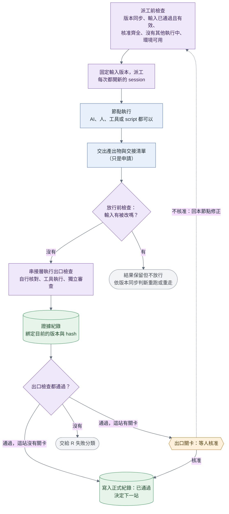
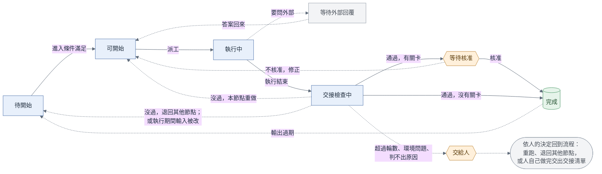
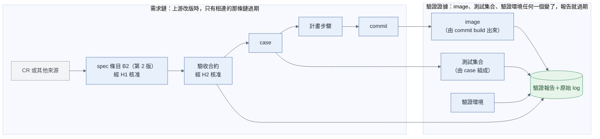
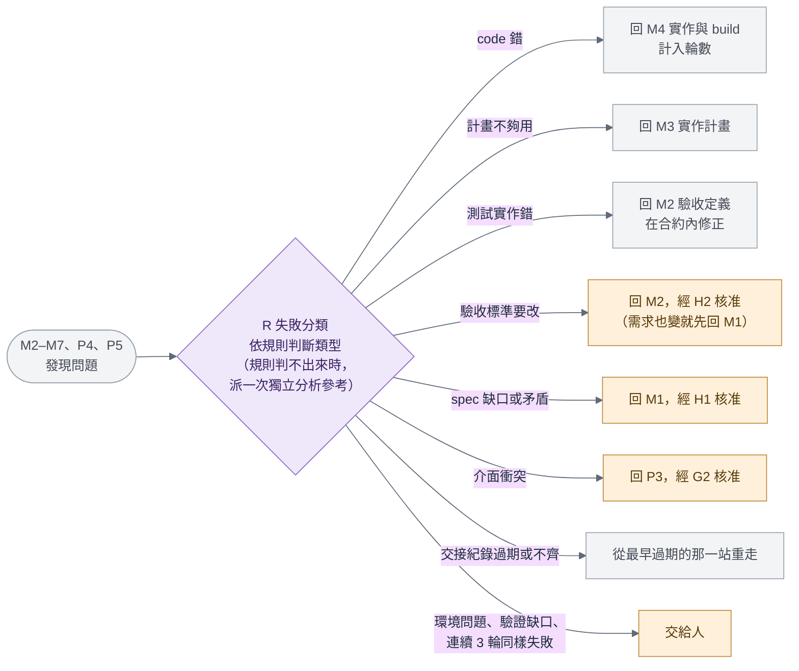
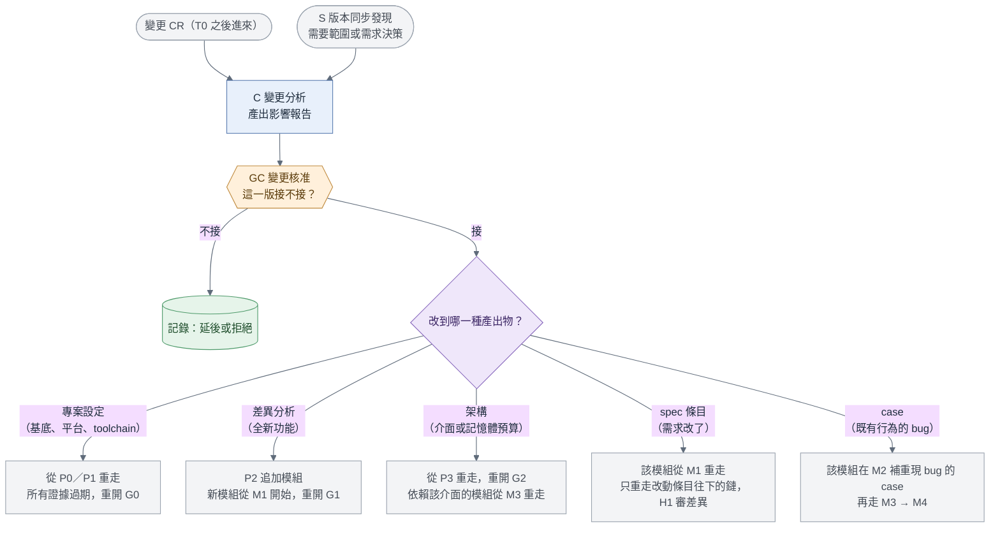
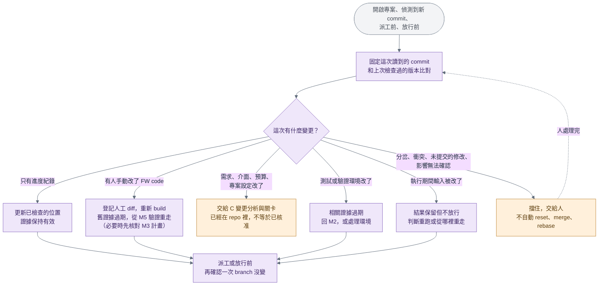

# 04 串接層規則

> **這份文件回答**：串接層怎麼派工、怎麼決定放行或退回、遇到失敗、變更 CR、新 commit 時怎麼處理。
>
> 串接層「要做到哪些事」（背景常駐、持久保存…）見 [06 串接層服務的要求](06_service.md)；用什麼程式實作見 [impl/service.md](../impl/service.md)。建置路線步驟 2 由人扮演串接層時，照同一份規則執行。

---

## 4.1 串接層是什麼

串接層是確定性的流程管理者，**不是 LLM**。它有三個角色：

- **觀察**：整合正式紀錄與執行端的即時狀態，用專案編號、執行編號、branch 與 commit 對齊。
- **守門**：先做 S 版本同步檢查，再自己執行出口檢查、核對核准，不相信交接清單裡自己寫的狀態。
- **派工**：決定下一站、標記過期、啟動不需要人在旁的節點，或通知人來做需要互動的節點。

LLM 可以提供影響分析或失敗判讀，但只是給規則的輸入，不能自己決定放行。

**每個節點一個全新的 session**：節點只拿到節點卡、上游交接清單，以及清單引用的產出物；不給前一站的對話。節點內部需要時可以用 subagent（例如 P2 把 CR 分給多個 subagent 平行分析；M6 從安全、MISRA、記憶體配置多角度審查），結果只回到該節點。

**為什麼不用「一個主 session 加 subagent」跑整個流程**：主 session 本身是 LLM，會看到所有 subagent 的結果，各站就不獨立了，下一站也變成 LLM 決定；而且主 session 不可能為了等人簽核開好幾天。

---

## 4.2 派工與放行

**圖：一次派工到放行**

[可編輯 Mermaid 圖源](../diagrams/glados_dispatch_release.mmd)

圖例：藍＝節點；橘＝需要人；紫＝串接層的判斷；綠＝紀錄；灰＝圖外的節點或起點。實線＝正常往下走；虛線＝失敗、退回或等待。

### 派工前要滿足的條件

1. **S 版本同步的派工前檢查通過**，並固定這次要用的輸入 commit 與所有上游產出物版本（§4.7）。
2. **節點卡列的輸入都「已通過」且「有效」**（[03 §3.3](03_artifacts.md#33-產出物與核准的狀態)）。
3. **必要的人工核准都在**，而且對應目前的版本。
4. **這個節點目前沒有其他執行中的嘗試**：同一個節點同一時間只放行一個。
5. **節點需要的環境可用**：只檢查這個節點用得到的（例如 M1 不會因為 FPGA 不可用而被擋，M5 才檢查驗證設備）。
6. **派工方式允許**：自動派工依專案設定；有人「打開來看」不等於授權執行。

### 回收與放行的順序

1. 收集產出、交接清單與 log。
2. **S 版本同步的放行前檢查**：比對執行期間新增的 commit。輸入在執行期間被改了，結果保留但不放行。
3. 核對交接清單格式與每個檔案的 hash。
4. 執行節點卡列的出口檢查，每個檢查都留下證據紀錄（[05 檢查](05_checks.md)）。
5. 這一站有出口關卡時，等人核准。不核准就回本節點修正。
6. 檢查全過、必要核准齊全 → 產出物設為「已通過」，寫入正式紀錄。
7. 更新正式進度；再做一次派工前檢查，決定下一站。

出口檢查沒過，交給 §4.5 R 失敗分類決定去處。**程式正常結束（exit 0）只代表程式跑完了，不代表節點完成。**

---

## 4.3 節點與執行的狀態

產出物與核准的狀態見 [03 §3.3](03_artifacts.md#33-產出物與核准的狀態)；這裡是串接層追蹤流程用的兩組狀態。

### 節點狀態

專案層節點每個專案一份；模組層節點每個模組一份。

**圖：節點狀態**

[可編輯 Mermaid 圖源](../diagrams/glados_node_state.mmd)

圖例同上。圖上把「交給人之後怎麼回到流程」收成一個方框，細節見 §4.9。

| 狀態 | 意思 |
| :---- | :---- |
| 待開始 | 進入條件還沒滿足 |
| 可開始 | 進入條件都滿足了，等派工 |
| 執行中 | 已派工，有一次正在進行的嘗試；記錄誰在做、執行編號、開始時間 |
| 交接檢查中 | 這次嘗試已結束，串接層正在回收與核對 |
| 等待外部回覆 | 有待確認事項要等客戶、SOC、HW 回答，已登記並寫進 Jira |
| 等待核准 | 出口檢查都過了，等出口關卡 |
| 完成 | 輸出都已通過且有效，必要核准齊全 |
| 交給人 | 超過迴圈上限、環境問題、判不出失敗類型、或有衝突 |

**狀態怎麼轉換**：

| 目前狀態 | 發生什麼事 | 變成 |
| :---- | :---- | :---- |
| 待開始 | 進入條件滿足 | 可開始 |
| 可開始 | 串接層派工 | 執行中 |
| 執行中 | 這次嘗試結束 | 交接檢查中 |
| 執行中 | 節點登記了要等外部回答的問題，並交出交接清單 | 等待外部回覆 |
| 等待外部回覆 | 外部答案回來 | 可開始（開新 session 從檔案接續，不接續舊對話） |
| 交接檢查中 | 檢查都過，而且有出口關卡 | 等待核准 |
| 交接檢查中 | 檢查都過，沒有出口關卡 | 完成 |
| 交接檢查中 | 檢查沒過，R 判定在本節點重做 | 可開始（計入輪數） |
| 交接檢查中 | 檢查沒過，R 判定退回其他節點 | 待開始（等上游新版） |
| 交接檢查中 | 執行期間輸入被改了 | 依 S 版本同步的判斷：重跑（可開始）或等上游（待開始） |
| 等待核准 | 核准 | 完成 |
| 等待核准 | 不核准 | 回本節點修正（可開始），或由核准人決定交給人 |
| 完成 | 輸出變成過期（上游改版、變更 CR、人工 commit） | 待開始（保留這次完成的歷史紀錄） |
| 任何狀態 | 超過迴圈上限、環境問題、判不出失敗類型 | 交給人 |
| 交給人 | 人做出決定（§4.9） | 依決定而定 |

### 執行狀態

每次嘗試一份，記在執行紀錄（[03 §3.7](03_artifacts.md#37-執行紀錄)）。

| 狀態 | 意思 |
| :---- | :---- |
| 準備中 | 已固定輸入版本，正在準備工作區 |
| 執行中 | 正在跑 |
| 已結束 | 程式結束（記下 exit code 與錯誤旗標）；不代表完成 |
| 核對中 | 正在做放行前的版本檢查、hash 與出口檢查 |
| 已通過 | 核對通過，等寫入正式紀錄 |
| 待同步 | 已通過，但正式紀錄還沒同步到共用位置；不能宣稱其他人已經看得到 |
| 已記錄 | 已寫入正式紀錄 |
| 未通過 | 核對沒過或節點失敗，交給 R 失敗分類 |
| 輸入過期 | 執行期間輸入被修改；結果保留，不放行 |
| 已取消 | 使用者要求立即停止，而且確認已經停下來 |
| 中斷待核對 | 服務停止或取消後，無法確認執行端或設備已經停止或釋放 |

---

## 4.4 過期與重新進入

**原則**：重新進入點＝最早一個「輸入產出物出了新版」的節點。R 失敗分類、C 變更處理、S 版本同步發現的變更，都走這同一套機制。

**圖：追溯與過期**

[可編輯 Mermaid 圖源](../diagrams/glados_cr_trace.mmd)

怎麼看這張圖：箭頭從上游指向下游，上游改版時，箭頭指到的東西就過期。左邊框是**需求鏈**，右邊框是**驗證證據**；驗證報告同時綁定 image、測試集合、驗證環境與驗收合約的版本。

### 前提：追溯要細到條目

- spec 寫成有編號的條目（B1、B2…），不能是一整段敘述。
- 每個產出物寫明引用的上游條目和版本；case 引用 spec 條目、計畫步驟引用 case、commit message 引用計畫步驟（格式見 [03 §3.4](03_artifacts.md#34-產出物的檔頭)）。

### 兩種過期，規則不同

- **需求鏈**：看追溯關係，只有相連的那條鏈過期。例如 spec 的 B2 改版，只有依賴 B2 的 case、計畫步驟、commit 過期；沒受影響的條目保持有效。
- **驗證證據**：綁 image、測試集合、驗證環境的版本與 hash，任何一個變了，相關報告就過期。

| 什麼改變 | 文件與定義 | 驗證證據 |
| :---- | :---- | :---- |
| spec 或驗收合約改版 | 依條目追溯，標記相依的產出物過期 | 受影響的驗收結果過期；如果 image 也變了，再套用下一列 |
| image 改變 | 沒受需求變更影響的 spec、case 定義保持有效 | 用這個 image 產生的 M5、P4、P5 驗證全部過期並重跑。目前採保守規則，不推定沒改需求的行為仍然正確 |
| 測試集合改版 | 合約內的變更不必重審 H2；改過的測試實作要重審 | 用舊測試版本產生的相關報告過期，用新集合重跑 |
| 驗證環境改版 | 看變更是否影響判定方式，決定要不要重開 H2 | 用舊環境產生的相關報告過期，在新環境重跑 |

- **case 定義有效，不代表舊 image 的 PASS 可以沿用。** 驗證缺口要明列、交給人決定補哪種驗證手段，不能用通過檢查的文件代替還沒取得的功能證據。
- **單純的進度紀錄 commit**（例如只更新 `.glados/` 裡的交接紀錄）不會讓 FW 證據過期（[03 §3.2](03_artifacts.md#32-編號版本與-hash)）。

---

## 4.5 R 失敗分類

**什麼時候啟動**：M2 的 spec 條目轉不成 case 或平台觀察不到、M3 遇到需求或架構爭議、M4 需要改計畫以外的檔案、M5 驗證失敗、M6 審查要求修正、M7 交接核對沒過、P4 整合或 P5 全量驗收失敗。

**圖：R 失敗分類的去處**

[可編輯 Mermaid 圖源](../diagrams/glados_failure_routing.mmd)

圖例：橘色的去處需要人核准或處理；灰色的去處不需要人。

| 失敗類型 | 怎麼判斷 | 要改版的產出物 | 退回 | 需要人嗎？ |
| :---- | :---- | :---- | :---- | :---- |
| code 錯 | 測試符合 spec，實作不符 | 模組 commit | M4 | 不用，計入輪數 |
| 計畫不夠用 | 需要改計畫以外的檔案，或計畫的步驟做不出來 | 實作計畫 | M3 | 不用 |
| 測試實作錯 | case 沒有落實已核准的驗收合約 | 測試實作 | M2 | 不用；在合約內修正，經獨立審查放行。若要改標準則須 H2 |
| 驗收標準要改 | 預期行為、判定方式或必要覆蓋要改 | 驗收合約 | M2（需求有變則先 M1） | 要（H2；需求變更另須 H1） |
| spec 缺口或矛盾 | spec 沒定義這個行為，或來源互相衝突 | 模組 spec | M1 | 要（H1） |
| 介面衝突 | 必須改其他模組的介面 | 架構文件 | P3 | 要（G2） |
| 交接紀錄過期或不齊 | M7 或 P4 核對時，發現產出物過期、核准不對應目前版本、或證據對不上 | — | 依 §4.4，從最早過期的那一站重走 | 依重走那一站的關卡 |
| 環境問題 | 驗證平台或工具異常 | — | 交給人 | 要 |
| 驗證缺口 | 平台觸發不了或觀察不到 | — | 交給人，決定補哪種驗證手段 | 要 |
| 沒有進展 | 連續 3 輪同樣的失敗 | — | 交給人 | 要 |

其他規則：

- **規則為主**。規則判不出來時，串接層派一次獨立分析（執行者不能是被判定節點的執行者），分析結果只是規則的輸入（待確認：[08 框架第 5 項](08_open_questions.md#81-框架待決)）。
- **實作 AI 不能自己改測試或驗收合約，也不能自己把失敗判成「測試錯」然後放行。** 在已核准合約內修正測試實作可以自動放行；改驗收標準一定要人核准。
- **M3 的審查阻擋項目**在 M3 內修計畫重審，不經 R；但牽涉需求或架構的爭議要經 R。
- **P4、P5 失敗**先找出對應的模組，再用上表分類。

---

## 4.6 C 變更處理

**什麼時候啟動**：T0 之後進來的變更 CR，或 S 版本同步發現需要範圍、需求決策的變更。節點規格見 [nodes/C](../nodes/C.md)。

**圖：變更處理**

[可編輯 Mermaid 圖源](../diagrams/glados_change_flow.mmd)

圖例同 §4.2。

**流程**：

1. 串接層啟動 C 變更分析，產出**影響報告**：會改到哪個產出物、哪些下游會過期、要重走哪些節點。
2. **GC 由人核准**這一版要不要接。不接就記錄後結束（延到下一版或拒絕）。
3. 接的話，C 交出被直接改到的上游產出物新版本 → 依 §4.4 標記下游過期 → 串接層從重新進入點派工。
4. 重新進入點需要的關卡（G0、G1、G2、H1、H2）**只審差異與受影響範圍**；在合約內新增或修正測試不重開 H2。

**改到哪個產出物，就從哪裡重走**：

| 變更類型 | 改版的產出物 | 重新進入點 | 重走時的關卡 |
| :---- | :---- | :---- | :---- |
| 改基底、平台或 toolchain | 專案說明、專案設定 | P0／P1，所有證據過期 | G0 |
| 全新功能，不碰既有模組 | 差異分析（追加模組） | P2 追加 → 新模組從 M1 開始 | G1 |
| 改模組介面或記憶體預算 | 架構文件 | P3 → 依賴該介面的模組從 M3 重走 | G2 |
| 改既有模組的需求 | 模組 spec 的條目 | 該模組 M1，只重走改動條目往下的鏈 | H1 審差異；合約變更才重開 H2 |
| 既有行為的 bug（spec 本來就對） | 測試實作（補一個能重現 bug 的 case） | 該模組 M2 → M3 確認或更新計畫 → M4 | 合約內新增 case 不必核准；要改合約則 H2 |
| 這一版不做 | 無 | 不重走 | GC 決定延後或拒絕 |

**變更進來的時間點**：

1. 模組還沒開始：直接併進該模組的 spec。
2. 模組正在跑：等目前節點做完再切換，不在節點做到一半時打斷。
3. 模組已合入整合 branch：重新打開該模組，P4、P5 的結果一併過期。

---

## 4.7 S 版本同步

**什麼時候執行**：開啟或更新專案、偵測到追蹤中 branch 的新 commit、每次派工前、每次放行前。只是查詢時可以只讀、顯示「待同步」；修改正式紀錄與派工由串接層統一執行。

**圖：版本同步**

[可編輯 Mermaid 圖源](../diagrams/glados_sync_flow.mmd)

圖例同 §4.2。圖上六種變更和下表一一對應。

**處理順序**：固定這次讀取的 branch 與 commit → 和上次已檢查的版本、這次執行用的輸入版本比對 → 取得 diff 與內容 hash → 分類影響 → 標記受影響的產出物與證據、決定去處 → 保存版本同步報告（[03 §3.10](03_artifacts.md#310-版本同步報告)）。

commit、修改的路徑、hash、明確的相依關係由規則處理；功能、需求或介面上的含義由獨立分析補充，涉及已核准的決策時回到人工關卡。**影響無法確認時，不推定沒影響，也不放行。**

| 變更 | 怎麼處理 |
| :---- | :---- |
| 只有進度、索引或 log 參照更新 | 更新已檢查的位置；內容與相依沒變的 FW 證據保持有效 |
| 有人手動改了 FW code 或 build 輸入 | 登記這次人工 diff、對應的模組與需求、影響範圍。舊 image 的結果保留作歷史，但不能證明目前的 source；重新 build 並套用 §4.4 的證據規則，必要時核對或更新 M3 計畫，再走 M5、M6 |
| 需求、介面、預算或專案設定改變 | 交給 C 變更分析與對應的關卡。**已經存在 repo 裡的變更，不等於已獲核准** |
| 測試實作或驗證環境改變 | 相關的審查與執行證據過期；回 M2 或處理環境；驗收合約改變則回 H2 |
| 執行期間它依賴的輸入被改了 | 顯示「輸入版本已過期」；保留該次結果，先不放行；判斷可以沿用、要重跑，還是要從哪裡重新進入 |
| branch 分岔、重疊衝突、工作區有未提交的修改、或拿不到必要的版本 | 顯示具體的阻擋原因，交給人；**不默默覆蓋、reset、merge 或 rebase 人工的修改** |

其他規則：

- **人工完成的實作可以接回流程**，不要求 AI 重寫，但仍需要原本的計畫核對、build、驗證與獨立審查證據。只是實作錯就依 R 回 M4；新增需求就先走 C，版本同步不能自己接受新範圍。
- **執行結束後仍要比對**：即使程式正常結束，也要比對執行期間新增的 commit。只有能證明無關的變更才保留有效性，受影響的結果不能直接套到新版本。
- **防止重複派工**：狀態更新與派工前還要確認 branch 仍是剛分析過的版本，避免兩個 GUI 重複派工或用過期的分析放行。
- **不製造無意義的 commit**：純紀錄變更只更新查詢位置；只有版本、影響或去向真的改變時才留下新的報告，避免「同步本身又觸發同步」的迴圈。
- **S 版本同步不會自己放寬需求或驗收標準**，也不能自己接受新範圍；需要決策的一律轉給 C 變更處理或對應的關卡。
- 這裡的「同步」是指讀取、比較與更新紀錄，**不承諾自動合併**。

---

## 4.8 審查放行

M3 實作計畫、M6 獨立審查、P5 安全審查的放行，不採「兩個 AI 達成共識」。每一項發現都要記錄（[03 §3.9](03_artifacts.md#39-審查發現紀錄)），由獨立審查確認處置，串接層核對後依下表放行。

| 發現 | 放行規則 |
| :---- | :---- |
| 功能錯誤、安全問題、記憶體越界、介面違約，或違反明定的必要規則 | 沒解決就擋住；修正後重新驗證，或由獨立審查依證據確認不成立 |
| 純風格或非必要的改善建議 | 記錄並說明處置，可以在不影響必要規則的前提下放行 |
| 牽涉需求、驗收標準或架構決策的爭議 | 回到對應的人工關卡，不由模型投票改變已核准的決策 |

- 實作者不能自己把阻擋項目降級或關閉。
- 審查結果綁定被審查的計畫或 diff 的 hash；受審內容一改，相關的審查證據就過期。
- 超過迴圈上限仍無法處置的爭議交給人。
- 必要規則清單待定（[08 框架第 13 項](08_open_questions.md#81-框架待決)）。

---

## 4.9 迴圈上限與交給人

- 每個迴圈都有輪數上限，寫在節點卡上；超過就交給人。目前只定了 M2（2 輪）、M4（3 輪），其他待定（[08 框架第 4 項](08_open_questions.md#81-框架待決)）。
- 連續 3 輪同樣的失敗，視為沒有進展，交給人。
- 交給人時，串接層要附上：哪個節點、跑了幾輪、每一輪的失敗證據、目前擋住的原因。

**交給人之後怎麼回到流程**（待確認：[08 框架第 6 項](08_open_questions.md#81-框架待決)）：

| 人的決定 | 之後怎麼走 |
| :---- | :---- |
| 自己來做這個節點 | 人是合法的執行者，交出交接清單，照同樣的檢查放行 |
| 指定退回的地方（例如判定是測試錯 → M2，或 spec 缺口 → M1） | 記成一筆決定紀錄（[03 §3.6](03_artifacts.md#36-核准與決定紀錄)），串接層照這個決定派工 |
| 修好環境後要求重跑 | 回到「可開始」；輪數要不要重算，待定 |
| 這一版不做這個模組或這個功能 | 走 C 變更處理與 GC |

人的決定不能代替關卡核准：例如要改驗收標準，仍然要 H2。
