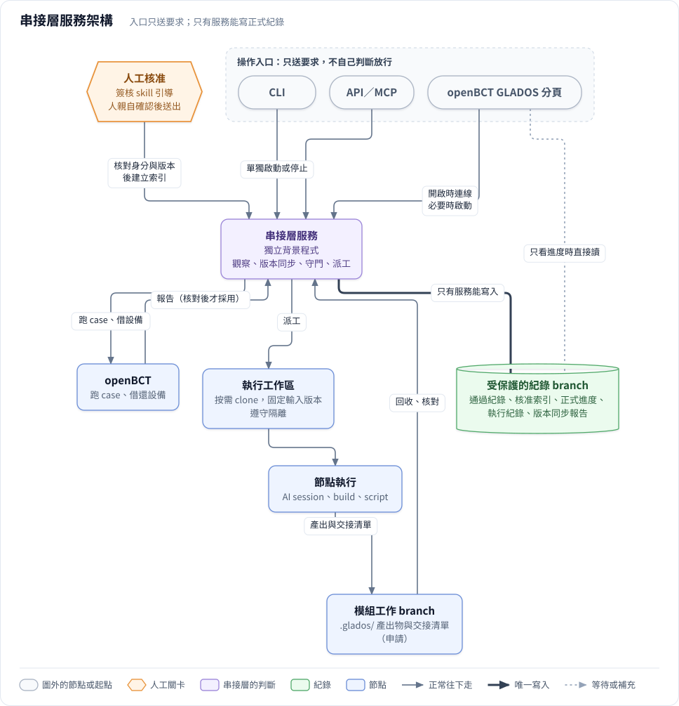
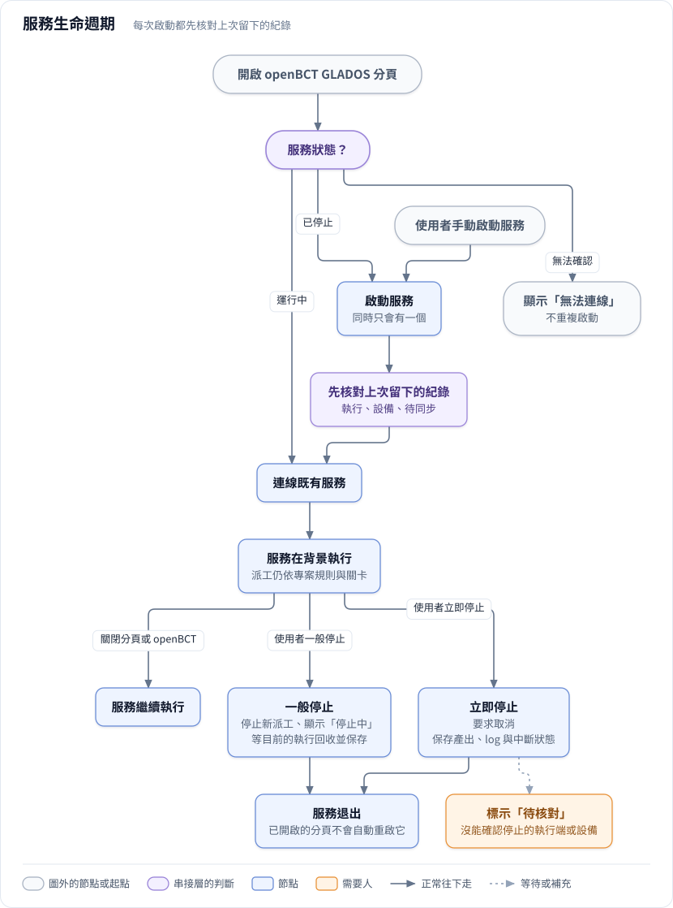

# 串接層服務實作設計

> **這份文件回答**：串接層服務用什麼實作、怎麼接 openBCT。屬於實作，框架確認後才開始。
>
> **和框架的關係**：框架只規定串接層「要做什麼」（[framework/04 §4.1](../framework/04_rules.md#41-串接層是什麼)、[framework/06](../framework/06_service.md)、[framework/03 §3.11](../framework/03_artifacts.md#311-存放位置與寫入權限)）。本文件記錄「用什麼實作、怎麼接 openBCT」。工具或宿主改變時只改本文件，不影響框架。
>
> **實作時程**：框架文件確認後才開始。建置路線步驟 2（手動跑一個模組）不需要本文件的任何元件；從步驟 3 開始實作（[framework/01 §1.6](../framework/01_overview.md#16-建置路線)）。

---

## I1. 決策：獨立服務，openBCT 當入口（選項 B）

2026-10-07 決定：**串接層是一個獨立的背景服務，openBCT 的 GLADOS 分頁是它的操作入口之一；同時借用 openBCT 既有的測試執行、設備借用與 lab worker。**

| 選項 | 內容 | 結論 |
| :---- | :---- | :---- |
| A. 完整放進 openBCT | 串接層程式放在 openBCT codebase 裡，和 GUI 共用同一個服務層 | 不採用：流程管理要背景常駐、等人簽核好幾天，不能和 GUI 綁在一起 |
| **B. 獨立服務＋openBCT 當入口** | 串接層是獨立的常駐服務；GLADOS 分頁、CLI、API 都呼叫它；它再透過 openBCT 跑測試、借設備 | **採用** |

選 B 的理由：

- 服務是獨立的背景程式，關閉 GUI、使用者登出都不會連帶停止；使用者可以單獨啟動或停止。開啟 openBCT 的 GLADOS 分頁時檢查並按需啟動服務（[framework/06 §6.1](../framework/06_service.md#61-獨立的背景服務)、I6）。
- 入口不只一個：openBCT 分頁、CLI、其他人的 GUI、MCP 都能用同一套放行規則。
- FPGA 等設備的互斥、測試執行與證據產生，沿用 openBCT 已有的能力，不重造。**（2026-10-07 核對：openBCT 目前的設備互斥管不到 FPGA，見 I7。）**

---

## I2. 架構

圖源：[`diagrams/src/09_service_architecture.mjs`](../diagrams/src/09_service_architecture.mjs)

粗線＝只有串接層服務能寫入正式紀錄。

| 元件 | 角色 | 能寫正式紀錄嗎 |
| :---- | :---- | :---- |
| 串接層服務 | 觀察、版本同步、守門、派工；持久保存進度、執行紀錄、核准索引、版本同步分析 | 能，唯一可寫者（[framework/03 §3.11](../framework/03_artifacts.md#311-存放位置與寫入權限)） |
| 操作入口：openBCT GLADOS 分頁、CLI、API／MCP | 查詢、送出要求（執行、核准、重跑）；不實作放行規則 | 不能，只能送要求給服務 |
| 專案工作區 repo | 模組與專案層的工作 branch 放節點產出；受保護的紀錄 branch 放正式紀錄與來源快照 | — |
| 執行工作區 | 按需 clone 或建 worktree，固定輸入版本，遵守隔離限制 | 不能 |
| 節點執行 | AI 獨立 session、build、script | 不能，只交產出與交接清單 |
| openBCT 測試執行與 lab worker | 跑 case、產生報告、管理設備借用 | 不能；報告由服務核對後才採用 |
| Jira／Confluence | 需求來源。服務派工具抓來源快照、做外部來源同步；專案設定允許時，寫回 P2b 定案的 CR 修訂（[framework/03 §3.2](../framework/03_artifacts.md#32-編號版本與-hash)） | 不能；快照由工具產生，放在受保護的紀錄 branch |

服務和 openBCT 之間的介面（呼叫哪些 API、報告格式、設備借用流程）待定（I8）。

---

## I3. openBCT 的 GLADOS 分頁

openBCT GUI 新增一個分頁，名稱固定為 **GLADOS**，作為建立專案、查詢進度、環境檢查、啟動節點、查看產出與人工關卡的入口。分頁本身不實作放行規則，所有操作都送給串接層服務判斷。

| 區域 | 顯示什麼 | 可以做什麼 |
| :---- | :---- | :---- |
| 上方專案區 | repo、專案編號、branch、讀取的 commit、同步時間、服務與執行端的連線狀態、整體狀態 | 選 GitLab 或本機 repo、選既有專案或建立新專案、更新資訊、環境檢查、啟動服務、停止服務或立即停止 |
| 左側流程區 | P0–P7、C、S，以及各模組的 M1–M7；被擋住、過期、等待核准的標示 | 選節點、查看擋住的原因與重新進入點 |
| 右側節點詳情 | 輸入與輸出的版本、檢查結果、必要核准、每一輪執行、log 與證據索引 | 有權限且條件滿足時，要求服務執行或重跑；核准人可以在這裡按「核准」親自送出決定（[gate_signoff.md](gate_signoff.md)）；連到 openBCT Scripts 頁的詳細測試結果 |

- 分頁常駐顯示服務狀態、執行位置，以及啟動／停止按鈕。服務狀態至少分成：啟動中、運行中、停止中、已停止、無法連線。**「無法連線」不等於「已停止」**，不能因此重複啟動。
- 服務停止後仍然可以查詢 GitLab 上保存的正式進度，即時狀態標示為「無法取得」。
- 環境依節點檢查：M1 不會因為 FPGA 不可用而被擋，M5 才檢查需要的驗證設備。
- 開啟專案可以做資料載入與準備檢查；自動派工要依明確的規則與專案設定，不能把「打開來看」當作執行授權。

**2026-10-07 核對 openBCT 現況**：

- openBCT 的 Tests 頁在 2026-10-05 改名為 **Scripts**，Send 頁改名為 **VUC**；History 與 UART 在 2026-10-06 從側欄移除（頁面還在，只是沒有入口）。所以節點詳情連到 Scripts 頁；要不要用 History 頁顯示歷史結果，待定。
- 依 openBCT `AGENTS.md` 的 GUI 模組約定（`gui.py` 已凍結成長，新頁面放 `heads/gui_pages/<page>.py`），GLADOS 分頁放在 `heads/gui_pages/glados.py`；沒有 Qt 的邏輯放 view-model，可以離線測試。

---

## I4. GitLab／本機 repo：查詢和執行分開

| 情境 | 行為 | 工作區 |
| :---- | :---- | :---- |
| 查詢 GitLab 專案 | 用 GitLab API 讀受保護紀錄 branch 與模組 branch 的 `.glados/`；每次固定讀同一個 commit | 查詢端不需要 clone |
| 在本機執行 GitLab 專案 | 有合適的工作區就重用，否則 clone 指定來源並準備節點的 worktree；執行版本同步與環境檢查 | 本機需要可重現的輸入快照 |
| 開啟本機 repo | 讀取本機的 `.glados/`、branch 與 commit，顯示和遠端的同步情況 | 用既有 repo；有未提交的修改或分岔時，先由版本同步處理 |
| 查看或驅動遠端執行 | 查詢串接層服務，或由有權限的人要求服務派工 | 查詢端不需要 clone；執行機器負責 clone 或 worktree |

- 選好 repo 後，先找 `.glados/projects/` 底下既有的專案編號；還沒初始化時，提供建立流程，不把整個 repo 當成唯一的專案。
- 建立時選起點、範圍與專案設定範本，依規則產生資料夾、草稿文件與設定，初步檢查後回到 P0／G0；需要寫入 repo 時才準備工作區。再次開啟只讀取與核對，不覆蓋既有文件。
- clone 或 fetch 看得到的 branch 必須符合專案設定的隔離限制；有禁看 branch 的專案（例如 E39），工作區本身就是只含允許 branch 的獨立 repo。GitLab API 的查詢也只限這個 repo。
- 本機工作區的對應存在各機器的設定裡，避免不同機器互相覆蓋路徑。

---

## I5. 正式紀錄和即時狀態：兩個來源一起看

| 資訊 | 來源 | 意思 |
| :---- | :---- | :---- |
| 正式進度 | 受保護的紀錄 branch；本機模式是本機的紀錄 branch | 交接、核准與證據對應的已記錄版本；本機還沒同步的要明列 |
| 即時狀態 | 串接層服務與執行端 | 節點正在跑、第幾輪、log、設備占用、回收或同步中 |
| 執行準備 | 本機或目標執行端的環境檢查 | 這個節點可用的工具、專案設定、來源版本與資源 |

分頁用專案編號、模組、節點、執行編號、輸入 commit 與 hash 合併顯示，兩個來源不能互相盲目覆蓋。正式紀錄顯示 M3 已完成、執行端正在做 M4，可以同時成立；執行端用的是舊計畫時，顯示「輸入過期」，由版本同步判斷。

| 連線情況 | 畫面怎麼顯示 |
| :---- | :---- |
| GitLab 與服務都可用 | 顯示正式進度＋即時狀態，以及各自的版本與時間 |
| 只有 GitLab 可用 | 可以查正式紀錄；即時狀態標示「無法取得」，不推定已停止 |
| 只有服務可用 | 可以查即時狀態；正式進度標示最後同步時間與可能過期 |
| 本機 repo | 顯示本機正式紀錄與還沒同步的差異；連得到服務時另外顯示即時狀態 |

**本機模式的限制**：本機的紀錄 branch 沒有權限保護，節點和服務同機同帳號時，節點可以直接改它。所以本機模式只用來查詢與演練，不產生正式的「已通過」紀錄（[framework/03 §3.11](../framework/03_artifacts.md#311-存放位置與寫入權限)；待確認：[framework/08 框架第 11 項](../framework/08_open_questions.md#81-框架待決)）。

---

## I6. 服務生命週期與持久保存

框架要求的性質（[framework/06](../framework/06_service.md)）在本實作中的做法：

- **常駐**：服務是可以單獨啟動與停止的程式，生命週期和 GUI 分開。開啟 openBCT 的 GLADOS 分頁時，先確認服務是否已啟動：已啟動就連線，未啟動就自動啟動，並用單一實例機制避免多個分頁或 GUI 重複啟動。關閉分頁或 openBCT 不會停止服務，使用者登出也不會。使用者主動停止後，已開啟的分頁顯示「服務已停止」和「啟動服務」按鈕，不自動把它啟動回來；再次開啟分頁時才重新檢查並按需啟動。自動啟動服務不等於授權執行節點，派工仍然依專案設定與關卡。
- **節點、執行、產出物有效性分開管理**：一個節點可以有多次執行；程式正常結束只表示程式跑完，分頁另外顯示「交接檢查中」「同步中」「節點完成」。一般「停止服務」立即停止新派工，狀態顯示「停止中」，等正在執行的工作回收並保存結果後才退出，不啟動下一站；等待人工核准的節點保存後即可退出，不必等核准。同步失敗時保存待同步紀錄後退出，正式進度仍依 I5 與 [framework/03 §3.11](../framework/03_artifacts.md#311-存放位置與寫入權限) 判定。
- **完成的順序**：收集產出與 log → 版本同步核對版本 → 服務核對 hash、檢查、審查與必要核准 → 寫入受保護的紀錄 branch 並同步 → 更新正式進度 → 版本同步的派工前檢查後，決定下一站。遠端同步失敗時，保留已取得的結果並標示「同步中」，不宣稱其他人已經能從 GitLab 看到完成。
- **持久保存與重啟**：進度、核准索引、執行紀錄、版本同步分析與中斷狀態都要持久保存；事件通知與記憶體裡的工作佇列不能當唯一的事實來源。「立即停止」要求取消執行，保存已取得的產出、log 與中斷狀態後退出；還沒確認取消的執行端或設備，明列為「待核對」，不宣稱已停止或已釋放。重啟時先核對殘留的執行、設備與待同步紀錄，再決定接續或重跑，不盲目重派同一個工作。
- **統一派工**：所有入口的執行要求都由服務認領與派工，避免多個 GUI 啟動同一站。

### I6.1 服務生命週期圖

圖源：[`diagrams/src/10_service_lifecycle.mjs`](../diagrams/src/10_service_lifecycle.mjs)

每次啟動服務（不論是開分頁時自動啟動或手動啟動），都先核對上次留下的執行、設備與待同步紀錄。

---

## I7. 可以借用的 openBCT 元件

**2026-10-07 已對最新版 openBCT（main `d995897`，2026-10-06）逐項核對**，結果寫在最右欄。

| openBCT 元件 | 在選項 B 下怎麼用 | 最新版現況與要補的地方 |
| :---- | :---- | :---- |
| 多入口 → `OpenBctService` 的分層 | GLADOS 服務是獨立程序，但沿用同樣的分層與寫法；GLADOS 分頁透過 API 呼叫 GLADOS 服務，不把流程規則放進 `OpenBctService` | 還在。核心規則只用標準函式庫，選用的依賴放在邊界 |
| `ToolSpec`／`ToolRunner` | 服務啟動外部命令（`claude -p`、build、script）時沿用同樣的封裝方式 | 還在（`core/tools.py`）。預設 timeout 30 秒、同步執行；**沒有執行編號、即時 log、取消**。長任務要另外補 |
| 測試執行與結果保存 | 服務透過 openBCT 執行測試並取得結果 | `RunResult.passed`（`core/models.py`）是「至少一個 PASS、其他都是 PASS 或 SKIP 就算過」，放行要另外判定「必要 case 全部 PASS」。報告 `summary.json`（`core/report_artifacts.py`）只有執行編號（`run_id`）、時間、各 test 的結果與訊息，**沒有 image、測試集合、驗證環境的 hash** |
| 事件通知（`EventBus`） | 通知用 | 只在記憶體裡（`core/events.py`），不能當事實來源（I6） |
| lab diagnostics | 節點的環境檢查 | 還在（`lab/diagnostics.py`）。只檢查設定與工具在不在、不碰 DUT，不代表設備已經連通 |
| remote worker | 遠端執行 | 工作佇列存在記憶體（`remote/worker.py`，最多保留 500 筆已完成的工作），重啟就消失；API 只有 health、capabilities、jobs 的查詢與送出，**沒有取消，也沒有借還設備** |
| 設備鎖 `DeviceLease` | FPGA 等設備的互斥 | 在 `core/run_status.py`。它是本機的檔案鎖，以 device path（COM 埠、PhysicalDrive）為單位；`lab/` 沒有用到它，所以**管不到 FPGA 與 ICE，也不跨機器**。I1「設備互斥沿用 openBCT」目前不成立 |
| `AgentRuntime` | 可以當一種節點執行介面 | 還在；走 CCR 或其他 OpenAI 相容 gateway，和 `claude -p`（[ai_node_execution.md](ai_node_execution.md)）是兩條不同的路。GLADOS 仍然每個節點開獨立 session，由服務放行 |
| `ArmICE` | 把 image 載進 FPGA | 仍是 stub（`lab/ice.py`）。目前載入 FPGA 靠 bct_knowledge_base 的 remote-ice（DS-5 `debugger.exe`），和 openBCT 是兩個工具（見 [nodes/M5](../nodes/M5.md)） |

GLADOS 分頁沿用 view-model 與 service 分離，不把新的流程邏輯塞進既有的大型 GUI 檔。順序：先接建立／開啟、查詢、環境檢查、手動啟動與回收，再逐步打開自動派工。

---

## I8. 待決事項

1. 服務部署在哪台機器；要不要和 openBCT 的 remote worker 同機。
2. 跨機器的身分與授權：誰能要求執行、誰能核准、服務帳號怎麼管理。
3. 服務和 openBCT 之間的 API：跑 case、取報告、借還設備的介面與報告格式。
4. image 載入（remote-ice）和跑測試（openBCT）要串成同一次執行，才能證明測試時跑的是哪個 image（見 [nodes/M5](../nodes/M5.md)）。由 openBCT 補 `ArmICE`、把 remote-ice 包成 openBCT 的外部工具，還是由 GLADOS 服務負責串接，待定。
5. 設備互斥要涵蓋 FPGA 與 ICE，並且能跨機器。
6. openBCT 的報告要不要直接補上 image、測試集合、驗證環境的 hash，還是由 GLADOS 服務在外面包一層。
